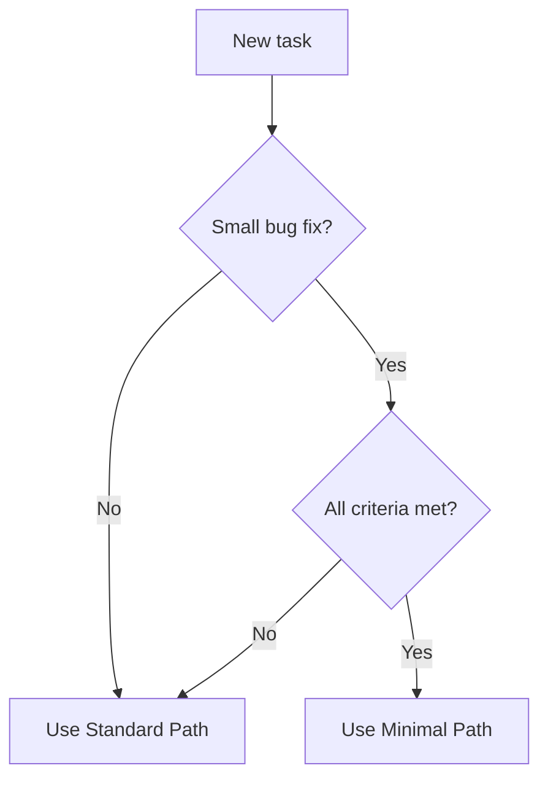

# Agent Instructions

This document provides explicit instructions for LLM agents working with the Development Lifecycle Protocol (DLP).

---

## Work Path Selection

Before starting any task, determine the appropriate path. See `foundations/work-paths.md` for full details.

### Quick Decision



**Minimal Path criteria** (ALL must be true):

- [ ] Isolated change (one component or small set of files)
- [ ] Root cause is known
- [ ] Fix is obvious (no design decisions needed)
- [ ] Low risk (no cascading failures or data loss possible)
- [ ] Easily reversible
- [ ] No new or modified interfaces/APIs/schemas
- [ ] Existing test coverage or trivially added

If ANY criterion is not met → **Standard Path**.

---

## Phases

The DLP has four sequential phases. You must work through them in order:

| Phase        | README Path              | Purpose                              |
| ------------ | ------------------------ | ------------------------------------ |
| REQUIREMENTS | `requirements/README.md` | Define what to build                 |
| DESIGN       | `design/README.md`       | Define how to structure the solution |
| DEVELOPMENT  | `development/README.md`  | Build the solution                   |
| TESTING      | `testing/README.md`      | Verify the solution works            |

**Cross-cutting concerns** in `concerns/` (security, performance, accessibility, observability) apply to ALL phases.

---

## Before Starting Any Work

### 1. Session Initialization

Before beginning ANY work, establish these with the user:

- [ ] Documentation output path (default to `docs/` at project root)
- [ ] Autonomy preference (autonomous execution OR step-by-step with review)
- [ ] Project context (purpose, technology stack, current state)

**CRITICAL:** Never write documentation inside the DLP directory. DLP is reference material only.

### 2. Constraint Discovery

Before generating any plan or code, search the project's documentation directory for existing constraints about:

- Technology choices (languages, frameworks)
- Architectural decisions already made
- Coding standards or conventions
- Integration requirements
- Any other project-specific rules

Report findings: "I have searched `[docs path]` for constraints and found: [list] or none."

---

## Phase Execution

### Path and Phase Anchor (Required)

Before generating any code or plan, you MUST state your path and phase:

**For Standard Path:**

```
> "🤖️: I am currently in the **[PHASE NAME]** phase of the DLP."
```

Where `[PHASE NAME]` is one of: REQUIREMENTS, DESIGN, DEVELOPMENT, or TESTING.

**For Minimal Path:**

```
> "🤖️: I am using the **MINIMAL PATH** for this bug fix."
>
> Qualification:
> - Isolated: [what component/file]
> - Root cause: [brief explanation]
> - Fix: [one-line description]
> - Risk: Low — [why]
> - Reversible: Yes
> - Interfaces: No changes
> - Tests: [existing/will add]
```

If at any point during Minimal Path work the criteria no longer apply, escalate:

```
> "🤖️: Escalating from MINIMAL PATH to STANDARD PATH.
> Reason: [why minimal path no longer applies]"
```

### Reading Order Within Each Phase

1. Read the phase's `README.md` first
2. Follow the reading order specified in that README
3. Reference `concerns/` for cross-cutting considerations
4. Use `templates/` for output artifacts

---

## Artifacts and Templates

Generate documentation artifacts BEFORE generating code. Use templates from `templates/`:

| Artifact Type         | Template                                  | Phase        |
| --------------------- | ----------------------------------------- | ------------ |
| Requirements Document | `templates/requirements-specification.md` | REQUIREMENTS |
| User Stories          | `templates/user-stories.md`               | REQUIREMENTS |
| Design Decisions      | `templates/design-decision.md`            | DESIGN       |
| Architecture          | `templates/architecture.md`               | DESIGN       |
| Data Models           | `templates/data-model.md`                 | DESIGN       |
| API Contracts         | `templates/api-contract.yml`              | DESIGN       |

If no template exists for a needed artifact, create one following the structure of existing templates.

---

## Phase Transitions

### When to Move to the Next Phase

Each phase has explicit exit criteria. Do not proceed until all are met:

**REQUIREMENTS → DESIGN:**

- [ ] All requirements have clear acceptance criteria
- [ ] Scope boundaries are documented
- [ ] Stakeholders have reviewed and approved
- [ ] No unresolved ambiguities

**DESIGN → DEVELOPMENT:**

- [ ] Architecture addresses all requirements
- [ ] Data models support all use cases
- [ ] Interfaces between components are defined
- [ ] Design has been reviewed and approved
- [ ] Documentation is updated

**DEVELOPMENT → TESTING:**

- [ ] Implementation is complete per design
- [ ] Code review is approved
- [ ] Code passes automated checks
- [ ] No known issues remain unaddressed

**TESTING → COMPLETE:**

- [ ] All requirements have corresponding tests
- [ ] Critical paths are covered
- [ ] Tests pass consistently

---

## Concerns Integration

Reference `concerns/` at each phase:

| Phase        | Security                                   | Performance                | Accessibility                | Observability                |
| ------------ | ------------------------------------------ | -------------------------- | ---------------------------- | ---------------------------- |
| REQUIREMENTS | Identify sensitive data, auth requirements | Define response time goals | Identify accessibility needs | Define monitoring needs      |
| DESIGN       | Establish trust boundaries, threat model   | Design for efficiency      | Design inclusive interfaces  | Plan logging and metrics     |
| DEVELOPMENT  | Follow secure coding practices             | Implement efficiently      | Implement accessible UI      | Add logging, metrics, traces |
| TESTING      | Test auth, authorization, injection        | Load test critical paths   | Test with assistive tech     | Verify observability works   |

---

## Development Phase Specifics

### Pre-Commit Hook

If not already present, add a pre-commit hook to enforce verification commands (tests, linter, etc.) before committing changes.

### Software Versions

Run `date` in the terminal to know today's date. Your knowledge cutoff may be outdated—do not assume you know the latest versions of dependencies or tools.

When adding dependencies:

1. Search the official package registry for the current latest stable version
2. Use that version explicitly
3. See `development/dependency-management.md` for full guidance

### Automation Rule

If you perform the same task twice, write a script. See `development/implementation-workflow.md` for details.

---

## Decision Making

When facing decisions:

1. Check if existing documentation provides guidance
2. Evaluate options using the framework in `foundations/decision-making.md`
3. For reversible, low-impact decisions: decide and proceed
4. For irreversible or high-impact decisions: present options to user
5. Document significant decisions using `templates/design-decision.md`

---

## Handling Ambiguity

When requirements or instructions are unclear:

**Ask for clarification when:**

- The ambiguity affects core functionality
- Different interpretations lead to significantly different implementations
- Getting it wrong would be costly to fix

**Make documented assumptions when:**

- The user is unavailable and progress is needed
- The ambiguity is minor and easily corrected later
- Domain knowledge provides a reasonable default

Always document assumptions explicitly for later verification.

---

## Summary Checklist

Before each work session:

- [ ] Session initialized (output path, autonomy, context)
- [ ] Constraints discovered from existing docs
- [ ] **Work path selected** (Standard or Minimal)
- [ ] Current phase/path identified and anchored
- [ ] Phase README read (Standard Path) or qualification verified (Minimal Path)
- [ ] Relevant concerns reviewed

Before producing output:

- [ ] Artifacts before code
- [ ] Templates used where available
- [ ] Decisions documented
- [ ] Assumptions explicit

Before phase transition:

- [ ] Exit criteria met
- [ ] Constraint verification stated
- [ ] User approval obtained (if not autonomous)
