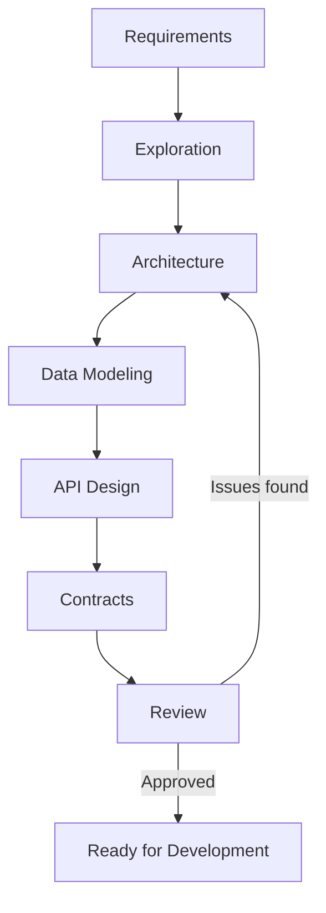

# Design Phase

Transform validated requirements into a technical blueprint. Design bridges the gap between what needs to be built and how it will be built.

## Purpose

Design work answers the question: "How will we structure this solution?"

Without deliberate design:
- Implementation becomes exploratory coding
- Inconsistent patterns emerge across the codebase
- Integration problems surface late
- Technical debt accumulates from ad-hoc decisions

## Inputs and Outputs

**Inputs:**
- Validated requirements specification
- Constraints (technology, resources, timeline)
- Existing system context (if applicable)

**Outputs:**
- Architecture defining components and their relationships
- Data models for system entities
- Interface contracts between components
- Reviewed and approved design ready for implementation

## Contents

| Document                                         | Purpose                                             |
| ------------------------------------------------ | --------------------------------------------------- |
| [exploration.md](exploration.md)                 | Evaluating approaches before committing to one      |
| [architecture.md](architecture.md)               | Defining high-level system structure and components |
| [data-modeling.md](data-modeling.md)             | Designing data structures and relationships         |
| [api-design.md](api-design.md)                   | Defining interfaces between components              |
| [interface-contracts.md](interface-contracts.md) | Formalizing boundaries with contracts               |
| [design-review.md](design-review.md)             | Validating design before implementation             |

## Reading Order

Work through these documents in sequence, though iteration is expected:

1. **exploration.md** — Consider approaches before committing
2. **architecture.md** — Define overall structure
3. **data-modeling.md** — Design data representations
4. **api-design.md** — Define component interfaces
5. **interface-contracts.md** — Formalize contracts
6. **design-review.md** — Validate the design

## Workflow

Design is iterative. Decisions in later stages may require revisiting earlier stages.

## Key Principles

- **Design for current requirements** — Avoid speculative architecture (YAGNI)
- **Make trade-offs explicit** — Document what you are optimizing for and what you are sacrificing
- **Prefer simple solutions** — Complexity must be justified by requirements (KISS)
- **Design for change** — Good design accommodates evolution without requiring rewrites
- **Validate early** — Review design before significant implementation investment

## Design Depth

Match design depth to project complexity:

**Minimal design** (small features, bug fixes):
- Identify affected components
- Verify approach with quick exploration
- Proceed to implementation

**Standard design** (new features, moderate complexity):
- Full exploration of approaches
- Architecture decisions documented
- Key interfaces defined
- Design reviewed

**Extensive design** (major systems, high risk):
- Comprehensive exploration with prototypes
- Detailed architecture documentation
- Complete interface contracts
- Formal design review with stakeholders

## When to Proceed to Development

Move to development when:

- Architecture addresses all requirements
- Data models support all use cases
- Interfaces between components are defined
- Design has been reviewed and approved
- No significant risks remain unexplored
- The team could implement from the design documents

If any of these are uncertain, continue design work.
