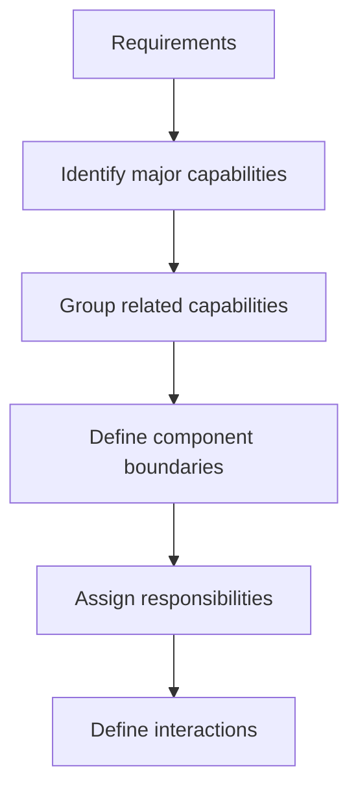
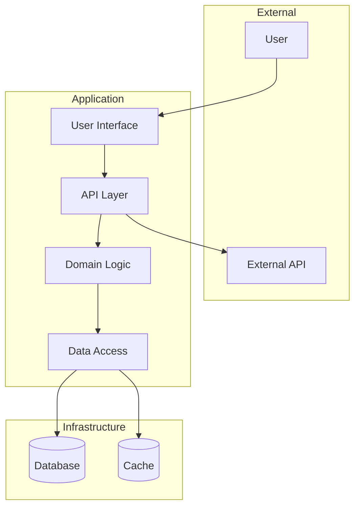

# Architecture

Architecture defines the high-level structure of a system: its components, their responsibilities, and how they interact. Architectural decisions are those that are costly to change later.

---

## What Architecture Defines

Architecture answers structural questions:

- What are the major components of the system?
- What does each component do?
- How do components communicate?
- What are the boundaries between components?
- What decisions are made at this level vs. left to implementation?

Architecture does not specify implementation details. It defines the skeleton that implementation fills in.

---

## Components

Components are the building blocks of architecture. Each component encapsulates a cohesive set of responsibilities.

### Identifying Components

Components emerge from requirements and domain analysis:



### Component Characteristics

Well-defined components have:

**Clear responsibility** — Each component does one thing well. The responsibility is expressible in one or two sentences.

**Defined interface** — How other components interact with this one is explicit and limited.

**Internal cohesion** — Elements within the component belong together; they change for the same reasons.

**Loose coupling** — The component depends on others through stable interfaces, not internal details.

### Documenting Components

For each component, capture:

```
Component: [Name]

Responsibility:
[What this component does, in 1-2 sentences]

Interfaces:
- [What it exposes to other components]
- [What it consumes from other components]

Key behaviors:
- [Important capability 1]
- [Important capability 2]

Internal notes:
[Any decisions about internal structure worth capturing]
```

---

## Component Interactions

Architecture defines how components communicate and depend on each other.

### Interaction Patterns

**Synchronous request/response** — One component calls another and waits for a response.

- Simple to understand
- Creates tight temporal coupling
- Failure in one affects the caller

**Asynchronous messaging** — One component sends a message without waiting for response.

- Looser coupling
- More complex to implement and debug
- Better isolation of failures

**Shared data** — Components communicate through shared state.

- Simple when applicable
- Creates coupling through data structure
- Requires careful coordination

**Events** — Components emit events that others subscribe to.

- Very loose coupling
- Components do not need to know about each other
- Harder to trace flow

### Dependency Direction

Establish which components depend on which:

**Principle: Dependencies point toward stability**

Stable components (change rarely):

- Core domain logic
- Fundamental data structures

Volatile components (change often):

- User interfaces
- External integrations

Volatile components should depend on stable components, not vice versa.

### Avoiding Circular Dependencies

Circular dependencies indicate poorly defined boundaries:

Problem:

```
Component A depends on Component B
Component B depends on Component A
```

Solutions:

1. Merge A and B (they may be one component)
2. Extract shared functionality into Component C
3. Use events/callbacks to break the cycle
4. Introduce an interface that one implements

---

## Architectural Diagrams

Visual representations clarify component relationships.

### Diagram Conventions

Use consistent conventions:

- **Boxes** represent components
- **Arrows** represent dependencies (arrow points from dependent to dependency)
- **Labels** on arrows describe the nature of interaction
- **Boundaries** (dashed lines) group related components

### Example Architecture Diagram



### Diagram Levels

Different levels of detail serve different purposes:

**Context level** — System as a black box, showing external interactions

**Container level** — Major components and their relationships

**Component level** — Internal structure of a single container

Match detail level to audience and purpose.

---

## Architectural Decisions

Some decisions have architectural significance—they affect the structure and are costly to change.

### Identifying Architectural Decisions

Decisions are architectural when they:

- Affect multiple components
- Are hard to reverse
- Constrain future choices
- Require significant investment to implement

### Documenting Architectural Decisions

For significant decisions, record:

```
Decision: [Title]

Status: [Proposed | Accepted | Deprecated | Superseded]

Context:
[What situation prompted this decision?]

Decision:
[What was decided?]

Consequences:
[What are the implications of this decision?]

Alternatives considered:
[What other options were evaluated?]
```

---

## Verifying Architecture

Architecture should satisfy requirements. Verify the mapping:

### Architecture-Requirements Mapping

For each major requirement:

- Which component(s) address it?
- Is the responsibility assignment clear?
- Are all parts of the requirement covered?

For each component:

- Which requirements does it serve?
- Is every component justified by requirements?
- Are responsibilities properly scoped?

### Architecture Quality Checklist

- [ ] Each component has a clear, single responsibility
- [ ] Component boundaries align with likely change patterns
- [ ] Dependencies flow toward stability
- [ ] No circular dependencies exist
- [ ] Interfaces between components are defined
- [ ] All requirements map to components
- [ ] No component is unjustified by requirements
- [ ] Failure scenarios are considered
- [ ] Scalability requirements are addressed
- [ ] Security boundaries are established

---

## Common Architectural Patterns

Recognize common patterns and when they apply:

### Layered Architecture

Components organized in layers; each layer depends only on layers below it.

```
Presentation Layer
       ↓
Application Layer
       ↓
Domain Layer
       ↓
Infrastructure Layer
```

**When to use:** Clear separation between concerns; well-understood domain.

**Trade-offs:** Can lead to rigid structures; changes may ripple through layers.

### Modular Architecture

Components organized around features or capabilities rather than technical layers.

```
User Module    Product Module    Order Module
     ↓              ↓                ↓
         Shared Infrastructure
```

**When to use:** Features are relatively independent; team structure aligns with modules.

**Trade-offs:** Shared concerns must be carefully managed; can lead to duplication.

### Event-Driven Architecture

Components communicate primarily through events.

```
Producer → Event Bus → Consumer A
                    → Consumer B
                    → Consumer C
```

**When to use:** Loose coupling is critical; complex workflows; multiple consumers.

**Trade-offs:** Harder to trace flow; eventual consistency challenges; debugging is complex.

---

## Architecture Evolution

Architecture is not fixed—it evolves with the system.

### When to Revisit Architecture

- Requirements change significantly
- Performance problems emerge
- Team structure changes
- Technical constraints shift
- Accumulated technical debt becomes painful

### Evolving Safely

When architecture must change:

1. Understand the current architecture thoroughly
2. Identify what specifically needs to change
3. Plan incremental migration (not big bang)
4. Maintain both old and new during transition
5. Verify behavior preservation at each step

---

## After Architecture

Once architecture is defined:

1. Document components and their responsibilities
2. Document key architectural decisions
3. Create diagrams for communication
4. Proceed to data modeling and interface design
5. Use architecture as the framework for all subsequent design

Architecture constrains and guides detailed design. Implementation decisions should align with architectural intent.
