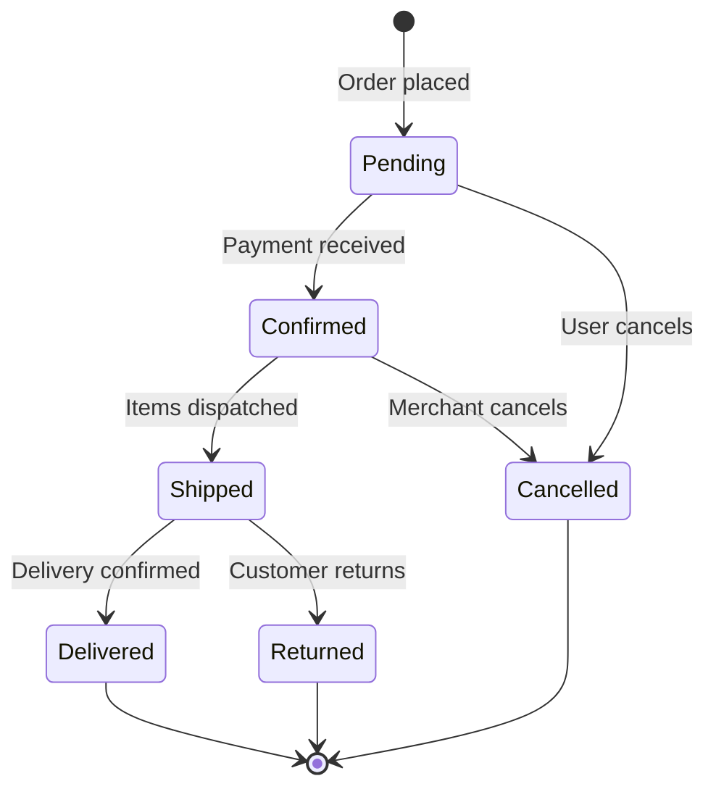

# Data Modeling

Data modeling designs the structures that represent information in the system. Good data models accurately reflect the problem domain and support the operations the system must perform.

---

## What Data Modeling Defines

Data modeling answers questions about information:

- What entities exist in the domain?
- What attributes does each entity have?
- How do entities relate to each other?
- What constraints govern valid data?
- How does data change over time?

---

## Entity Identification

Entities are the things the system needs to know about.

### Finding Entities

Entities emerge from requirements:

```
Requirement: "Users can create orders containing products"

Entities identified:
- User — the person placing orders
- Order — a request to purchase
- Product — what can be purchased
- (OrderItem — links orders to products with quantity)
```

### Entity vs. Attribute

Not everything is an entity. Some things are attributes of entities:

```
Question: Is "Address" an entity or an attribute?

Consider:
- Does it have independent identity? (Can we refer to "Address #123"?)
- Do multiple entities reference the same address?
- Does it have its own lifecycle?

If yes → Likely an entity
If no → Likely an attribute or embedded value
```

### Documenting Entities

For each entity:

```
Entity: Order

Description:
A request to purchase products, placed by a user.

Attributes:
- id: UUID (primary key)
- user_id: UUID (reference to the ordering user)
- status: current state (pending, confirmed, shipped, delivered, cancelled)
- total_amount: sum of all items
- created_at: when the order was placed
- updated_at: when the order was last modified

Lifecycle:
Created when user submits checkout → Updated as status progresses →
Retained indefinitely for records

Constraints:
- Must have at least one order item
- Total amount must equal sum of item amounts
- Status transitions follow defined state machine
```

---

## Primary Keys

Every entity needs a unique identifier—its primary key.

### UUID vs. Auto-Incrementing Integers

**Prefer UUIDs over auto-incrementing integers** for primary keys in most cases.

**UUIDs (Universally Unique Identifiers):**

Advantages:

- Globally unique without coordination
- Can be generated client-side or server-side
- Safe to expose in URLs without leaking info
- No sequential enumeration vulnerability
- Easier for distributed systems and sharding
- No collisions when merging data from different sources

Disadvantages:

- Larger storage (16 bytes vs 4-8 bytes)
- Less human-readable
- Slightly slower index operations (use UUIDv7 to avoid)
- Not naturally sortable by creation time (use UUIDv7 if needed)

### UUID Formats

```
UUIDv4 (random):
  550e8400-e29b-41d4-a716-446655440000
  Standard choice, cryptographically random

UUIDv7 (time-ordered):
  018e8400-e29b-71d4-a716-446655440000
  Sortable by creation time, better for database indexing
  Preferred for new systems

Example entity with UUID:
  Entity: User
  Attributes:
    - id: UUID (primary key, UUIDv7)
    - email: string (unique)
    - created_at: timestamp
```

### Implementation Notes

```
Most databases support UUIDs natively:
  PostgreSQL: uuid type, gen_random_uuid()
  MySQL 8.0+:  uuid type (binary(16)), UUID()
  SQLite:      text or blob, generate in application
  MongoDB:     ObjectId (similar concept, 12 bytes)

Application libraries:
  JavaScript:  crypto.randomUUID() (built-in)
  Python:      uuid.uuid4(), uuid.uuid7()
  Rust:        uuid crate
  Go:          google/uuid package
```

---

## Relationships

Entities connect to each other through relationships.

### Relationship Types

**One-to-one** — Each instance of A relates to exactly one instance of B.

```
User ←→ Profile
Each user has exactly one profile; each profile belongs to one user.
```

**One-to-many** — Each instance of A relates to multiple instances of B.

```
User ←→ Orders
A user can have many orders; each order belongs to one user.
```

**Many-to-many** — Multiple instances of A relate to multiple instances of B.

```
Orders ←→ Products
An order can contain many products; a product can appear in many orders.
(Often modeled with a junction entity: OrderItem)
```

### Relationship Attributes

Sometimes relationships themselves have attributes:

```
Order ←→ Product relationship needs:
- quantity (how many of this product in this order)
- unit_price (price at time of order, may differ from current product price)

This suggests a junction entity: OrderItem
with attributes: order_id, product_id, quantity, unit_price
```

### Documenting Relationships

```
Relationship: User → Orders

Type: One-to-many
Description: A user places orders over time.
Cardinality: A user may have zero or more orders.
             An order belongs to exactly one user.
Constraints: Deleting a user requires handling their orders.
```

---

## Constraints

Constraints define rules that valid data must satisfy.

### Types of Constraints

**Existence constraints** — What must exist?

- Every order must have a user
- Every order item must have an order and a product

**Uniqueness constraints** — What must be unique?

- User email addresses must be unique
- Only one active subscription per user

**Value constraints** — What values are allowed?

- Order quantity must be positive
- Email must be valid format
- Status must be one of defined values

**Relationship constraints** — What relationships must hold?

- Order total must equal sum of order items
- A shipped order cannot be cancelled

**Temporal constraints** — What timing rules apply?

- Updated_at must be >= created_at
- Subscription end_date must be > start_date

---

## State Management

Some entities change state over time. Model state transitions explicitly.

### State Machines

For entities with complex lifecycles:



### State Transition Rules

Document what governs transitions:

```
State transition: Pending → Confirmed
Trigger: Successful payment processing
Actions: Create payment record, send confirmation email
Guards: Order has at least one item, inventory is available

State transition: Confirmed → Cancelled
Trigger: Cancellation request
Guards: Order has not shipped
Actions: Refund payment, restore inventory, send cancellation email
```

---

## Data Modeling Approaches

### Start with Domain Concepts

Model the problem domain, not the solution:

Poor: Model based on UI screens

```
Screen1Data, Screen2Data, FormSubmission
```

Better: Model based on domain concepts

```
User, Product, Order, Payment
```

### Normalize Thoughtfully

Normalization reduces redundancy but adds complexity:

**Normalize when:**

- Data integrity is critical
- Updates to shared data must be consistent
- Storage efficiency matters

**Denormalize when:**

- Read performance is critical
- Data is read far more than written
- Integrity can be maintained through other means

### Consider Access Patterns

How data will be accessed affects how it should be modeled:

```
Access pattern: "Show order with all items and product details"

Normalized: Order → OrderItem → Product (multiple lookups)
Denormalized: Order contains embedded items with product info (single lookup)

Trade-off: Denormalized is faster to read but harder to update
           if product info changes.
```

---

## Modeling Checklist

- [ ] All entities from requirements are identified
- [ ] Each entity has clear identity and purpose
- [ ] Primary keys defined (prefer UUIDs for user-facing entities)
- [ ] Attributes are assigned to appropriate entities
- [ ] Relationships between entities are defined
- [ ] Relationship cardinality is specified
- [ ] Constraints are documented
- [ ] State machines are modeled for stateful entities
- [ ] Access patterns are considered
- [ ] Normalization decisions are deliberate
- [ ] Model supports all required operations

---

## Common Modeling Mistakes

**Premature denormalization** — Optimizing for read performance before proving it is needed. Start normalized; denormalize when measurements justify it.

**Missing constraints** — Constraints are requirements. If data must satisfy rules, model those rules.

**Confusing entities and attributes** — Just because two things are named similarly does not mean they are related. "User name" is not the same entity as "User."

**Ignoring lifecycle** — Entities are created, modified, and sometimes deleted. Model the full lifecycle, not just the happy state.

**Over-modeling** — Not every detail needs a model. Model what the system needs to know, not everything that could theoretically be relevant.

---

## After Data Modeling

Once data models are defined:

1. Document entities, attributes, and relationships
2. Document constraints and state machines
3. Verify models support all requirements
4. Proceed to API design to define how components access data
5. Revisit models if API design reveals gaps

Data models are foundational—interfaces, validation, and storage all build upon them.
