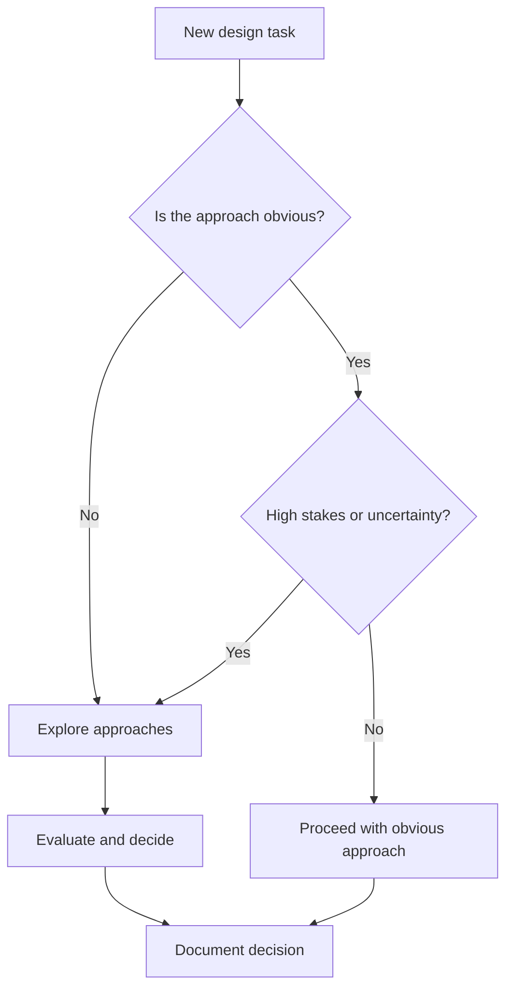
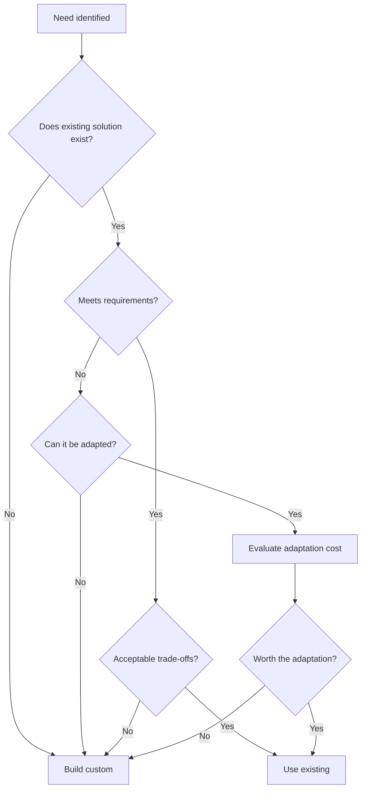

# Design Exploration

Exploration evaluates approaches before committing to one. Good exploration prevents expensive course corrections later by surfacing trade-offs and risks early.

---

## Why Explore

The first solution that comes to mind is rarely the best. Exploration:

- Reveals options you would not otherwise consider
- Surfaces trade-offs that inform decisions
- Identifies risks before they become problems
- Builds confidence that the chosen approach is sound
- Documents alternatives for future reference

## When to Explore



Explore when:
- Multiple viable approaches exist
- The decision is costly to reverse
- Requirements involve unfamiliar territory
- Previous similar decisions caused problems
- Stakeholders have strong opinions that need evaluation

Skip exploration when:
- The approach is genuinely obvious and low-risk
- A standard pattern clearly applies
- Time pressure is extreme and risk is low
- You have recent, directly applicable experience

---

## Generating Candidate Solutions

Before evaluating, generate options. Resist the urge to critique prematurely.

### Generating Approaches

Aim for two to four candidates. Fewer means you may miss good options; more creates analysis paralysis.

**Techniques for generating options:**

- **Vary the axis** — Change one fundamental assumption and see what approach follows
- **Research** — How have others solved similar problems?
- **Extremes** — What is the simplest possible solution? The most robust? The fastest?
- **Constraints** — What if you had half the time? Twice the resources? No external dependencies?

### Documenting Candidates

For each candidate, capture:

```
Approach: [Name/identifier]

Description:
[Brief explanation of how this approach works]

Key characteristics:
- [Notable feature or quality]
- [Another characteristic]

Initial assessment:
[Preliminary thoughts on viability]
```

---

## Trade-off Analysis

Once you have candidates, analyze them systematically.

### Trade-off Dimensions

Evaluate each approach against relevant dimensions:

**Complexity** — How hard is this to understand, implement, and maintain?

**Performance** — How will this behave under load and at scale?

**Flexibility** — How easily can this accommodate future changes?

**Risk** — What could go wrong? What are the unknowns?

**Effort** — How much work is required to implement?

**Dependencies** — What does this require that we do not control?

Not all dimensions matter equally for every decision. Identify which dimensions are most important for your context.

### Comparison Table

Organize analysis for comparison:

```
| Dimension    | Approach A | Approach B   | Approach C         |
| ------------ | ---------- | ------------ | ------------------ |
| Complexity   | Low        | Medium       | High               |
| Performance  | Adequate   | Good         | Excellent          |
| Flexibility  | Limited    | Good         | Excellent          |
| Risk         | Low        | Medium       | High               |
| Effort       | 2 weeks    | 4 weeks      | 8 weeks            |
| Dependencies | None       | External API | New infrastructure |
```

### Weighting Dimensions

When dimensions conflict, determine which matter most:

```
For this decision, priorities are:
1. Effort (tight timeline)
2. Risk (production system)
3. Performance (adequate is sufficient)
4. Flexibility (low priority for v1)
```

---

## Build vs. Use Existing

A common exploration is whether to build custom or use existing solutions.



### Evaluating Existing Solutions

When considering existing solutions (libraries, services, frameworks):

**Fit assessment:**
- Does it solve the actual problem?
- What percentage of requirements does it cover?
- What would you need to build around it?

**Quality assessment:**
- Is it actively maintained?
- Is the documentation adequate?
- What is the community/support like?
- What is the security posture?

**Cost assessment:**
- What is the learning curve?
- What is the integration effort?
- What are the licensing implications?
- What is the long-term maintenance burden?

**Risk assessment:**
- What happens if the project is abandoned?
- How easy is it to migrate away?
- What is the vendor/maintainer lock-in?

---

## Handling Uncertainty

Sometimes you cannot evaluate approaches without more information.

### Prototypes and Spikes

When uncertainty is high, build to learn:

**Prototype** — A quick implementation to test feasibility or understand a problem better. Prototypes are thrown away; their purpose is learning, not production use.

**Spike** — A time-boxed investigation to answer a specific question. Spikes have clear goals and end conditions.

```
Spike: Evaluate GraphQL for our API

Question: Can GraphQL handle our authorization model?

Time box: 2 days

Success criteria:
- Implement auth for one complex query
- Document any limitations encountered
- Recommendation: use or do not use
```

### When to Prototype

Prototype when:
- Feasibility is genuinely uncertain
- The cost of prototyping is low compared to getting it wrong
- Written analysis cannot resolve the uncertainty
- You need to demonstrate something to stakeholders

Skip prototyping when:
- Experience provides sufficient confidence
- The decision is easily reversible
- Time pressure outweighs uncertainty
- Analysis adequately addresses the unknowns

---

## Making the Decision

After exploration, decide and move forward.

### Decision Criteria

Choose the approach that:
- Best satisfies requirements
- Aligns with priorities and constraints
- Has acceptable risk profile
- Is supported by the team

### Documenting the Decision

Record decisions with enough context for future reference:

```
Decision: Use approach B (message queue for background jobs)

Context:
We need to process uploads asynchronously. Three approaches were considered.

Options evaluated:
A. In-process threading — Simple but does not survive restarts
B. Message queue — More infrastructure but reliable and scalable
C. Scheduled batch processing — Simple but adds latency

Decision rationale:
Reliability is critical (user uploads must not be lost). The added
infrastructure cost is justified by the reliability guarantee.

Trade-offs accepted:
- Additional infrastructure to maintain
- More complex local development setup

Alternatives deferred:
Scheduled processing may be revisited for less critical batch work.

Date: 2024-01-15
```

---

## Exploration Checklist

```
1. [ ] Multiple approaches identified (2-4)
2. [ ] Each approach is briefly documented
3. [ ] Trade-off dimensions are identified
4. [ ] Approaches are compared against dimensions
5. [ ] Priorities for this decision are clear
6. [ ] Build vs. use existing is considered
7. [ ] Unknowns are addressed (analysis or prototype)
8. [ ] Decision is made and documented
9. [ ] Rationale explains why this approach was chosen
```

---

## Common Exploration Mistakes

**Single-option exploration** — Evaluating only the first idea. Force yourself to generate alternatives.

**Analysis paralysis** — Endless evaluation without decision. Time-box exploration.

**Missing dimensions** — Ignoring factors that will matter later. Consider operations, security, maintainability.

**Sunk cost reasoning** — Continuing with a poor approach because of prior investment. Evaluate options on future merit.

**Premature commitment** — Deciding before adequately exploring. Resist the urge to start building immediately.

---

## After Exploration

Once an approach is selected:

1. Document the decision and rationale
2. Communicate to affected parties
3. Proceed to detailed architecture and design
4. Refer back to exploration when questions arise

The exploration artifact remains valuable—it explains not just what was chosen but what was considered and why alternatives were rejected.
