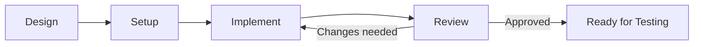

# Development Phase

Transform design into working code. Development is where architecture and contracts become concrete implementation.

## Purpose

Development answers the question: "How do we build what was designed?"

Without disciplined development:
- Code diverges from design intent
- Inconsistent patterns create maintenance burden
- Technical debt accumulates rapidly
- Integration becomes painful

## Inputs and Outputs

**Inputs:**
- Approved design (architecture, data models, contracts)
- Development environment and tools
- Coding standards and conventions

**Outputs:**
- Implemented, reviewed code
- Documented decisions and deviations
- Code ready for testing

## Contents

| Document                                                 | Purpose                                                     |
| -------------------------------------------------------- | ----------------------------------------------------------- |
| [setup.md](setup.md)                                     | Preparing the development environment and project structure |
| [coding-standards.md](coding-standards.md)               | Conventions for consistent, readable code                   |
| [patterns.md](patterns.md)                               | Common solutions to recurring problems                      |
| [error-handling.md](error-handling.md)                   | Strategies for dealing with failures                        |
| [dependency-management.md](dependency-management.md)     | Evaluating, updating, and removing dependencies             |
| [git-workflow.md](git-workflow.md)                       | Version control practices and commit discipline             |
| [implementation-workflow.md](implementation-workflow.md) | The process of turning design into code                     |
| [code-review.md](code-review.md)                         | Reviewing implementations for quality                       |

## Reading Order

1. **setup.md** — Before writing code
2. **coding-standards.md** — To understand conventions
3. **patterns.md** — To recognize common solutions
4. **error-handling.md** — To handle failures properly
5. **dependency-management.md** — To manage external code
6. **git-workflow.md** — To manage changes effectively
7. **implementation-workflow.md** — To guide the coding process
8. **code-review.md** — To review and improve code

## Workflow

Development iterates between implementation and review until code meets standards.

## Key Principles

- **Follow the design** — Implementation should realize the design, not reinvent it
- **Small, incremental changes** — Build in small steps; verify frequently
- **Consistency over cleverness** — Predictable code is maintainable code
- **Leave code better than you found it** — Address issues when you see them
- **Document the non-obvious** — Code shows what; comments explain why

## Development Discipline

**Before writing code:**
- Understand the design thoroughly
- Set up the environment correctly
- Know the coding standards

**While writing code:**
- Implement one thing at a time
- Verify as you go
- Commit frequently with clear messages

**After writing code:**
- Review your own work first
- Request and respond to code review
- Ensure tests exist and pass

## When to Proceed to Testing

Move to formal testing when:

- Implementation is complete per design
- Code review is approved
- Code passes automated checks (linting, static analysis)
- Developer testing is complete
- No known issues remain unaddressed

Development continues to overlap with testing—implementations are verified as they are built.
