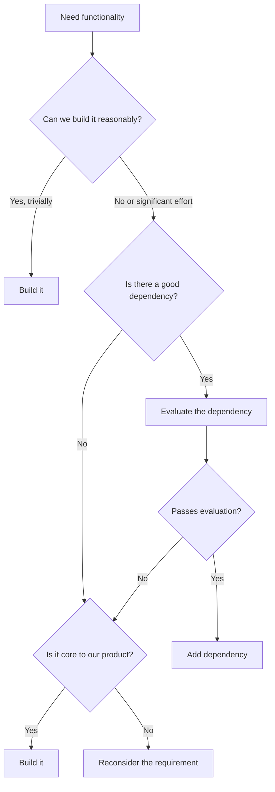
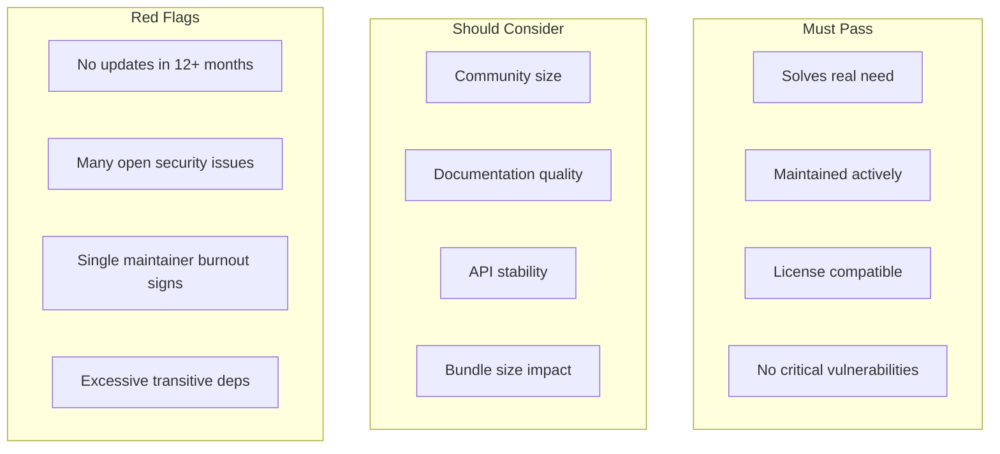

# Dependency Management

Dependencies are external code your project relies on. They accelerate development but introduce risk. Managing dependencies well means gaining their benefits while controlling their costs.

---

## Dependency Management Mindset

### Every Dependency Is a Trade-off

Dependencies provide:

- Functionality you don't have to build
- Expertise you don't have to develop
- Maintenance burden shared with others

Dependencies cost:

- Another codebase to understand
- Another source of bugs and vulnerabilities
- Another project that might be abandoned
- Build complexity and size

### The Dependency Decision



**Default to fewer dependencies.** The best dependency is often no dependency.

---

## Version Enforcement

> **IMPORTANT: Always use the latest stable version when adding dependencies.**

When adding any dependency, you MUST verify and use the current latest stable version from the official package registry. This is non-negotiable.

### When Older Versions Are Acceptable

Rare exceptions require explicit documentation:

Acceptable reasons for older version:

- Breaking changes in latest incompatible with project constraints
- Known critical bug in latest with no workaround
- Dependency on another package that requires specific version

Required documentation:

- Which version is being used
- What the latest stable version is
- Why the older version is necessary
- Plan to upgrade when possible

### Version Verification Workflow

1. Search official registry:
   - npm: npmjs.com/package/[name]
   - PyPI: pypi.org/project/[name]
   - crates.io: crates.io/crates/[name]
   - Go: pkg.go.dev/[import-path]
   - Ruby: rubygems.org/gems/[name]

2. Note the current latest stable version

3. Install that exact version:

```
npm install package@latest
pip install package # defaults to latest
cargo add package # defaults to latest
```

4. Verify installed version matches expected

---

## Evaluating New Dependencies

Before adding any dependency, evaluate it systematically.

### Evaluation Criteria



### Research Current Information

**Critical: Always search for current dependency information online. Do not rely on knowledge cutoff data.**

When evaluating or working with dependencies:

Always web search for:

- Current stable version number
- Latest release date and changelog
- Known vulnerabilities (CVEs)
- Breaking changes in recent versions
- Migration guides for major upgrades
- Current best practices for the dependency
- Official documentation URLs

Why this matters:

- Dependency ecosystems change rapidly
- Security vulnerabilities are discovered constantly
- Deprecated APIs and breaking changes happen
- Best practices evolve
- Knowledge cutoff data is outdated

**Unknown technical details:**

If you don't know:

- How to configure the dependency
- What the current API looks like
- How to handle specific use cases
- What the performance characteristics are
- What the breaking changes are

Then you must:

- ✓ Search official documentation
- ✓ Search for current usage examples
- ✓ Read recent release notes
- ✓ Check GitHub issues/discussions
- ✗ Never guess or use outdated knowledge
- ✗ Never recommend without verification

### Size and Scope Assessment

Prefer smaller, focused dependencies over large frameworks:

- Prefer: `date-fns` (import only functions you use)
- Over: `moment.js` (loads entire library)

- Prefer: Individual lodash functions (`lodash.debounce`)
- Over: Full lodash import

- Prefer: Focused libraries that do one thing well
- Over: Swiss-army-knife libraries with many features

---

### Version Pinning Strategies

**Exact version (most restrictive):**

```
"lodash": "4.17.21"
```

Use when:

- Dependency has history of breaking changes
- You need reproducible builds
- Security-critical dependency

**Caret (compatible with version):**

```
"lodash": "^4.17.21"
```

- Allows: 4.17.22, 4.18.0
- Blocks: 5.0.0

Use when:

- Dependency follows semver reliably
- You want automatic patch updates
- Most common choice

**Tilde (patch updates only):**

```
"lodash": "~4.17.21"
```

- Allows: 4.17.22
- Blocks: 4.18.0

Use when:

- You want only bug fixes
- Minor versions have caused issues

**Range (specific range):**

```
"lodash": ">=4.17.0 <5.0.0"
```

Use when:

- You need specific version constraints
- Working around known bad versions

### Lock Files

Always commit lock files:

```
npm:    package-lock.json
yarn:   yarn.lock
pnpm:   pnpm-lock.yaml
pip:    requirements.txt (pinned) or Pipfile.lock
go:     go.sum
rust:   Cargo.lock
```

Lock files ensure:

- Everyone uses identical versions
- Builds are reproducible
- Transitive dependencies are locked
- Security audits are accurate

---

### Finding Unused Dependencies

Tools to identify unused dependencies:

JavaScript:

```
npx depcheck
npx npm-check
```

Python:

```
pip-autoremove --list
deptry
```

Go:

```
go mod tidy (removes unused)
```

Rust:

```
cargo machete
```

---

## Dependency Management Checklist

### Adding Dependencies

- [ ] Documented specific need
- [ ] Searched for existing solutions
- [ ] Web searched for current version and information (not knowledge cutoff)
- [ ] Researched current documentation and best practices
- [ ] Evaluated maintenance health
- [ ] Checked license compatibility
- [ ] Assessed security vulnerabilities
- [ ] Reviewed size impact
- [ ] Pinned appropriate version
- [ ] Committed lockfile
- [ ] Documented decision

### Removing Dependencies

- [ ] Verify no longer used
- [ ] Search entire codebase
- [ ] Run full test suite
- [ ] Update documentation
- [ ] Commit lockfile changes
