# Dependency Management

Dependencies are external code your project relies on. They accelerate development but introduce risk. Managing dependencies well means gaining their benefits while controlling their costs.

---

## Dependency Management Mindset

### Every Dependency Is a Trade-off

Dependencies provide:

- Functionality you don't have to build
- Expertise you don't have to develop
- Maintenance burden shared with others

Dependencies cost:

- Another codebase to understand
- Another source of bugs and vulnerabilities
- Another project that might be abandoned
- Build complexity and size

### The Dependency Decision


**Default to fewer dependencies.** The best dependency is often no dependency.

---

## Version Enforcement

> [!IMPORTANT]
> **MANDATORY: Always use the latest stable version when adding dependencies.**

When adding any dependency, you MUST verify and use the current latest stable version from the official package registry. This is non-negotiable.

### Enforcement Checklist

Before adding any dependency, complete this checklist:

```
- [ ] Searched official registry for latest stable version
- [ ] Confirmed version being installed matches latest stable
- [ ] If using older version, documented explicit justification below
```

### When Older Versions Are Acceptable

Rare exceptions require explicit documentation:

```
Acceptable reasons for older version:
  - Breaking changes in latest incompatible with project constraints
  - Known critical bug in latest with no workaround
  - Dependency on another package that requires specific version

Required documentation:
  - Which version is being used
  - What the latest stable version is
  - Why the older version is necessary
  - Plan to upgrade when possible
```

### Version Verification Workflow

```
1. Search official registry:
   - npm: npmjs.com/package/[name]
   - PyPI: pypi.org/project/[name]
   - crates.io: crates.io/crates/[name]
   - Go: pkg.go.dev/[import-path]
   - Ruby: rubygems.org/gems/[name]

2. Note the current latest stable version

3. Install that exact version:
   npm install package@latest
   pip install package  # defaults to latest
   cargo add package    # defaults to latest

4. Verify installed version matches expected
```

---

## Evaluating New Dependencies

Before adding any dependency, evaluate it systematically.

### Evaluation Criteria


### Evaluation Checklist

**Necessity:**

```
- [ ] What specific problem does this solve?
- [ ] Could we solve it with existing dependencies?
- [ ] Could we solve it with a smaller dependency?
- [ ] Could we implement just what we need ourselves?
- [ ] Is this a one-time use or ongoing need?
```

**Quality:**

```
- [ ] How many weekly downloads / stars?
- [ ] When was the last release?
- [ ] How many open issues vs. closed?
- [ ] How responsive are maintainers to issues?
- [ ] Is there good documentation?
- [ ] Are there tests with reasonable coverage?
```

**Risk:**

```
- [ ] How many dependencies does it have?
- [ ] Are there known security vulnerabilities?
- [ ] What is the license? Is it compatible?
- [ ] Who maintains it? Company or individual?
- [ ] What happens if it's abandoned?
```

**Fit:**

```
- [ ] Does the API fit our coding style?
- [ ] What's the bundle size impact?
- [ ] Does it support our target platforms?
- [ ] Is it actively used by similar projects?
```

### Research Current Information

**Critical: Always search for current dependency information online. Do not rely on knowledge cutoff data.**

When evaluating or working with dependencies:

```
Always web search for:
  - Current stable version number
  - Latest release date and changelog
  - Known vulnerabilities (CVEs)
  - Breaking changes in recent versions
  - Migration guides for major upgrades
  - Current best practices for the dependency
  - Official documentation URLs

Why this matters:
  - Dependency ecosystems change rapidly
  - Security vulnerabilities are discovered constantly
  - Deprecated APIs and breaking changes happen
  - Best practices evolve
  - Knowledge cutoff data is outdated
```

**Research workflow:**

```
1. Search for: "[package-name] latest version [current year]"
2. Visit official package registry:
   - npm: npmjs.com/package/[name]
   - PyPI: pypi.org/project/[name]
   - crates.io: crates.io/crates/[name]
   - Go: pkg.go.dev/[import-path]
   - Ruby gems: rubygems.org/gems/[name]

3. Check official repository/documentation
4. Search for known issues: "[package-name] issues [current year]"
5. Check security: "[package-name] vulnerabilities CVE"
```

**Unknown technical details:**

```
If you don't know:
  - How to configure the dependency
  - What the current API looks like
  - How to handle specific use cases
  - What the performance characteristics are
  - What the breaking changes are

Then you must:
  ✓ Search official documentation
  ✓ Search for current usage examples
  ✓ Read recent release notes
  ✓ Check GitHub issues/discussions
  ✗ Never guess or use outdated knowledge
  ✗ Never recommend without verification
```

### Evaluating Maintenance Health

```
Healthy signs:
  ✓ Regular releases (at least yearly)
  ✓ Issues addressed within reasonable time
  ✓ Multiple active contributors
  ✓ Clear changelog and versioning
  ✓ Responsive to security reports

Warning signs:
  ⚠ No releases in 12+ months
  ⚠ Issues piling up without response
  ⚠ Single maintainer with declining activity
  ⚠ Deprecation notices without clear path
  ⚠ Forks gaining more traction than original

Red flags:
  ✗ Archived or explicitly abandoned
  ✗ Known unpatched security vulnerabilities
  ✗ Maintainer mass-deleting issues
  ✗ Hostile or erratic maintainer behavior
```

### Size and Scope Assessment

Prefer smaller, focused dependencies over large frameworks:

```
Prefer:
  date-fns (import only functions you use)
  Over: moment.js (loads entire library)

Prefer:
  Individual lodash functions (lodash.debounce)
  Over: Full lodash import

Prefer:
  Focused libraries that do one thing well
  Over: Swiss-army-knife libraries with many features
```

---

## Adding Dependencies

When you've decided to add a dependency, do it deliberately.

### Adding Process


### Version Pinning Strategies

**Exact version (most restrictive):**

```
"lodash": "4.17.21"

Use when:
  - Dependency has history of breaking changes
  - You need reproducible builds
  - Security-critical dependency
```

**Caret (compatible with version):**

```
"lodash": "^4.17.21"
Allows: 4.17.22, 4.18.0
Blocks: 5.0.0

Use when:
  - Dependency follows semver reliably
  - You want automatic patch updates
  - Most common choice
```

**Tilde (patch updates only):**

```
"lodash": "~4.17.21"
Allows: 4.17.22
Blocks: 4.18.0

Use when:
  - You want only bug fixes
  - Minor versions have caused issues
```

**Range (specific range):**

```
"lodash": ">=4.17.0 <5.0.0"

Use when:
  - You need specific version constraints
  - Working around known bad versions
```

### Lock Files

Always commit lock files:

```
npm:    package-lock.json
yarn:   yarn.lock
pnpm:   pnpm-lock.yaml
pip:    requirements.txt (pinned) or Pipfile.lock
go:     go.sum
rust:   Cargo.lock
```

Lock files ensure:

- Everyone uses identical versions
- Builds are reproducible
- Transitive dependencies are locked
- Security audits are accurate

---

## Managing Existing Dependencies

### Dependency Inventory

Maintain awareness of what you depend on:

```
Periodic inventory questions:
  - What dependencies do we have?
  - Which are direct vs. transitive?
  - Which are outdated?
  - Which have known vulnerabilities?
  - Which are no longer needed?
```

### Dependency Auditing

Regularly audit for security issues:

```
npm:    npm audit
yarn:   yarn audit
pip:    pip-audit, safety check
go:     govulncheck
rust:   cargo audit
```

Respond to audit findings:

```mermaid
flowchart TD
    A[Vulnerability found] --> B{Severity?}
    B -->|Critical/High| C[Address immediately]
    B -->|Medium| D[Address this sprint]
    B -->|Low| E[Add to backlog]
    C --> F{Patch available?}
    F -->|Yes| G[Update dependency]
    F -->|No| H{Exploitable in our use?}
    H -->|Yes| I[Find alternative or mitigate]
    H -->|No| J[Monitor for patch]
```



### Tracking Outdated Dependencies

Check for updates regularly:

```
npm:    npm outdated
yarn:   yarn outdated
pip:    pip list --outdated
go:     go list -u -m all
rust:   cargo outdated
```

---

## Updating Dependencies

Updates are necessary but risky. Approach them systematically.

### Update Strategy


### Patch Updates

Small bug fixes and security patches:

```
Approach:
  - Batch multiple patch updates together
  - Run test suite
  - Quick review of changelogs for surprises
  - Deploy with normal process

Frequency: Weekly or with each release
```

### Minor Updates

New features, non-breaking changes:

```
Approach:
  - Review changelog for each update
  - Check for deprecation warnings
  - Run full test suite
  - Test affected features manually
  - Monitor after deployment

Frequency: Monthly or quarterly
```

### Major Updates

Breaking changes, API modifications:

```
Approach:
  - Create dedicated branch
  - Read full migration guide
  - Plan for required code changes
  - Update incrementally if possible
  - Extensive testing
  - Consider feature flags for rollback

Frequency: As needed, planned deliberately
```

### Update Checklist

```
Before updating:
- [ ] Read changelog/release notes
- [ ] Check for breaking changes
- [ ] Review GitHub issues for update problems
- [ ] Ensure good test coverage of affected code

During update:
- [ ] Update in isolation (one dep at a time for majors)
- [ ] Run full test suite
- [ ] Check for deprecation warnings
- [ ] Verify build succeeds

After updating:
- [ ] Test affected functionality manually
- [ ] Monitor error rates after deployment
- [ ] Update documentation if APIs changed
- [ ] Commit lockfile changes
```

---

## Removing Dependencies

Removing unnecessary dependencies improves security, performance, and maintainability.

### When to Remove

```
Remove a dependency when:
  - It's no longer used
  - It's only used in one small place (inline the code)
  - A better alternative exists
  - It's been abandoned
  - It has unresolved security issues
  - Its functionality is now in the language/platform
```

### Removal Process


### Finding Unused Dependencies

Tools to identify unused dependencies:

```
JavaScript:
  npx depcheck
  npx npm-check

Python:
  pip-autoremove --list
  deptry

Go:
  go mod tidy (removes unused)

Rust:
  cargo machete
```

### Safe Removal Checklist

```
- [ ] Search codebase for all imports/requires
- [ ] Check for dynamic imports or requires
- [ ] Check build scripts and config files
- [ ] Check test files
- [ ] Remove from package manifest
- [ ] Run full test suite
- [ ] Build for all targets
- [ ] Verify no runtime errors
- [ ] Update lockfile
- [ ] Document removal reason
```

---

## Transitive Dependencies

Transitive dependencies are dependencies of your dependencies.

### Understanding the Dependency Tree

```
Your Project
├── express (direct)
│   ├── accepts (transitive)
│   │   ├── mime-types (transitive)
│   │   │   └── mime-db (transitive)
│   │   └── negotiator (transitive)
│   ├── body-parser (transitive)
│   └── ... (many more)
└── lodash (direct)
```

View your tree:

```
npm:    npm ls
yarn:   yarn list
pip:    pipdeptree
go:     go mod graph
rust:   cargo tree
```

### Managing Transitive Dependency Risks

```
Concerns:
  - You don't control their updates
  - Security vulnerabilities can hide deep
  - Version conflicts can occur
  - Size can balloon unexpectedly

Mitigations:
  - Use lockfiles (pins transitive versions)
  - Regular security audits (scans transitives)
  - Prefer dependencies with fewer dependencies
  - Use tools to visualize and analyze tree
```

### Overriding Transitive Versions

When you need to force a transitive dependency version:

```
npm (package.json):
  "overrides": {
    "vulnerable-package": "2.0.1"
  }

yarn (package.json):
  "resolutions": {
    "vulnerable-package": "2.0.1"
  }

pip (requirements.txt):
  vulnerable-package==2.0.1  # Pin directly

Go (go.mod):
  replace vulnerable-package => vulnerable-package v2.0.1
```

Use overrides sparingly—they can cause compatibility issues.

---

## License Compliance

Dependencies come with licenses that impose obligations.

### Common Licenses


### License Compatibility Quick Guide

```
MIT, Apache 2.0, BSD:
  ✓ Use in any project
  ✓ Modify and distribute
  ✓ Commercial use allowed
  → Just include the license notice

LGPL:
  ✓ Use in any project
  ✓ Commercial use allowed
  ⚠ Modifications to the library must be shared
  → Link dynamically if possible

GPL:
  ⚠ Your code may need to be GPL too
  ⚠ Consult legal for commercial use
  → Generally avoid for proprietary projects

AGPL:
  ⚠ Even network use triggers obligations
  ⚠ Very restrictive for SaaS
  → Avoid for most commercial projects

No License / Unlicensed:
  ✗ Legally risky
  ✗ No permission granted
  → Do not use without explicit permission
```

### License Auditing

Regularly audit licenses:

```
npm:    npx license-checker
yarn:   yarn licenses list
pip:    pip-licenses
go:     go-licenses
rust:   cargo-license
```

---

## Dependency Documentation

Document your dependencies for future maintainers.

### What to Document

```
For each significant dependency:
  - Why it was chosen
  - What alternatives were considered
  - Known limitations or gotchas
  - Update instructions if special
  - Replacement plan if deprecated
```

### Example Documentation

```markdown
## Dependencies

### Authentication: passport.js

- **Why**: Mature, supports 500+ auth strategies
- **Alternatives considered**: Auth0 (cost), custom (time)
- **Gotchas**: Session serialization requires explicit config
- **Update notes**: Check breaking changes in minor versions

### Date handling: date-fns

- **Why**: Tree-shakeable, smaller than moment.js
- **Alternatives considered**: moment.js (size), dayjs (fewer features)
- **Gotchas**: Import individual functions to minimize bundle
- **Update notes**: Standard semver, safe to update patches
```

---

## Dependency Management Checklist

### Adding Dependencies

```
- [ ] Documented specific need
- [ ] Searched for existing solutions
- [ ] Web searched for current version and information (not knowledge cutoff)
- [ ] Researched current documentation and best practices
- [ ] Evaluated maintenance health
- [ ] Checked license compatibility
- [ ] Assessed security vulnerabilities
- [ ] Reviewed size impact
- [ ] Pinned appropriate version
- [ ] Committed lockfile
- [ ] Documented decision
```

### Regular Maintenance

```
- [ ] Audit for security vulnerabilities (weekly)
- [ ] Check for outdated packages (monthly)
- [ ] Review and apply patch updates (with releases)
- [ ] Plan minor/major updates (quarterly)
- [ ] Prune unused dependencies (quarterly)
- [ ] Verify license compliance (quarterly)
```

### Updating Dependencies

```
- [ ] Web search for latest version and release information
- [ ] Read current changelog/release notes (not cached knowledge)
- [ ] Check for breaking changes
- [ ] Research migration steps if needed
- [ ] Run full test suite
- [ ] Test affected features
- [ ] Update lockfile
- [ ] Monitor after deployment
```

### Removing Dependencies

```
- [ ] Verify no longer used
- [ ] Search entire codebase
- [ ] Run full test suite
- [ ] Update documentation
- [ ] Commit lockfile changes
```
