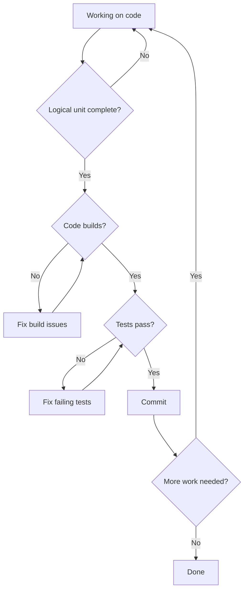
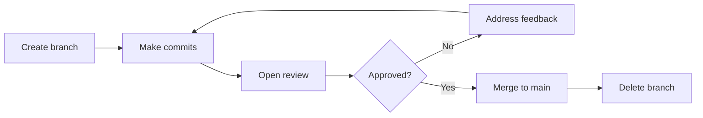

# Git Workflow

Version control is essential for managing code changes. This document covers practices for effective use of Git, focusing on creating clear, reviewable history.

---

## Commit Philosophy

Commits are the atoms of version control history. Good commits make history useful for understanding, reviewing, and debugging.

### What Makes a Good Commit

**Atomic** — Each commit represents one logical change.

```
Poor: "Fixed bug and added feature and refactored utils"
Better: Three separate commits:
  1. "Fix null check in user validation"
  2. "Add email notification on order completion"
  3. "Extract date formatting to utility function"
```

**Complete** — The commit stands alone; the codebase works after applying it.

```
Poor: A commit that breaks the build, followed by "Fix build"
Better: Single commit that includes both the change and the fix
```

**Buildable and testable** — After each commit, the code compiles and tests pass.

```
Commits should not require subsequent commits to be functional.
Each commit is a potential release point.
```

---

## Commit Sizing

### How Small

Commits should be small enough to:
- Review in a few minutes
- Understand at a glance
- Revert without losing unrelated work
- Bisect effectively when hunting bugs

### How Large

Commits should be large enough to:
- Represent a complete thought
- Build and pass tests
- Make sense in isolation

### Guidelines

```
Too small:
  - "Add opening brace"
  - "Add variable declaration"
  - "Add function body"
  These should be one commit.

Too large:
  - "Implement user authentication system"
  This should be multiple commits:
    - Add user model
    - Add password hashing
    - Add login endpoint
    - Add session management

Right size:
  - "Add password hashing utility"
  - "Add user login endpoint with validation"
  Each is complete, testable, and reviewable.
```

---

## When to Commit



Commit when:
- A logical unit of work is complete
- The code builds successfully
- Tests pass
- You can write a clear commit message describing what changed

Do not commit:
- At arbitrary stopping points (end of day, lunch break)
- With broken builds
- With failing tests
- With incomplete changes

---

## Commit Messages

Commit messages document what changed and why.

### Message Structure

```
Short summary (50 characters or less)

Longer description if needed. Wrap at 72 characters.
Explain what and why, not how (the code shows how).

- Bullet points are fine for listing changes
- Keep each point concise

References: TICKET-123
```

### Writing Good Messages

**Start with a verb** — Describe what the commit does.

```
Good:
  "Add user email validation"
  "Fix null pointer in order processing"
  "Remove deprecated authentication method"

Poor:
  "User email validation"
  "Bug fix"
  "Cleanup"
```

**Be specific** — Generic messages are not helpful.

```
Poor:
  "Fix bug"
  "Update code"
  "Various changes"

Better:
  "Fix race condition in concurrent order creation"
  "Update user model to include timezone field"
  "Rename OrderProcessor to OrderService for consistency"
```

**Explain why when not obvious** — The diff shows what changed; the message explains why.

```
Good:
  "Use insertion sort for small arrays

   Benchmarks show insertion sort outperforms quicksort for
   arrays under 50 elements due to lower overhead. This path
   is hit frequently in pagination code."
```

### Message Checklist

```
- [ ] Summary is 50 characters or less
- [ ] Summary starts with a verb
- [ ] Summary describes what the commit does
- [ ] Body explains why (if not obvious from summary)
- [ ] References related tickets/issues
- [ ] No typos or unclear language
```

---

## Branching

Branches isolate work in progress from the main codebase.

### Branch Naming

Use descriptive, consistent names:

```
feature/add-user-authentication
fix/order-validation-null-check
refactor/extract-payment-module
```

### Branch Lifecycle



### Keeping Branches Current

Long-running branches diverge from main. Regularly integrate changes:

```
Options:
  - Rebase onto main: Creates linear history
  - Merge main into branch: Preserves branch history

Either works; be consistent within a project.
```

---

## Before Committing

### Pre-Commit Checklist

```
- [ ] Changes match the intended scope (no accidental changes)
- [ ] Code builds successfully
- [ ] Tests pass
- [ ] No debugging code left in (console.log, print statements)
- [ ] No commented-out code without explanation
- [ ] Commit message is clear and follows conventions
```

### Review Your Own Diff

Before committing, review what you are about to commit:

```
git diff --staged
```

Check for:
- Unintended changes
- Debug code
- Temporary workarounds that should be removed
- Incomplete changes

---

## Commit Hygiene

### Atomic Changes

If you realize a commit should be split:

```
Before pushing, you can:
  - Amend the last commit
  - Interactive rebase to reorganize commits
  - Reset and re-commit in better chunks
```

### Commit History Quality

Good history:
- Each commit is understandable in isolation
- Bisect works (any commit can be built and tested)
- Related changes are grouped
- History tells the story of how the code evolved

Poor history:
- "WIP" commits mixed with real changes
- "Fix typo" commits scattered throughout
- Broken commits followed by fixes
- Merge commits that obscure the actual work

---

## Keeping Commits Releasable

Each commit should leave the codebase in a working state.

### Why This Matters

- **Bisect** — Finding bugs requires that each commit be runnable
- **Revert** — Rolling back requires that each commit be independent
- **Review** — Understanding changes requires that each commit make sense alone
- **Deploy** — Any commit could potentially go to production

### Achieving This

```
Approach:
  1. Plan changes before starting
  2. Implement in small, complete steps
  3. Verify each step before committing
  4. Combine incomplete work before sharing

If you have messy local history:
  - Use interactive rebase to clean up
  - Squash fixup commits
  - Reorder commits logically
  - This is fine BEFORE pushing
```

---

## Git Workflow Checklist

```
Committing:
- [ ] Change is a single, logical unit
- [ ] Code builds
- [ ] Tests pass
- [ ] Diff reviewed for unintended changes
- [ ] Commit message is clear and specific

Branching:
- [ ] Branch name is descriptive
- [ ] Branch is based on current main
- [ ] Branch is kept up to date with main

Before merging:
- [ ] All commits follow guidelines
- [ ] History is clean (no WIP, fixup commits)
- [ ] Branch is rebased/merged with current main
- [ ] CI passes
```
