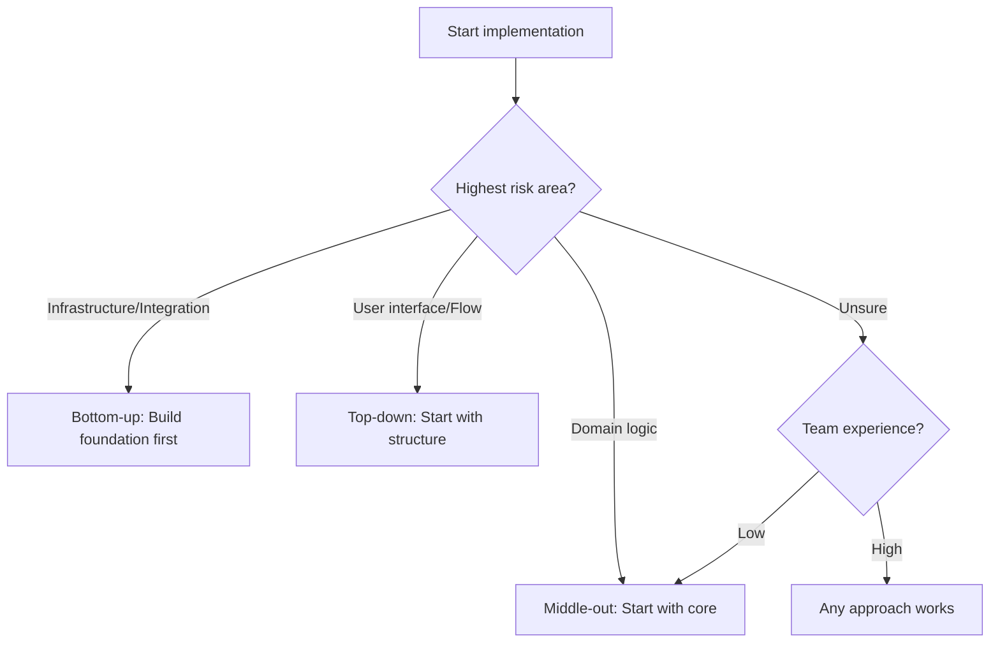

# Implementation Workflow

Implementation workflow guides the process of turning design into code. A disciplined approach produces better results than ad-hoc coding.

---

## Implementation Principles

### Work Incrementally

Build in small, verifiable steps rather than large leaps.

```
Poor approach:
  1. Write all the code
  2. Run it
  3. Debug the many issues

Better approach:
  1. Implement smallest useful piece
  2. Verify it works
  3. Commit
  4. Implement next piece
  5. Repeat
```

Benefits of incremental work:
- Errors are caught early, near their source
- Progress is visible and measurable
- Easier to stay focused
- Natural commit points

### Follow the Design

Implementation should realize the design, not reinvent it.

```
If the design specifies:
  - Component A handles validation
  - Component B handles persistence

Implementation should:
  - Put validation logic in Component A
  - Put persistence logic in Component B

Not:
  - Combine validation and persistence in Component A
  - Add a new Component C not in the design

If design changes are needed, update the design document.
```

### Verify Continuously

Do not wait until the end to test.

```
After implementing a function:
  - Does it handle the happy path?
  - Does it handle edge cases?
  - Does it handle errors?
  - Do existing tests still pass?
```

### Automate Repetitive Tasks

If you find yourself performing the same task twice, automate it with a script.

```
Signs you need automation:
  - Running the same command sequence repeatedly
  - Manually copying/transforming data between systems
  - Performing the same setup steps for each feature
  - Executing the same verification steps after changes
  - Applying the same code transformation to multiple files
```

**The automation rule:**

```
First time:  Do it manually, document the steps
Second time: Write a script AND use it immediately (no third time)
```

**When you catch yourself doing the same task twice:**

```
1. Stop and recognize the pattern
   "I'm about to run these same commands again..."

2. Write the script
   Create .sh, .py, or appropriate script
   Add clear comments and usage instructions
   Make it project-specific, not one-off

3. Document it
   Add to project README or docs/scripts.md
   Explain what it does, when to use it
   Document any prerequisites

4. Use the script for this occurrence
   Run the script instead of manual steps
   Verify it works correctly
   Refine if needed

From now on: Always use the script, never do it manually again
```

**What to automate:**

```
Good candidates:
  ✓ Build and test sequences
  ✓ Database setup and seeding
  ✓ Environment configuration
  ✓ Code generation from templates
  ✓ Deployment preparation
  ✓ Data migration or transformation
  ✓ Verification and validation checks

Poor candidates:
  ✗ One-time operations
  ✗ Tasks that change significantly each time
  ✗ Tasks requiring human judgment
  ✗ Complex operations better served by proper tooling
```

**Script quality guidelines:**

```
Scripts should:
  - Have clear names describing their purpose
  - Include usage documentation at the top
  - Check prerequisites before running
  - Provide clear error messages
  - Be idempotent when possible
  - Exit with appropriate status codes

Example script header:
  #!/bin/bash
  # Setup test database with seed data
  # Usage: ./setup-test-db.sh
  # Prerequisites: PostgreSQL running, .env file configured
```

**Benefits:**

```
Automation provides:
  - Consistency (same steps every time)
  - Speed (seconds vs minutes)
  - Documentation (script shows exact steps)
  - Error reduction (no skipped steps)
  - Onboarding (new team members use scripts)
  - Focus (automation handles tedious tasks)
```

**Remember:** Automation is not about writing perfect, generalized tools. It's about eliminating repetitive manual work with simple, project-specific scripts.

---

## Implementation Order

### Top-Down vs. Bottom-Up

**Top-down** — Start with high-level components, stub out dependencies.

```
Advantages:
  - See the big picture early
  - Validate overall structure
  - Can demo progress sooner

Disadvantages:
  - Stubs must be replaced
  - May not discover low-level issues early
```

**Bottom-up** — Start with foundational components, build upward.

```
Advantages:
  - Foundation is solid
  - Components are usable as built
  - Fewer stubs needed

Disadvantages:
  - Harder to see big picture
  - May build things that do not fit
```

**Middle-out** — Start with the core domain, extend outward.

```
Advantages:
  - Core logic is validated early
  - Interfaces emerge naturally

Disadvantages:
  - Requires good understanding of where the core is
```

### Choosing an Order



### Dependency Order

Implement components in dependency order when possible:

```
If B depends on A:
  1. Implement A
  2. Verify A works
  3. Implement B using A
  4. Verify B works

If circular dependency exists:
  - Reconsider the design
  - Or use interfaces/stubs to break the cycle
```

---

## The Implementation Loop

Repeat this cycle for each unit of work:

### 1. Understand

Before writing code, understand what you are building:
- What does this component do?
- What are the inputs and outputs?
- What are the edge cases?
- How does this fit with existing code?

### 2. Plan

Sketch out the approach:
- What are the steps?
- What existing code can be used?
- What needs to be created?
- What might be tricky?

### 3. Implement

Write the code:
- Start with the simplest case
- Add complexity incrementally
- Follow coding standards
- Handle errors appropriately

### 4. Verify

Confirm it works:
- Test the happy path
- Test edge cases
- Test error conditions
- Run existing tests

### 5. Refine

Improve the code:
- Is it readable?
- Is it following standards?
- Can it be simplified?
- Are there obvious improvements?

### 6. Commit

Record the change:
- Stage the relevant files
- Write a clear commit message
- Verify the commit is atomic

---

## Handling Blockers

Sometimes implementation hits obstacles.

### Types of Blockers

**Missing information** — Requirements or design is unclear.

```
Action:
  - Document the specific question
  - Ask for clarification
  - Do not guess on important decisions
```

**Technical obstacle** — Something does not work as expected.

```
Action:
  - Investigate and understand the issue
  - Check documentation and resources
  - Try alternative approaches
  - Ask for help if stuck too long
```

**Dependency on others** — Need something from another person or team.

```
Action:
  - Communicate the dependency clearly
  - Work on other things while waiting
  - Use stubs/mocks if possible
```

### Blocker Protocol

```
If blocked for more than [threshold]:
  1. Document what you have tried
  2. Formulate specific questions
  3. Ask for help with context
  4. Continue with other work if possible
```

---

## Implementation Checklist

### Before Starting

```
- [ ] Design is understood
- [ ] Requirements are clear
- [ ] Approach is planned
- [ ] Dependencies are identified
- [ ] Environment is ready
```

### During Implementation

```
- [ ] Working incrementally (small steps)
- [ ] Following the design
- [ ] Following coding standards
- [ ] Handling errors appropriately
- [ ] Verifying as you go
- [ ] Automating repetitive tasks (script on second occurrence)
- [ ] Committing atomic changes
```

### After Completing

```
- [ ] All requirements are addressed
- [ ] All tests pass
- [ ] Code is clean and readable
- [ ] No debugging artifacts remain
- [ ] Commits are organized
- [ ] Ready for review
```

---

## Common Implementation Mistakes

**Implementing without understanding** — Starting to code before understanding the requirements.

```
Symptom: Frequent rework, misaligned implementation
Fix: Spend time understanding before coding
```

**Big bang implementation** — Writing all the code before testing any of it.

```
Symptom: Long debugging sessions, many interrelated bugs
Fix: Implement and verify incrementally
```

**Diverging from design** — Making significant design changes during implementation without updating design.

```
Symptom: Implementation does not match documentation
Fix: Update design when changes are necessary; do not silently diverge
```

**Gold plating** — Adding features or improvements not in requirements.

```
Symptom: Scope creep, delayed completion
Fix: Implement what is specified; suggest improvements separately
```

**Skipping verification** — Assuming code works without testing it.

```
Symptom: Bugs discovered late, in integration or review
Fix: Verify each piece as you build it
```

---

## Incremental Verification

As you implement, verify continuously.

### Verification Approaches

**Manual testing** — Run the code and check behavior.

```
After implementing a function:
  - Call it with normal input
  - Call it with edge cases
  - Call it with invalid input
```

**Automated tests** — Write tests alongside implementation.

```
Before or after implementing:
  - Write test for happy path
  - Write tests for edge cases
  - Write tests for error cases
```

**Integration verification** — Check that components work together.

```
After connecting components:
  - Test the interaction
  - Verify data flows correctly
  - Check error propagation
```

### Verification Questions

After each unit of work:
- Does it do what it should?
- Does it handle edge cases?
- Does it fail gracefully?
- Does it integrate correctly?
- Do existing tests still pass?

---

## After Implementation

Once implementation is complete:

1. Review your own code before requesting review
2. Ensure all tests pass
3. Verify documentation is updated
4. Request code review
5. Address review feedback
6. Rebase (or merge) and proceed to testing

The code is not done until it is reviewed, tested, and integrated.
