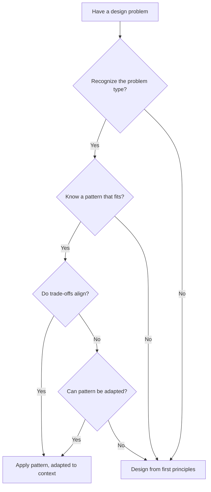

# Patterns

Patterns are proven solutions to recurring problems. Recognizing patterns helps you apply tested approaches rather than reinventing solutions.

---

## What Patterns Are

A pattern describes:

- **Problem** — A recurring situation that needs addressing
- **Solution** — A proven approach to the problem
- **Trade-offs** — What you gain and what you sacrifice
- **When to use** — Contexts where the pattern fits
- **When to avoid** — Contexts where the pattern hurts

Patterns are not templates to copy blindly. They are concepts to understand and adapt.

---

## Common Patterns

### Guard Clause

**Problem:** Deeply nested conditionals make code hard to follow.

**Solution:** Check for invalid conditions early and return/exit, then proceed with the main logic.

Without guard clauses:

```
process_order(order):
  if order is not null:
    if order.items is not empty:
      if order.user is valid:
        // actual processing here
        // deeply nested
```

With guard clauses:

```
process_order(order):
  if order is null:
    return error("Order is required")
  if order.items is empty:
    return error("Order must have items")
  if order.user is not valid:
    return error("Valid user required")

  // actual processing here, at top level
```

**When to use:** Functions with multiple preconditions.

**When to avoid:** When the conditions are part of the main logic, not preconditions.

---

### Null Object

**Problem:** Null checks scattered throughout code.

**Solution:** Provide a default object that implements the expected interface with safe, do-nothing behavior.

Without null object:

```
user = get_user(id)
if user is not null:
  name = user.name
else:
  name = "Guest"
```

With null object:

```
user = get_user(id)  // returns GuestUser if not found
name = user.name     // GuestUser.name returns "Guest"

GuestUser implements User interface:
  name = "Guest"
  can_purchase() = false
  permissions() = empty list
```

**When to use:** When null represents a valid, common case with consistent behavior.

**When to avoid:** When null represents an error that should be handled explicitly.

---

### Strategy

**Problem:** Multiple algorithms or behaviors that can be used interchangeably.

**Solution:** Define a common interface for the algorithms and allow them to be swapped.

Without strategy:

```
calculate_shipping(order, method):
  if method == "standard":
    return order.weight * 0.5
  else if method == "express":
    return order.weight * 1.5
  else if method == "overnight":
    return order.weight * 3.0
```

With strategy:

```
interface ShippingCalculator:
  calculate(order): number

StandardShipping implements ShippingCalculator:
  calculate(order) = order.weight * 0.5

ExpressShipping implements ShippingCalculator:
  calculate(order) = order.weight * 1.5

// Usage:
calculator = get_shipping_calculator(method)
cost = calculator.calculate(order)
```

**When to use:** When behavior varies based on configuration or context and new variations are likely.

**When to avoid:** When there are only a few fixed variations that are unlikely to change.

---

### Repository

**Problem:** Data access logic scattered throughout the application.

**Solution:** Encapsulate data access behind a defined interface.

Without repository:

```
// In various places throughout the code:
users = database.query("SELECT * FROM users WHERE active = true")
database.execute("UPDATE users SET name = ? WHERE id = ?", name, id)
```

With repository:

```
interface UserRepository:
  find_active_users(): list of User
  update_user(user): void

// Usage throughout code:
users = user_repository.find_active_users()
user_repository.update_user(user)
```

**When to use:** When you want to isolate data access and enable testing with fake data sources.

**When to avoid:** For simple scripts or applications with trivial data access.

---

### Factory

**Problem:** Object creation logic is complex or needs to vary.

**Solution:** Encapsulate creation logic in a separate component.

Without factory:

```
// Complex creation scattered in code
if config.type == "mysql":
  connection = MySQLConnection(config.host, config.port, config.user)
else if config.type == "postgres":
  connection = PostgresConnection(config.host, config.port, config.user)
connection.set_timeout(config.timeout)
connection.set_pool_size(config.pool_size)
```

With factory:

```
create_connection(config):
  if config.type == "mysql":
    connection = MySQLConnection(config.host, config.port, config.user)
  else if config.type == "postgres":
    connection = PostgresConnection(config.host, config.port, config.user)
  connection.set_timeout(config.timeout)
  connection.set_pool_size(config.pool_size)
  return connection

// Usage:
connection = create_connection(config)
```

**When to use:** When object creation involves multiple steps, conditional logic, or configuration.

**When to avoid:** When construction is straightforward.

---

### Builder

**Problem:** Creating complex objects with many optional parameters.

**Solution:** Provide a fluent interface to construct objects step by step.

Without builder:

```
// Many parameters, hard to read
query = Query("users", ["name", "email"], "active = true", "name ASC", 10, 0)
```

With builder:

```
query = QueryBuilder()
  .from("users")
  .select(["name", "email"])
  .where("active = true")
  .order_by("name ASC")
  .limit(10)
  .build()
```

**When to use:** When objects have many optional configuration options.

**When to avoid:** When objects are simple with few parameters.

---

## Anti-Patterns

Anti-patterns are common practices that seem helpful but cause problems.

### God Object

**Problem:** One class/module that knows and does too much.

```
UserManager:
  - Creates users
  - Validates passwords
  - Sends emails
  - Generates reports
  - Manages permissions
  - Handles billing
  // Everything user-related, and more
```

**Why it is harmful:** Changes ripple throughout the system. Testing is difficult. The class becomes a dumping ground.

**Solution:** Split responsibilities into focused components.

---

### Spaghetti Code

**Problem:** Tangled, unstructured code with unclear flow.

Signs:

- goto statements or equivalent jumps
- Deeply nested conditionals
- Functions that call each other in circles
- Global state modified from many places

**Why it is harmful:** Impossible to understand or modify safely.

**Solution:** Structure code with clear flow, single responsibilities, and limited nesting.

---

### Copy-Paste Programming

**Problem:** Duplicating code instead of abstracting common logic.

Signs:

- Multiple functions with nearly identical code
- Bug fixes needed in multiple places
- "Find and replace" across files to make changes

**Why it is harmful:** Bugs multiply. Changes require hunting for all copies.

**Solution:** Extract common logic. But see DRY principle—not all duplication is bad.

---

### Premature Optimization

**Problem:** Optimizing code before knowing if optimization is needed.

Signs:

- Complex caching before measuring performance
- Inline assembly for "performance" in non-critical paths
- Obscure algorithms chosen over clear ones "for speed"

**Why it is harmful:** Adds complexity without benefit. May optimize the wrong thing.

**Solution:** Write clear code first. Measure performance. Optimize where measurements show need.

---

### Golden Hammer

**Problem:** Using a familiar tool/pattern for everything, regardless of fit.

Signs:

- "We should use [favorite pattern] here"
- Forcing problems to fit solutions rather than finding appropriate solutions
- Same architecture regardless of problem size or type

**Why it is harmful:** Wrong tools create unnecessary complexity or miss better solutions.

**Solution:** Choose patterns based on the problem, not familiarity.

---

## Applying Patterns

### When to Use Patterns

Use patterns when:

- You recognize the problem the pattern solves
- The pattern's trade-offs align with your needs
- The pattern simplifies the solution

Do not use patterns when:

- The problem does not match what the pattern solves
- A simpler solution exists
- You are using it just to use it

### Pattern Selection



### Adapting Patterns

Patterns are not templates. Adapt them:

- Use the concept, not the exact structure
- Omit unnecessary parts
- Add what the pattern lacks for your context
- Name things appropriately for your domain

---

## Pattern Checklist

- [ ] Problem is clearly understood before selecting a pattern
- [ ] Pattern actually addresses the problem (not forced)
- [ ] Trade-offs are acceptable for this context
- [ ] Pattern is adapted to the specific situation
- [ ] Pattern is not over-applied (keep it simple)
- [ ] Anti-patterns are recognized and avoided
