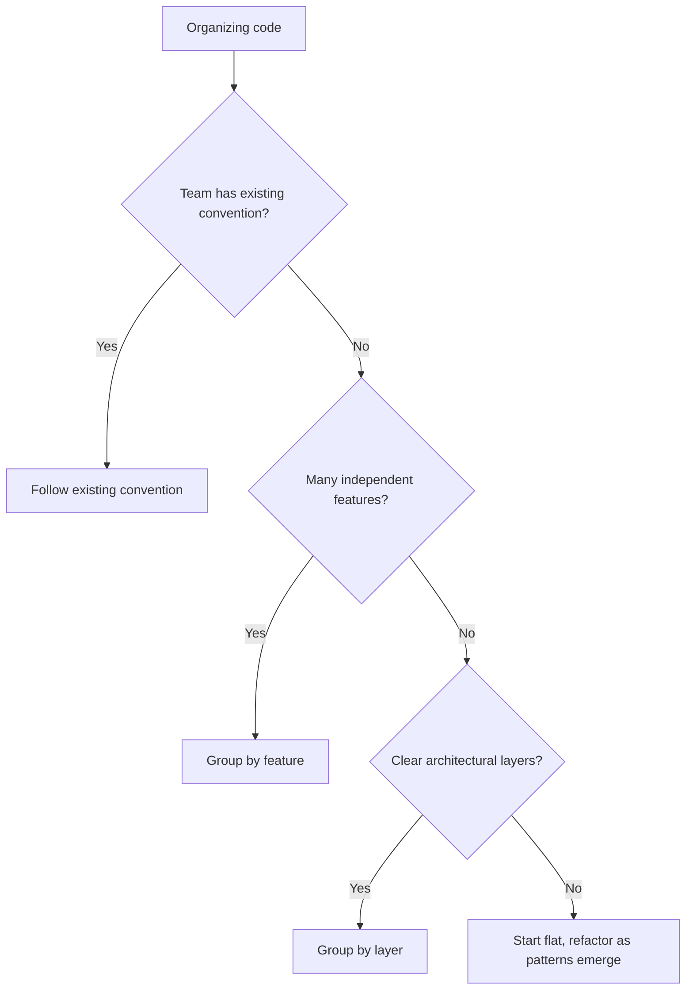

# Development Setup

Setup prepares the environment for implementation. A well-organized setup prevents confusion and enables consistent development practices.

---

## Environment Preparation

Before writing code, ensure the development environment is ready.

### Environment Consistency

Development environments should be reproducible:

- **Specify versions** — Pin dependency versions to avoid "works on my machine" problems
- **Document setup steps** — New developers should be able to set up quickly
- **Automate where possible** — Scripts for common setup tasks reduce errors
- **Isolate environments** — Avoid global installations that can conflict

---

## Project Structure

Organize code predictably. Consistent structure helps developers navigate unfamiliar parts of the codebase.

### Structure Principles

**Group by cohesion** — Related files belong together.

Cohesive grouping (by feature):

```
orders/
  order_service.py
  order_repository.py
  order_model.py
  order_test.py
```

Scattered grouping (by type):

```
services/order_service.py
repositories/order_repository.py
models/order_model.py
tests/order_test.py
```

Both approaches can work. Choose one and apply it consistently.

**Reflect architecture** — Structure should mirror architectural components.

If architecture has:

- API layer
- Service layer
- Data layer

Structure might be:

```
api/
services/
data/
```

**Separate concerns** — Keep different concerns in different places.

```
src/           — Application code
tests/         — Test code
config/        — Configuration files
scripts/       — Utility scripts
docs/          — Documentation
```

### Structure Decision



---

## Dependencies

Dependencies are external code your project relies on.

### Managing Dependencies

**Declare explicitly** — All dependencies should be listed in a manifest file.

Dependencies go in:

- `package.json` (Node.js)
- `requirements.txt` or `pyproject.toml` (Python)
- `Gemfile` (Ruby)
- `go.mod` (Go)
- `Cargo.toml` (Rust)

**Pin versions** — Specify exact versions or version ranges.

- Exact: `library==2.1.0`
- Range: `library>=2.1,<3.0`

Exact pins are more reproducible but require manual updates.  
Ranges allow automatic updates but risk breaking changes.

**Separate dev from production** — Development tools should not be production dependencies.

- Production: the library you use to serve requests
- Development: the linter, test framework, build tools

---

## Configuration

Configuration separates environment-specific values from code.

### Configuration Principles

**Externalize environment-specific values** — Database URLs, API keys, and feature flags should not be hardcoded.

**Use sensible defaults** — Code should work with minimal configuration in development.

**Fail clearly on missing required config** — If configuration is required, check for it at startup and fail with a clear message.

**Separate secrets from configuration** — Secrets need additional protection.

### Configuration Approaches

**Environment variables** — Simple, widely supported, secure for secrets.

```
DATABASE_URL=postgres://localhost/myapp
API_KEY=secret_key_here
DEBUG=true
```

**Configuration files** — Good for complex, structured configuration.

```
config/
  default.yaml     — Defaults for all environments
  development.yaml — Development overrides
  production.yaml  — Production overrides
```

**Code-based configuration** — When configuration is code (routes, middleware).

- Configuration loaded at startup, not scattered through codebase.

### Configuration Checklist

- [ ] All environment-specific values are externalized
- [ ] Configuration approach is documented
- [ ] Defaults exist for development
- [ ] Required configuration is validated at startup
- [ ] Secrets are handled securely (not in version control)
- [ ] Configuration can be overridden per environment

---

## Initial Project Scaffold

When starting a new project, establish structure early.

### Scaffold Checklist

- [ ] Directory structure created
- [ ] Dependency manifest initialized
- [ ] Configuration approach established
- [ ] Build/run scripts defined
- [ ] Testing infrastructure set up
- [ ] Version control initialized
- [ ] README with setup instructions exists
- [ ] CI/CD pipeline configured (if applicable)

### Scaffold Approach

**Minimal viable structure** — Start with what you need now.

```
project/
  src/           — Code goes here
  tests/         — Tests go here
  README.md      — How to set up and run
  .gitignore     — What not to track
  [dependency manifest]
```

**Grow as needed** — Add structure when complexity requires it.

- Don't create: `src/modules/feature_a/submodule_1/`
- Until you have: _Multiple features that need organization_

---

## Setup Verification

After setup, verify everything works.

### Verification Steps

1. Clean checkout: Clone the repository fresh
2. Follow setup instructions: Run documented setup steps
3. Run application: Start the application locally
4. Run tests: Execute the test suite
5. Make a change: Edit code, see the change reflected
6. Commit: Verify version control works

If any step fails, fix the setup and update documentation.

---

## Common Setup Mistakes

**Undocumented steps** — Setup requires knowledge not in documentation. Fix: Document every step.

**Global dependencies** — Setup requires globally installed tools without specifying versions. Fix: Use project-local tools with pinned versions.

**Stale instructions** — Documentation describes outdated setup. Fix: Verify instructions when making changes.

**Complex setup** — Setup requires many manual steps. Fix: Automate common setup tasks.

**Missing verification** — No way to know if setup worked. Fix: Include "hello world" verification step.

---

## After Setup

Once setup is complete:

1. Verify the environment works end-to-end
2. Document any deviations or issues encountered
3. Proceed to implementation following coding standards
4. Maintain setup documentation as the project evolves

Good setup is invisible—developers can start working without friction.
