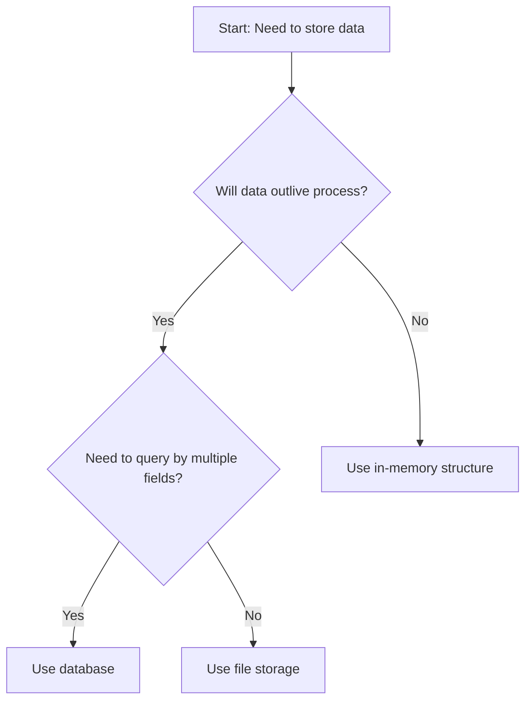

# Document Format

This document explains how to read and execute the protocol. Understanding these conventions ensures you interpret guidance correctly and apply it effectively.

---

## Document Structure

Each document in this protocol follows a consistent structure:

1. **Title and overview** — What the document covers and why it matters
2. **Context** — Background information needed to understand the guidance
3. **Main content** — The actual guidance, using checklists, decision trees, and prose
4. **Cross-references** — Links to related documents when concepts connect

Not every document contains every element. Simple topics may skip context; reference documents may omit decision trees.

---

## Checklists

Checklists are ordered lists of items to address. They appear throughout the protocol to guide verification and completion.

### Reading Checklists

Checklist: Before committing code

1. [ ] Tests pass
2. [ ] No new warnings introduced
3. [ ] Commit message follows convention
4. [ ] Changes match the stated intent

Each item should be verified or completed. The order matters—items often build on previous items.

### Checklist Types

**Sequential checklists** — Items must be completed in order. Later items depend on earlier ones.

Checklist: Setting up a new module

1. [ ] Create directory structure
2. [ ] Define public interface
3. [ ] Implement core functionality
4. [ ] Add tests

**Verification checklists** — Items can be checked in any order. All must pass.

Checklist: Code review readiness

- [ ] Functionality matches requirements
- [ ] Error cases are handled
- [ ] Code is readable
- [ ] No obvious performance issues

### Using Checklists

When executing a checklist:

1. Read the entire checklist first to understand scope
2. Address each item deliberately, not mechanically
3. If an item does not apply, note why and continue
4. If an item cannot be satisfied, stop and address the blocker
5. Completing a checklist should leave you confident the goal is achieved

---

## Decision Trees

Decision trees help select appropriate approaches based on context. They appear as Mermaid flowcharts.

### Reading Decision Trees



- **Rectangles** contain statements or starting points
- **Diamonds** contain questions to evaluate
- **Arrows** show paths based on answers

### Using Decision Trees

Navigate from the entry point, evaluating each question honestly, and follow the matching path to a terminal node. If no path fits your situation, see [decision-making.md](decision-making.md).

Decision trees simplify reality—they cannot capture every nuance or edge case. When a tree leads to an answer that feels wrong for your context, trust your judgment but document why you diverged.

---

## Prose Sections

Not everything fits checklists or decision trees. Prose sections provide:

- **Context** — Background needed to understand guidance
- **Rationale** — Why certain approaches are recommended
- **Examples** — Concrete illustrations of abstract concepts
- **Warnings** — Common mistakes and how to avoid them

### Reading Prose

Prose in this protocol is intentionally concise. Every paragraph serves a purpose:

- If something seems obvious, it is included because people commonly overlook it
- If something seems detailed, the details matter for correct execution
- If cross-references appear, following them adds important context

---

## Pseudocode

Code examples in this protocol use language-agnostic pseudocode. The goal is clarity, not executability.

### Pseudocode Conventions

```
function process_order(order):
    if order.items is empty:
        raise Error("Cannot process empty order")

    total = 0
    for each item in order.items:
        total = total + item.price

    return total
```

- **Indentation** shows structure
- **Plain English** describes operations (`for each`, `if`, `raise`)
- **Dot notation** accesses properties (`order.items`)
- **No type annotations** unless types are the point being made

### Reading Pseudocode

Pseudocode demonstrates concepts, not implementation details. When reading:

1. Focus on the logic being illustrated
2. Translate to your language and conventions when implementing
3. Consider edge cases the pseudocode may omit for brevity
4. Do not copy pseudocode literally—adapt it to your context

---

## Cross-References

Documents reference each other when concepts connect.

### Reference Types

**Inline references** — Mentioned within flowing text: "See [principles.md](principles.md) for guidance on trade-offs."

**See also sections** — Listed at document end for related topics.

**Prerequisite references** — Indicate documents to read first: "This document assumes familiarity with [terminology.md](terminology.md)."

### Following References

Not every reference requires immediate action:

- Follow references when you need the linked context
- Skip references if you already understand the linked concept
- Return to references when you encounter confusion later

---

## Mandatory vs. Optional Content

Some guidance is prescriptive; some is advisory.

### Recognizing the Difference

**Mandatory language:**

- "Must," "shall," "required"
- Checklists with all items marked as necessary
- Decision trees with single paths for given conditions

**Advisory language:**

- "Should," "recommended," "prefer"
- "Consider," "may want to"
- Multiple acceptable options presented

### Deviating from Guidance

When deviating from recommendations:

1. Ensure you understand why the recommendation exists
2. Confirm your situation genuinely differs
3. Document your reasoning for future reference
4. Be prepared to revisit if the deviation causes problems

Deviating from mandatory guidance requires stronger justification and should be rare.
