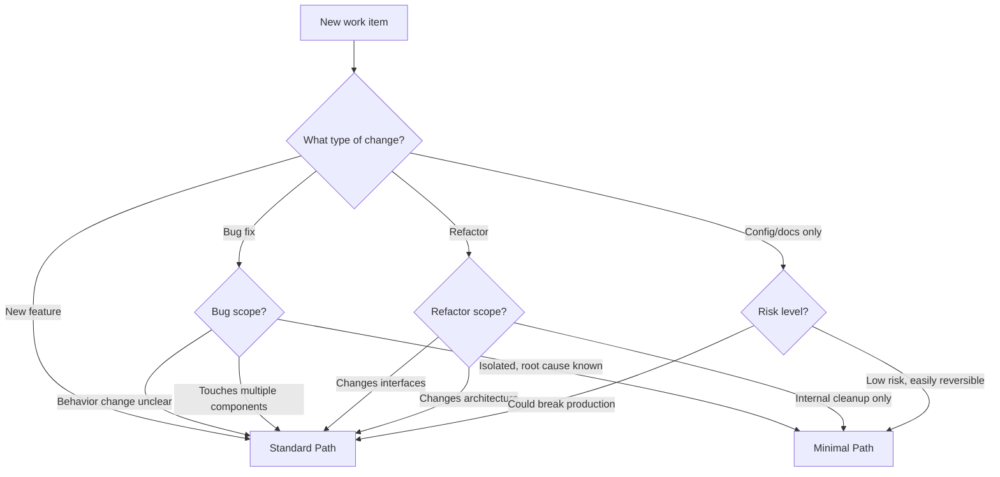

# Work Paths

Not all work requires the same level of ceremony. This document defines different paths through the DLP based on the scope and risk of the work.

---

## Quick Reference

| Path     | When to Use                       | Phases Required                   | Documentation Required |
| -------- | --------------------------------- | --------------------------------- | ---------------------- |
| Standard | New features, significant changes | All four phases                   | Full artifacts         |
| Minimal  | Small bug fixes, trivial changes  | DEVELOPMENT → TESTING (condensed) | Commit message only    |

---

## Path Selection

Before starting work, determine which path applies.

### Decision Tree



---

## Minimal Path

The Minimal Path is for small, well-understood changes where full ceremony adds friction without value.

### Qualification Checklist

ALL of the following must be true to use the Minimal Path:

- [ ] **Isolated change** — Touches one component or a small, related set of files
- [ ] **Root cause known** — You understand exactly why the bug occurs
- [ ] **Fix is obvious** — The solution is straightforward, no design decisions needed
- [ ] **Low risk** — Change cannot cause cascading failures or data loss
- [ ] **Easily reversible** — Can be reverted without complications
- [ ] **No new interfaces** — Does not add or modify public APIs, contracts, or schemas
- [ ] **Existing test coverage** — Tests exist or can be trivially added

If ANY criterion is not met, use the Standard Path.

### Minimal Path Workflow

#### 1. Verify Qualification

State why this change qualifies:

Minimal Path qualification:

- Isolated: Only affects [component/file]
- Root cause: [Brief explanation]
- Fix: [One-line description]
- Risk: Low — [why]
- Reversible: Yes — standard revert
- Interfaces: No changes
- Tests: [Existing tests / will add]

#### 2. Implement and Test

Follow the core implementation loop from `development/implementation-workflow.md`:

1. Understand the bug (reproduce it)
2. Implement the fix
3. Verify the fix works
4. Ensure existing tests pass
5. Add a test if none covers this case
6. Commit with a clear message

#### 3. Commit Message Requirements

Even on the Minimal Path, commit messages must be clear:

```
[Brief description of what was fixed]

Root cause: [What caused the bug]
Fix: [What the change does]
Test: [How it was verified]
```

#### 4. Exit Checklist

- [ ] Bug is fixed (verified manually or with test)
- [ ] No regressions (existing tests pass)
- [ ] New test added if gap existed
- [ ] Commit message documents the fix

---

## Standard Path

The Standard Path is the full DLP workflow for significant work.

### When to Use

Use the Standard Path for:

- New features of any size
- Bug fixes with unclear scope or root cause
- Changes affecting multiple components
- Changes to public interfaces or data schemas
- Work requiring design decisions
- Anything with non-trivial risk

### Standard Path Workflow

Follow the full phase sequence:

1. **REQUIREMENTS** — Define what needs to change and why
2. **DESIGN** — Plan how to implement the change
3. **DEVELOPMENT** — Build the solution
4. **TESTING** — Verify it works correctly

See `AGENTS.md` for full phase requirements and exit criteria.

---

## Path Escalation

If during Minimal Path work you discover:

- The root cause is different than expected
- The fix requires design decisions
- Multiple components are affected
- Risk is higher than anticipated

**Stop and escalate to the Standard Path.**

State:

```
> "🤖️: Escalating from MINIMAL PATH to STANDARD PATH.
> Reason: [Why the Minimal Path no longer applies]"
```

Then begin from the appropriate phase (usually REQUIREMENTS or DESIGN).

---

## Examples

### Minimal Path Examples

**Qualifies:**

- Fixing a typo in a validation error message
- Correcting an off-by-one error in a loop with clear test failure
- Fixing a null check that causes a crash in a specific edge case
- Updating a hardcoded value that should be different
- Fixing CSS that causes misalignment on a specific screen size

**Does NOT qualify:**

- Fixing a "bug" that might actually be intended behavior
- Fixing a race condition (requires understanding concurrency design)
- Fixing a bug by adding a new parameter to a public API
- Fixing a bug that appears in multiple places (may need refactoring)
- Fixing a bug when you're not sure why the fix works

### Standard Path Examples

- Adding a new API endpoint
- Implementing a new feature flag
- Refactoring authentication flow
- Changing database schema
- Fixing a bug that requires architectural understanding
- Any change the user explicitly wants designed first

---

## Anti-Patterns

### Forcing Minimal Path

**Problem:** Using Minimal Path to avoid documentation, then discovering complexity mid-implementation.

**Symptom:** "Quick fix" turns into hours of debugging and multiple attempts.

**Prevention:** Be honest about qualification criteria. When in doubt, use Standard Path.

### Over-Engineering Small Fixes

**Problem:** Using Standard Path for trivial changes, creating documentation overhead that adds no value.

**Symptom:** Spending an hour documenting a one-line typo fix.

**Prevention:** If all Minimal Path criteria are clearly met, use it.

### Scope Creep on Minimal Path

**Problem:** Starting with a small fix, then adding "just one more thing" repeatedly.

**Symptom:** Minimal Path work grows into a feature without proper design.

**Prevention:** If scope expands, stop and escalate. New scope requires new path evaluation.
