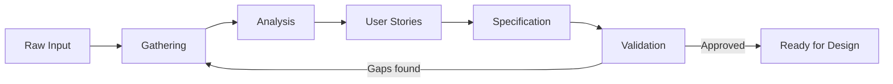

# Requirements Phase

Transform a vague idea into clear, actionable requirements. This phase bridges the gap between what someone wants and what will actually be built.

---

## Phase Summary

| Aspect             | Details                                                                |
| ------------------ | ---------------------------------------------------------------------- |
| **Goal**           | Define WHAT to build with testable acceptance criteria                 |
| **Entry Criteria** | User request, problem statement, or feature idea                       |
| **Exit Criteria**  | Validated specification ready for design                               |
| **Key Artifacts**  | Requirements specification, user stories                               |
| **Templates**      | `templates/requirements-specification.md`, `templates/user-stories.md` |

---

## Purpose

Requirements work answers the question: "What problem are we solving, and how will we know when it is solved?"

Without clear requirements:

- Development targets shift constantly
- "Done" is undefined and debatable
- Effort is wasted on unwanted features
- Important needs are discovered too late

## Inputs and Outputs

**Inputs:**

- User request, problem statement, or feature idea
- Existing system context (if enhancing or modifying)
- Constraints (time, technology, resources)

**Outputs:**

- Validated specification ready for design phase
- Clear acceptance criteria for each requirement
- Documented scope boundaries

## Contents

| Document                             | Purpose                                                                  |
| ------------------------------------ | ------------------------------------------------------------------------ |
| [gathering.md](gathering.md)         | Extracting requirements from sources through questions and analysis      |
| [analysis.md](analysis.md)           | Processing gathered information to identify implicit needs and conflicts |
| [user-stories.md](user-stories.md)   | Writing effective user stories and organizing them with story mapping    |
| [specification.md](specification.md) | Writing formal, testable requirement statements                          |
| [validation.md](validation.md)       | Confirming requirements are complete and approved                        |

## Reading Order

Work through these documents sequentially:

1. **gathering.md** — Collect raw information
2. **analysis.md** — Process and refine what you collected
3. **user-stories.md** — Capture requirements as user stories
4. **specification.md** — Formalize into precise statements
5. **validation.md** — Verify completeness and get approval

## Workflow

The process is iterative. Validation often reveals gaps that require returning to earlier steps.

## Key Principles

- **Ask before assuming** — Ambiguity resolved through questions is cheaper than ambiguity resolved through rework
- **Document the negative** — What is explicitly out of scope is as important as what is in scope
- **Testability is non-negotiable** — If you cannot describe how to verify a requirement, it is not ready
- **Stakeholder alignment matters** — Technical correctness means nothing if it does not solve the actual problem

## Exit Checklist: When to Proceed to Design

Complete ALL items before moving to the DESIGN phase:

- [ ] All requirements have clear acceptance criteria
- [ ] Scope boundaries are documented and agreed upon
- [ ] Stakeholders have reviewed and approved the specification
- [ ] No known ambiguities remain unresolved
- [ ] You could explain to someone else exactly what "done" means

If any item from the list above is incomplete, continue requirements work.

---

## Concerns to Reference

During requirements gathering, consider:

- **Security** (`concerns/security.md`) — Identify sensitive data, authentication needs, compliance requirements
- **Performance** (`concerns/performance.md`) — Define response time goals, throughput expectations
- **Accessibility** (`concerns/accessibility.md`) — Identify user accessibility needs
- **Observability** (`concerns/observability.md`) — Define monitoring and alerting requirements
