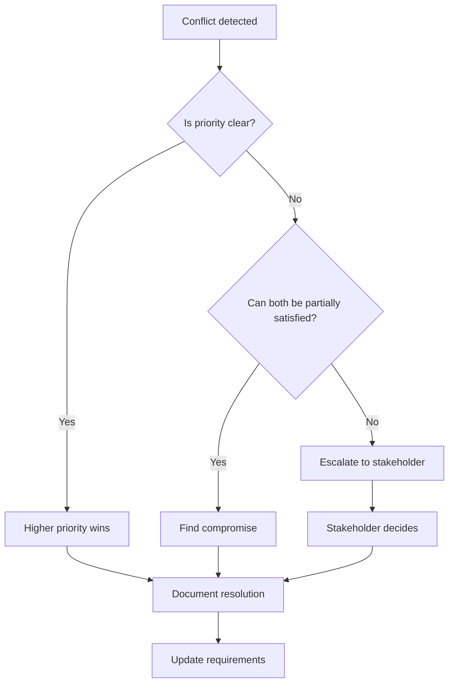

# Requirements Analysis

Analysis transforms raw gathered information into structured, actionable requirements. This phase processes what was collected, identifies gaps, resolves conflicts, and prioritizes what matters.

---

## The Analysis Process

Analysis is not passive reading—it is active interrogation of gathered information.

### What Analysis Produces

- Implicit requirements made explicit
- Conflicts identified and resolved
- Requirements prioritized by importance
- Scope boundaries clarified
- Dependencies between requirements mapped

### Analysis Mindset

Approach gathered information with constructive skepticism:

- What is stated explicitly?
- What is implied but not stated?
- What is missing?
- What contradicts something else?
- What depends on what?

---

## Identifying Implicit Requirements

Stakeholders often omit requirements they consider obvious. Your job is to surface them.

### Categories of Implicit Requirements

**Assumed functionality** — Features so expected they go unmentioned.

```
Stated: "Users should be able to create accounts"
Implicit:
  - Users should be able to log in after creating an account
  - Users should be able to log out
  - Users should be able to recover forgotten passwords
  - Users should not be able to create duplicate accounts
```

**Error handling** — What happens when things go wrong is rarely specified upfront.

```
Stated: "System should process payments"
Implicit:
  - What happens if payment fails?
  - What happens if payment times out?
  - What happens if payment is declined?
  - How is the user notified of payment status?
```

**Non-functional requirements** — Qualities the system must have beyond features.

- Performance: How fast must it respond?
- Security: What must be protected?
- Reliability: What uptime is expected?
- Scalability: How many users/requests must it handle?

**Edge cases** — Boundary conditions and unusual scenarios.

- Empty states (no data, first user, no results)
- Maximum limits (how many items, how large)
- Concurrent actions (two users editing the same thing)
- State transitions (what happens during processing)

### Surfacing Implicit Requirements

For each explicit requirement, ask:

1. What must be true before this can happen?
2. What must happen after this completes?
3. What could go wrong during this?
4. What variations exist?
5. What do users assume will happen?

---

## Detecting Conflicts

Gathered requirements may contradict each other. Conflicts must be resolved before proceeding.

### Types of Conflicts

**Direct contradiction** — Two requirements cannot both be satisfied.

```
Requirement A: "All actions should be logged for audit"
Requirement B: "System should not store any user activity data"
```

**Resource conflict** — Requirements compete for limited resources.

```
Requirement A: "System should respond within 100ms"
Requirement B: "System should analyze all historical data for recommendations"
```

**Scope conflict** — Stakeholders disagree about what is included.

```
Stakeholder A: "Mobile support is essential for launch"
Stakeholder B: "Mobile can wait until phase 2"
```

### Resolving Conflicts



When documenting conflict resolution:

```
CONFLICT: Audit logging vs. data minimization
Resolution: Log actions but anonymize user identifiers after 30 days
Decided by: Product owner, 2024-01-15
Trade-off: Reduced audit trail detail for older records
```

---

## Prioritization

Not all requirements are equally important. Prioritization guides what to build first and what to cut if needed.

### Prioritization Categories

**Must-have** — The solution is not viable without these. No negotiation.

**Should-have** — Important but not critical. The solution works without them, though less well.

**Nice-to-have** — Desirable if time permits. First to be cut under pressure.

**Won't-have (this time)** — Explicitly deferred. Documenting these prevents scope creep.

### Prioritization Criteria

When assigning priority, consider:

- **Value** — How much does this contribute to solving the core problem?
- **Risk** — How likely is this to cause problems if missing or done poorly?
- **Dependencies** — What else requires this to exist first?
- **Cost** — How much effort does this require relative to its value?

### Prioritization Checklist

1. [ ] Each requirement has an assigned priority
2. [ ] Must-have requirements are genuinely essential
3. [ ] Should-have and nice-to-have are distinguished
4. [ ] Deferred items are explicitly documented
5. [ ] Stakeholders agree with prioritization
6. [ ] Dependencies respect priority order (dependencies of must-haves are also must-haves)

---

## Defining Scope Boundaries

Scope defines what is in and what is out. Clear boundaries prevent scope creep and set realistic expectations.

### Documenting Scope

**In scope:**

- Explicit list of what will be delivered
- Boundaries of functionality (what it will do)
- Environments it will work in
- Users it will serve

**Out of scope:**

- Explicit list of what will not be delivered
- Related features deferred to later
- Platforms or environments not supported
- User types not served

**Scope boundaries:**

- Where this feature ends and another begins
- Integration points with other systems
- Handoff points to manual processes

### Scope Change Protocol

When scope changes are proposed after analysis:

1. Document the proposed change
2. Assess impact on existing requirements
3. Identify what must be added, modified, or removed
4. Evaluate effect on timeline and resources
5. Get explicit approval before incorporating

---

## Dependency Mapping

Requirements often depend on each other. Understanding dependencies affects prioritization and implementation order.

### Types of Dependencies

**Functional dependency** — One requirement cannot work without another.

```
"Users can filter search results" depends on "Users can search"
```

**Data dependency** — One requirement needs data produced by another.

```
"Generate monthly reports" depends on "Record daily transactions"
```

**Logical dependency** — One requirement only makes sense after another exists.

```
"Users can share saved items" depends on "Users can save items"
```

### Documenting Dependencies

Create a simple dependency map:

```
Requirement: User search
  Required for: Search filters, Search history, Search suggestions

Requirement: User accounts
  Required for: Saved searches, User preferences, Purchase history
  Requires: Email verification system
```

---

## Analysis Output

At the end of analysis, you should have:

**Refined requirements list** — All gathered requirements, cleaned up and expanded with implicit requirements.

**Conflict resolution log** — Any conflicts found and how they were resolved.

**Prioritized backlog** — Requirements ordered by importance with clear must-have/should-have/nice-to-have designations.

**Scope document** — Clear in-scope, out-of-scope, and boundary definitions.

**Dependency map** — Relationships between requirements that affect implementation order. Include a Mermaid diagram if possible.

**Risk register** — Requirements that are high-risk, uncertain, or may need revisiting.

---

## Analysis Checklist

- [ ] All gathered requirements are processed
- [ ] Implicit requirements are surfaced
- [ ] Conflicts are identified and resolved
- [ ] Requirements are prioritized
- [ ] Scope boundaries are clear
- [ ] Dependencies are mapped
- [ ] High-risk items are flagged
- [ ] Ready to proceed to specification

---

## Proceeding to Specification

Move to specification when:

- Analysis has stabilized (few new discoveries)
- Conflicts are resolved
- Priorities are assigned
- Scope is clear
- You have enough clarity to write precise statements

Specification will further refine and formalize what analysis produced.
