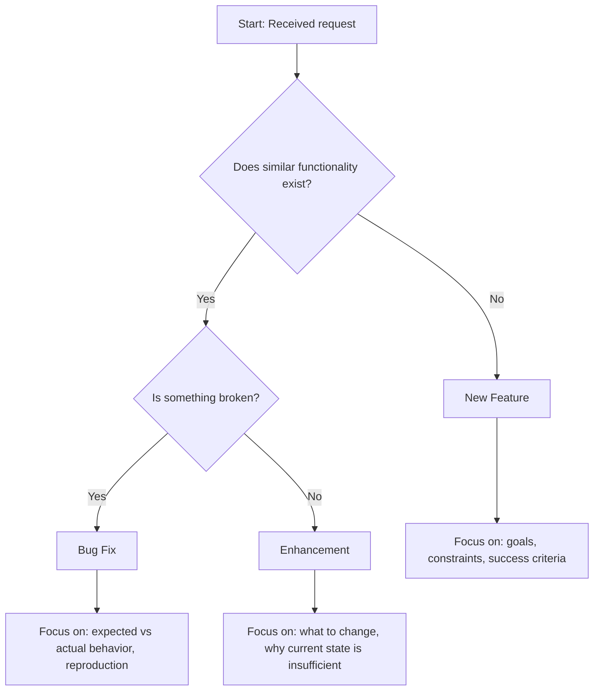
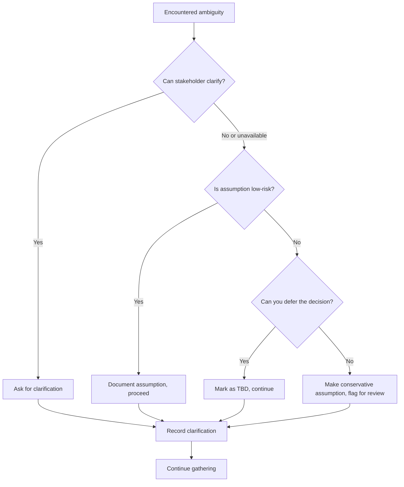

# Requirements Gathering

Gathering requirements means extracting information from sources—people, documents, existing systems—to understand what needs to be built. The goal is to capture enough information to proceed, not to achieve perfect understanding immediately.

---

## Sources of Requirements

Requirements come from multiple sources, each with different characteristics:

**Stakeholders** — People who want the software or will use it. They know what problems they have but may not know what solutions are possible.

**Existing systems** — Current software, manual processes, or workarounds reveal actual needs and pain points.

**Documentation** — Specifications, user guides, support tickets, and feature requests from previous work.

**Domain knowledge** — Industry standards, regulations, and common practices that apply regardless of what stakeholders mention.

---

## Classifying the Request

Before gathering details, understand what type of work you are dealing with.



**New Feature** — Something that does not exist. Requires understanding goals, constraints, and what success looks like.

**Bug Fix** — Something exists but does not work correctly. Requires understanding expected behavior, actual behavior, and reproduction steps.

**Enhancement** — Something exists and works but needs improvement. Requires understanding what to change and why the current state is insufficient.

---

## Questions to Ask

Effective gathering depends on asking the right questions. Different question types serve different purposes.

### Goal Questions

Understand the underlying need, not just the stated request.

- What problem are you trying to solve?
- What happens if this problem is not solved?
- What does success look like?
- Who benefits from this being built?
- Why now?

### Scope Questions

Establish boundaries around the work.

- What is the minimum that would be useful?
- What is explicitly not included?
- Are there related features that should wait?
- What existing functionality should remain unchanged?

### Context Questions

Understand the environment and constraints.

- Who will use this? In what situations?
- What systems does this need to work with?
- Are there performance or security requirements?
- What constraints exist (time, budget, technology)?
- What has been tried before?

### Detail Questions

Capture specific behaviors and edge cases.

- What inputs are expected?
- What outputs should be produced?
- What happens when things go wrong?
- Are there variations or special cases?
- What happens at boundaries (empty, maximum, minimum)?

### Verification Questions

Confirm understanding before proceeding.

- Let me summarize what I understand—is this correct?
- What would demonstrate that this is working?
- How will you know the problem is solved?

---

## Handling Ambiguity

Ambiguity is normal in early requirements. The question is how to resolve it.



### When to Ask

Ask for clarification when:
- The ambiguity affects core functionality
- Different interpretations lead to significantly different implementations
- You have no basis for a reasonable assumption
- Getting it wrong would be costly

### When to Assume

Make documented assumptions when:
- The stakeholder is unavailable and progress is needed
- The ambiguity is minor and easily corrected later
- Domain knowledge provides a reasonable default
- The assumption can be verified during validation

### Documenting Ambiguity

When you cannot resolve ambiguity immediately:

```
ASSUMPTION: User email addresses will be unique across the system.
Basis: Standard practice for account-based systems.
Risk if wrong: Medium - would require schema change.
To verify: Confirm with stakeholder before design phase.
```

---

## Gathering Checklist

Use this checklist to ensure comprehensive gathering:

```
[ ] Problem statement is understood
[ ] Success criteria are identified
[ ] Stakeholders are identified
[ ] Scope boundaries are discussed
[ ] Integration points are known
[ ] Constraints are documented
[ ] Happy path is described
[ ] Error scenarios are considered
[ ] Edge cases are explored
[ ] Assumptions are documented
[ ] Outstanding questions are listed
```

---

## Gathering Session Output

At the end of gathering, you should be able to produce:

**Problem statement** — One or two sentences describing what problem is being solved and for whom.

**Goals** — What the solution should achieve, stated in terms of outcomes rather than implementation.

**Constraints** — Fixed limitations that the solution must work within.

**Scope** — What is included and explicitly excluded.

**Initial requirements** — Rough statements of what the system should do, ready for analysis and refinement.

**Open questions** — Ambiguities or uncertainties that need resolution.

**Assumptions** — Decisions made without explicit confirmation, flagged for validation.

---

## Common Gathering Mistakes

**Jumping to solutions** — Gathering requirements, not designing solutions. Capture what is needed, not how to build it.

**Taking requests literally** — The stated request may not reflect the underlying need. Dig deeper with goal questions.

**Ignoring constraints** — Constraints are requirements too. A solution that ignores constraints is not a valid solution.

**Gathering in isolation** — Multiple stakeholders may have conflicting or complementary views. Ensure all perspectives are captured.

**Stopping too early** — If you have no open questions, you may not have asked enough questions. Some ambiguity is expected; none is suspicious.

---

## Proceeding to Analysis

Move to analysis when:
- You have a clear problem statement
- Core goals are understood
- Scope boundaries are sketched
- You have material to analyze (not just open questions)
- Continuing to gather yields diminishing returns

Analysis will reveal gaps that may require returning to gathering.
