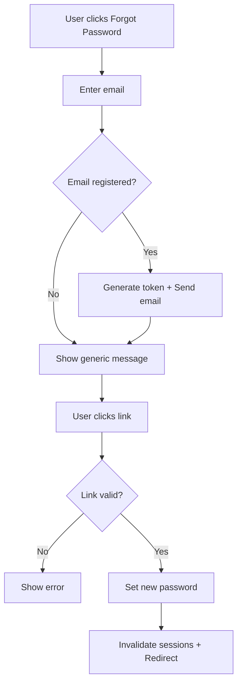

# Requirements Specification

Specification transforms analyzed requirements into precise, testable statements. A specification is the authoritative source of truth for what will be built—precise enough to implement and test against.

---

## What Makes a Good Specification

A well-written specification is:

**Unambiguous** — Each statement has one interpretation. Different readers reach the same understanding.

**Testable** — You can objectively determine whether the requirement is satisfied.

**Complete** — All necessary information is present. No critical details are left to interpretation.

**Consistent** — No requirement contradicts another. Terminology is used uniformly.

**Traceable** — Each requirement can be traced back to a need and forward to implementation and tests.

---

## Writing Requirement Statements

### Statement Structure

A requirement statement should specify:

- **Subject** — What entity or component is being described
- **Action** — What behavior or capability is required
- **Condition** — When or under what circumstances (if applicable)
- **Constraint** — Limits or qualities the behavior must have (if applicable)

### Good vs. Poor Statements

```
Poor: "The system should be fast"
Problems: Vague, not testable, no criteria for "fast"

Better: "Search results should appear within 2 seconds of submission"
Improvements: Specific action, measurable constraint, testable
```

```
Poor: "Users can manage their profile"
Problems: "Manage" is ambiguous, unclear what operations

Better: "Users can view, edit, and delete their profile information"
Improvements: Specific operations listed, actionable
```

```
Poor: "The system handles errors gracefully"
Problems: "Gracefully" is subjective, not testable

Better: "When a payment fails, the system displays the reason
         and offers retry or alternative payment options"
Improvements: Specific condition, specific response, testable
```

### Avoiding Ambiguous Language

Words that often introduce ambiguity:

| Avoid           | Problem             | Use Instead                                       |
| --------------- | ------------------- | ------------------------------------------------- |
| should/may      | Unclear if required | "must" for required, or state explicitly optional |
| fast/slow       | Subjective          | Specific time thresholds                          |
| user-friendly   | Subjective          | Specific UI behaviors                             |
| flexible        | Vague               | List specific variations supported                |
| etc., and so on | Incomplete          | Enumerate all items                               |
| appropriate     | Undefined           | Specify criteria                                  |
| reasonable      | Undefined           | Specify limits                                    |

---

## Acceptance Criteria

Acceptance criteria define exactly how to verify a requirement is satisfied. Every requirement needs acceptance criteria.

### Writing Acceptance Criteria

Acceptance criteria should be:

- **Binary** — Pass or fail, no partial credit
- **Observable** — Based on visible behavior, not internal state
- **Independent** — Each criterion can be verified separately
- **Specific** — No interpretation required

### Acceptance Criteria Formats

**Given-When-Then format** — Useful for behavior-focused criteria.

```
Requirement: Users can reset their password

Acceptance criteria:
- Given a user on the login page
  When they click "Forgot password" and enter their email
  Then they receive a password reset link within 5 minutes

- Given a valid password reset link
  When the user sets a new password meeting complexity requirements
  Then they can log in with the new password

- Given an expired password reset link (older than 24 hours)
  When the user attempts to use it
  Then they see an error and are prompted to request a new link
```

**Checklist format** — Useful for feature verification.

```
Requirement: User profile page

Acceptance criteria:
- [ ] Profile displays user name, email, and profile picture
- [ ] Edit button is visible only to the profile owner
- [ ] Profile picture can be changed by uploading an image
- [ ] Uploaded images are cropped to square and resized to 200x200px
- [ ] Invalid image formats show an error message
- [ ] Changes are saved only when user clicks "Save"
```

### Common Acceptance Criteria Gaps

Ensure criteria cover:

- Happy path (normal successful operation)
- Error cases (what happens when things fail)
- Edge cases (boundaries, limits, empty states)
- Permissions (who can and cannot perform the action)
- State changes (what data is affected)

---

## Edge Cases and Error Conditions

Edge cases often determine software quality. Specification must address them explicitly.

### Categories of Edge Cases

**Empty states**

- First user in the system
- Search with no results
- List with no items
- User with no activity

**Boundary conditions**

- Maximum allowed values
- Minimum allowed values
- Exactly at limits

**Invalid input**

- Wrong data type
- Missing required fields
- Malformed data
- Values outside allowed range

**Timing and sequence**

- Simultaneous actions
- Out-of-order operations
- Interrupted operations
- Timeout scenarios

**Resource limits**

- Large file uploads
- Many concurrent users
- Full storage
- Network unavailability

### Documenting Edge Cases

For each requirement, consider and document:

```
Requirement: Users can upload profile pictures

Edge cases:
- No picture uploaded: Display default avatar
- File too large (> 5MB): Show error, suggest compression
- Invalid format (not JPEG/PNG): Show error, list valid formats
- Upload interrupted: Discard partial upload, prompt retry
- Storage quota exceeded: Show error, suggest removing old files
```

---

## Non-Functional Requirements

Non-functional requirements (NFRs) specify qualities the system must have, not behaviors.

### Common NFR Categories

**Performance**

- Response time limits
- Throughput requirements
- Resource usage constraints

**Security**

- Authentication requirements
- Authorization rules
- Data protection needs
- Audit requirements

**Reliability**

- Uptime expectations
- Recovery time objectives
- Data durability requirements

**Scalability**

- Expected user/load growth
- Capacity requirements
- Degradation behavior under load

**Usability**

- Accessibility requirements
- Supported devices/browsers
- Internationalization needs

### Specifying NFRs

NFRs must be as precise as functional requirements:

```
Poor: "The system should be secure"

Better:
- All passwords must be hashed using bcrypt with cost factor 12
- Sessions expire after 30 minutes of inactivity
- Failed login attempts are rate-limited to 5 per minute per IP
- All data in transit uses TLS 1.2 or higher
```

```
Poor: "The system should handle many users"

Better:
- System supports 10,000 concurrent users
- Response time remains under 500ms at 80% capacity
- System degrades gracefully: read operations continue when writes are throttled
```

---

## Specification Document Structure

Organize specifications for clarity and navigation:

```
1. Overview
   - Purpose and scope
   - Stakeholders
   - Related documents

2. Functional Requirements
   2.1 Feature Area A
       - Requirement A.1
         - Description
         - Acceptance criteria
         - Edge cases
       - Requirement A.2
         ...
   2.2 Feature Area B
       ...

3. Non-Functional Requirements
   3.1 Performance
   3.2 Security
   3.3 Reliability
   ...

4. Constraints and Assumptions
   - Technical constraints
   - Business constraints
   - Documented assumptions

5. Glossary
   - Terms specific to this specification
```

---

## Specification Checklist

```
- [ ] Each requirement has a unique identifier
- [ ] Each requirement is unambiguous
- [ ] Each requirement has acceptance criteria
- [ ] Edge cases are documented
- [ ] Error conditions are specified
- [ ] Non-functional requirements are included
- [ ] Dependencies are noted
- [ ] Assumptions are documented
- [ ] Terminology is consistent
- [ ] Specification is internally consistent (no contradictions)
- [ ] Traceable to gathered requirements
```

## Real-World Examples

The following examples demonstrate specification structure. For complete templates, see `templates/`.

### Example 1: Password Reset Feature (Complete)

This example shows full specification depth for a security-critical feature.

**User Flow:**



```markdown
# Password Reset Specification

## Functional Requirements

### FR-1: Request Password Reset

**Description:** Users request reset link via email.

**Acceptance Criteria:**

- Given registered email → send reset link within 60 seconds
- Given unregistered email → show same message (prevent enumeration)

**Edge Cases:**

- Empty/invalid email: validation error
- Multiple requests: invalidate previous links
- Email service down: log error, show retry message

### FR-2: Reset Link Validation

- Links expire after 1 hour
- Single-use (invalidated after reset)
- Cryptographically random token (min 32 bytes)

### FR-3: Set New Password

**Acceptance Criteria:**

- Password: min 8 chars, mixed case, number, not in last 5

**Edge Cases:**

- Mismatched passwords: show error
- Invalid password: show failed requirement
- Concurrent link use: error on submit

## Non-Functional Requirements

### Security

- Tokens stored hashed
- Rate limit: 5 requests/email/hour, 10 attempts/IP/hour
- All activity logged

### Performance

- Email sent within 60 seconds
- Link validation < 200ms
```

### Example 2: Shopping Cart API (Skeleton)

Shows API specification structure—detail level depends on API complexity.

```markdown
# Shopping Cart API

## POST /api/cart/items

**Request:** product_id (required), quantity (1-99), variant_id (optional)

**Success (200):** cart_id, items[], subtotal, item_count

**Errors:**
| Code | Condition |
|------|-----------|
| 400 | Invalid quantity |
| 404 | Product not found |
| 409 | Out of stock |

**Business Rules:**

- Duplicate items: sum quantities
- Max 99 per item, 50 unique items
- Cart persists 30 days (guest) / indefinitely (logged in)

## GET /api/cart

Returns cart object (empty cart returns items: [], subtotal: 0)

## PATCH /api/cart/items/{id}

Update quantity (0 to remove)

## DELETE /api/cart/items/{id}

Remove item

## DELETE /api/cart

Clear cart
```

### Example 3: Dashboard Feature (Skeleton)

Shows UI specification structure—focus on metrics, interactions, and NFRs.

```markdown
# Sales Dashboard

## Metrics Displayed

| Metric          | Update Frequency |
| --------------- | ---------------- |
| Today's Revenue | Real-time        |
| Orders Today    | Real-time        |
| Avg Order Value | Real-time        |
| Conversion Rate | 5 minutes        |

- Each metric shows % change vs same day last week
- Visual indicators: ↑ green (positive), ↓ red (negative), — gray (<1%)

## Interactions

- Date range selector: Today, Yesterday, 7d, 30d, This Month, Custom (max 90d)
- Sales chart: line (hourly) for single day, bar (daily) for ranges
- Top products table: sortable, paginated (10 items, "show more")
- Store selector: visible only to multi-store users

## NFRs

- Initial load < 2s, range change < 1s
- Real-time latency < 30s
- Accessible: text alternatives, keyboard nav, screen reader compatible
```

---

## Proceeding to Validation

Move to validation when:

- All analyzed requirements are specified
- Acceptance criteria exist for each requirement
- Edge cases and errors are addressed
- NFRs are included
- The specification is internally consistent
- You believe a developer could implement from this document

Validation will verify the specification is correct and complete.
