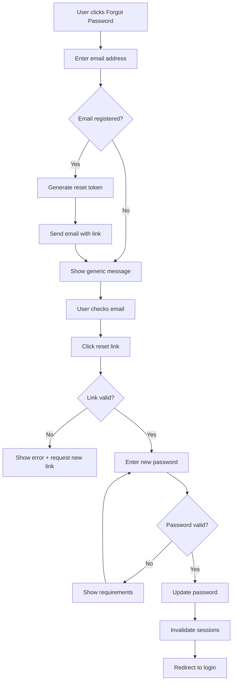
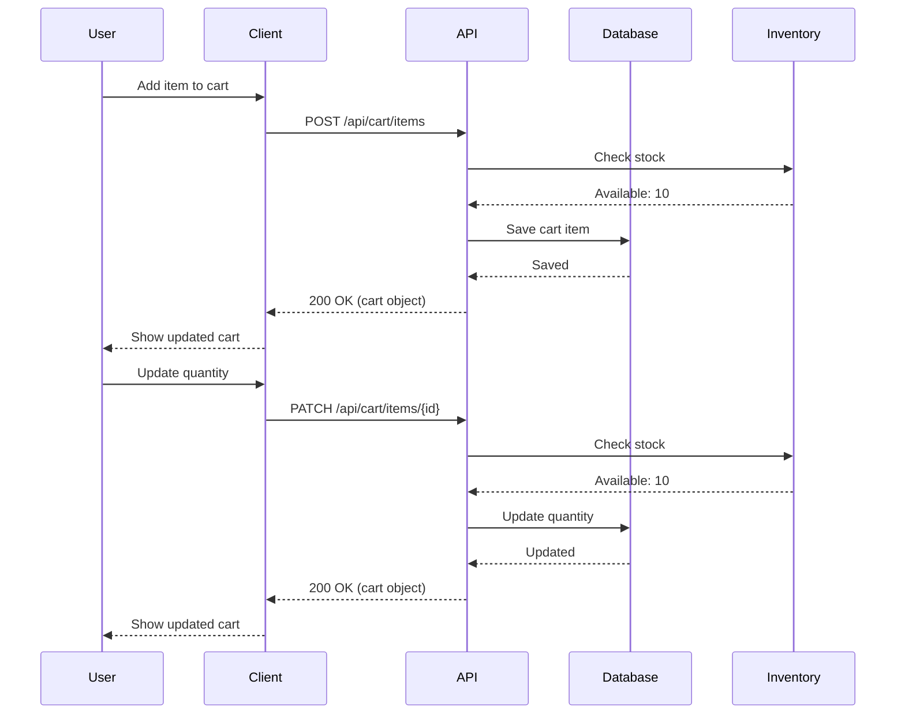
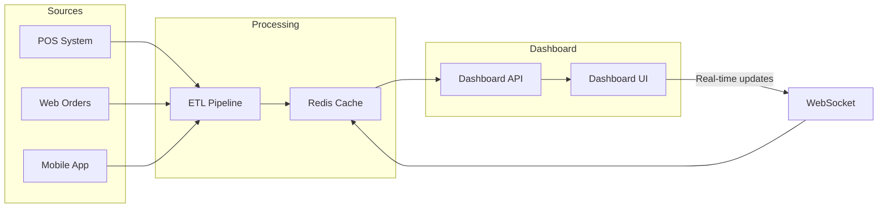

# Requirements Specification

Specification transforms analyzed requirements into precise, testable statements. A specification is the authoritative source of truth for what will be built—precise enough to implement and test against.

---

## What Makes a Good Specification

A well-written specification is:

**Unambiguous** — Each statement has one interpretation. Different readers reach the same understanding.

**Testable** — You can objectively determine whether the requirement is satisfied.

**Complete** — All necessary information is present. No critical details are left to interpretation.

**Consistent** — No requirement contradicts another. Terminology is used uniformly.

**Traceable** — Each requirement can be traced back to a need and forward to implementation and tests.

---

## Writing Requirement Statements

### Statement Structure

A requirement statement should specify:

- **Subject** — What entity or component is being described
- **Action** — What behavior or capability is required
- **Condition** — When or under what circumstances (if applicable)
- **Constraint** — Limits or qualities the behavior must have (if applicable)

### Good vs. Poor Statements

```
Poor: "The system should be fast"
Problems: Vague, not testable, no criteria for "fast"

Better: "Search results should appear within 2 seconds of submission"
Improvements: Specific action, measurable constraint, testable
```

```
Poor: "Users can manage their profile"
Problems: "Manage" is ambiguous, unclear what operations

Better: "Users can view, edit, and delete their profile information"
Improvements: Specific operations listed, actionable
```

```
Poor: "The system handles errors gracefully"
Problems: "Gracefully" is subjective, not testable

Better: "When a payment fails, the system displays the reason
         and offers retry or alternative payment options"
Improvements: Specific condition, specific response, testable
```

### Avoiding Ambiguous Language

Words that often introduce ambiguity:

| Avoid           | Problem             | Use Instead                                       |
| --------------- | ------------------- | ------------------------------------------------- |
| should/may      | Unclear if required | "must" for required, or state explicitly optional |
| fast/slow       | Subjective          | Specific time thresholds                          |
| user-friendly   | Subjective          | Specific UI behaviors                             |
| flexible        | Vague               | List specific variations supported                |
| etc., and so on | Incomplete          | Enumerate all items                               |
| appropriate     | Undefined           | Specify criteria                                  |
| reasonable      | Undefined           | Specify limits                                    |

---

## Acceptance Criteria

Acceptance criteria define exactly how to verify a requirement is satisfied. Every requirement needs acceptance criteria.

### Writing Acceptance Criteria

Acceptance criteria should be:

- **Binary** — Pass or fail, no partial credit
- **Observable** — Based on visible behavior, not internal state
- **Independent** — Each criterion can be verified separately
- **Specific** — No interpretation required

### Acceptance Criteria Formats

**Given-When-Then format** — Useful for behavior-focused criteria.

```
Requirement: Users can reset their password

Acceptance criteria:
- Given a user on the login page
  When they click "Forgot password" and enter their email
  Then they receive a password reset link within 5 minutes

- Given a valid password reset link
  When the user sets a new password meeting complexity requirements
  Then they can log in with the new password

- Given an expired password reset link (older than 24 hours)
  When the user attempts to use it
  Then they see an error and are prompted to request a new link
```

**Checklist format** — Useful for feature verification.

```
Requirement: User profile page

Acceptance criteria:
- [ ] Profile displays user name, email, and profile picture
- [ ] Edit button is visible only to the profile owner
- [ ] Profile picture can be changed by uploading an image
- [ ] Uploaded images are cropped to square and resized to 200x200px
- [ ] Invalid image formats show an error message
- [ ] Changes are saved only when user clicks "Save"
```

### Common Acceptance Criteria Gaps

Ensure criteria cover:

- Happy path (normal successful operation)
- Error cases (what happens when things fail)
- Edge cases (boundaries, limits, empty states)
- Permissions (who can and cannot perform the action)
- State changes (what data is affected)

---

## Edge Cases and Error Conditions

Edge cases often determine software quality. Specification must address them explicitly.

### Categories of Edge Cases

**Empty states**
- First user in the system
- Search with no results
- List with no items
- User with no activity

**Boundary conditions**
- Maximum allowed values
- Minimum allowed values
- Exactly at limits

**Invalid input**
- Wrong data type
- Missing required fields
- Malformed data
- Values outside allowed range

**Timing and sequence**
- Simultaneous actions
- Out-of-order operations
- Interrupted operations
- Timeout scenarios

**Resource limits**
- Large file uploads
- Many concurrent users
- Full storage
- Network unavailability

### Documenting Edge Cases

For each requirement, consider and document:

```
Requirement: Users can upload profile pictures

Edge cases:
- No picture uploaded: Display default avatar
- File too large (> 5MB): Show error, suggest compression
- Invalid format (not JPEG/PNG): Show error, list valid formats
- Upload interrupted: Discard partial upload, prompt retry
- Storage quota exceeded: Show error, suggest removing old files
```

---

## Non-Functional Requirements

Non-functional requirements (NFRs) specify qualities the system must have, not behaviors.

### Common NFR Categories

**Performance**
- Response time limits
- Throughput requirements
- Resource usage constraints

**Security**
- Authentication requirements
- Authorization rules
- Data protection needs
- Audit requirements

**Reliability**
- Uptime expectations
- Recovery time objectives
- Data durability requirements

**Scalability**
- Expected user/load growth
- Capacity requirements
- Degradation behavior under load

**Usability**
- Accessibility requirements
- Supported devices/browsers
- Internationalization needs

### Specifying NFRs

NFRs must be as precise as functional requirements:

```
Poor: "The system should be secure"

Better:
- All passwords must be hashed using bcrypt with cost factor 12
- Sessions expire after 30 minutes of inactivity
- Failed login attempts are rate-limited to 5 per minute per IP
- All data in transit uses TLS 1.2 or higher
```

```
Poor: "The system should handle many users"

Better:
- System supports 10,000 concurrent users
- Response time remains under 500ms at 80% capacity
- System degrades gracefully: read operations continue when writes are throttled
```

---

## Specification Document Structure

Organize specifications for clarity and navigation:

```
1. Overview
   - Purpose and scope
   - Stakeholders
   - Related documents

2. Functional Requirements
   2.1 Feature Area A
       - Requirement A.1
         - Description
         - Acceptance criteria
         - Edge cases
       - Requirement A.2
         ...
   2.2 Feature Area B
       ...

3. Non-Functional Requirements
   3.1 Performance
   3.2 Security
   3.3 Reliability
   ...

4. Constraints and Assumptions
   - Technical constraints
   - Business constraints
   - Documented assumptions

5. Glossary
   - Terms specific to this specification
```

---

## Specification Checklist

```
- [ ] Each requirement has a unique identifier
- [ ] Each requirement is unambiguous
- [ ] Each requirement has acceptance criteria
- [ ] Edge cases are documented
- [ ] Error conditions are specified
- [ ] Non-functional requirements are included
- [ ] Dependencies are noted
- [ ] Assumptions are documented
- [ ] Terminology is consistent
- [ ] Specification is internally consistent (no contradictions)
- [ ] Traceable to gathered requirements
```

---

## Real-World Examples

The following examples demonstrate complete requirement specifications for common features.

### Example 1: Password Reset Feature

**User Flow:**



```markdown
# Password Reset Feature Specification

## Overview
Allow users to securely reset their password when they forget it.

## Functional Requirements

### FR-1: Request Password Reset
**Description:** Users can request a password reset link via email.

**Acceptance Criteria:**
- Given a user on the login page
  When they click "Forgot Password"
  Then they see a form requesting their email address

- Given a valid registered email
  When submitted
  Then a reset link is sent within 60 seconds
  And user sees "If this email exists, a reset link has been sent"

- Given an unregistered email
  When submitted
  Then no email is sent
  And user sees the same message (prevents email enumeration)

**Edge Cases:**
- Empty email field: Show validation error
- Invalid email format: Show validation error
- User requests multiple times: Invalidate previous links, send new one
- Email service unavailable: Log error, show "try again later" message

### FR-2: Reset Link Validation
**Description:** System validates reset links before allowing password change.

**Acceptance Criteria:**
- Reset links expire after 1 hour
- Reset links are single-use (invalidated after successful reset)
- Reset links contain cryptographically random token (min 32 bytes)
- Invalid/expired links show clear error with option to request new link

### FR-3: Set New Password
**Description:** Users can set a new password via valid reset link.

**Acceptance Criteria:**
- Given a valid reset link
  When user clicks it
  Then they see a form to enter new password (twice)

- Password requirements:
  - Minimum 8 characters
  - At least one uppercase letter
  - At least one lowercase letter
  - At least one number
  - Cannot match last 5 passwords

- Given matching valid passwords
  When submitted
  Then password is updated
  And user is redirected to login with success message
  And all existing sessions are invalidated
  And confirmation email is sent

**Edge Cases:**
- Passwords don't match: Show error, don't submit
- Password doesn't meet requirements: Show specific requirement that failed
- Link used while filling form (by attacker): Show error on submit

## Non-Functional Requirements

### NFR-1: Security
- Reset tokens stored as hashed values (not plaintext)
- Rate limit: Max 5 reset requests per email per hour
- Rate limit: Max 10 reset attempts per IP per hour
- All reset activity logged for security audit

### NFR-2: Performance
- Reset email sent within 60 seconds of request
- Link validation responds within 200ms

## Dependencies
- Email service (SendGrid) for sending reset emails
- Existing user authentication system

## Assumptions
- Users have access to their registered email
- Email addresses are unique per user
```

### Example 2: Shopping Cart API

**Interaction Flow:**



```markdown
# Shopping Cart API Specification

## Overview
REST API endpoints for managing user shopping carts.

## API Endpoints

### POST /api/cart/items
Add item to cart.

**Request:**
| Field      | Type    | Required | Description                   |
| ---------- | ------- | -------- | ----------------------------- |
| product_id | string  | Yes      | Product identifier            |
| quantity   | integer | Yes      | Quantity to add (1-99)        |
| variant_id | string  | No       | Product variant (size, color) |

**Response Success (200):**
| Field      | Type    | Description         |
| ---------- | ------- | ------------------- |
| cart_id    | string  | Cart identifier     |
| items      | array   | All items in cart   |
| subtotal   | decimal | Cart subtotal       |
| item_count | integer | Total items in cart |

**Response Errors:**
| Code | Condition                      | Response                                                              |
| ---- | ------------------------------ | --------------------------------------------------------------------- |
| 400  | Invalid quantity (< 1 or > 99) | `{"error": "quantity_invalid", "message": "Quantity must be 1-99"}`   |
| 404  | Product not found              | `{"error": "product_not_found", "message": "Product does not exist"}` |
| 409  | Product out of stock           | `{"error": "out_of_stock", "available": 5}`                           |
| 422  | Variant required but missing   | `{"error": "variant_required", "variants": [...]}`                    |

**Business Rules:**
- If item already in cart, quantities are summed
- Maximum 99 of any single item
- Maximum 50 unique items per cart
- Cart persists for 30 days (guest) or indefinitely (logged in)

**Example:**
Request:
  POST /api/cart/items
  {"product_id": "PROD-123", "quantity": 2}

Response:
  {
    "cart_id": "cart_abc123",
    "items": [
      {
        "product_id": "PROD-123",
        "name": "Blue T-Shirt",
        "quantity": 2,
        "unit_price": 29.99,
        "line_total": 59.98
      }
    ],
    "subtotal": 59.98,
    "item_count": 2
  }

### GET /api/cart
Retrieve current cart.

**Response Success (200):**
Returns cart object (same structure as POST response).

**Response Empty Cart (200):**
  {
    "cart_id": "cart_abc123",
    "items": [],
    "subtotal": 0,
    "item_count": 0
  }

### PATCH /api/cart/items/{product_id}
Update item quantity.

**Request:**
| Field    | Type    | Required | Description                |
| -------- | ------- | -------- | -------------------------- |
| quantity | integer | Yes      | New quantity (0 to remove) |

**Response Errors:**
| Code | Condition                        |
| ---- | -------------------------------- |
| 404  | Item not in cart                 |
| 409  | Requested quantity exceeds stock |

### DELETE /api/cart/items/{product_id}
Remove item from cart.

**Response Success (200):** Updated cart object
**Response Error (404):** Item not in cart

### DELETE /api/cart
Clear entire cart.

**Response Success (200):** Empty cart object

## Non-Functional Requirements

### Performance
- All endpoints respond within 100ms (p95)
- Support 1000 concurrent cart operations

### Availability
- 99.9% uptime
- Cart data replicated across regions

### Data
- Cart contents encrypted at rest
- Guest cart linked to account on login
```

### Example 3: Dashboard Reporting Feature

**Data Flow:**



```markdown
# Sales Dashboard Specification

## Overview
Real-time dashboard showing key sales metrics for store managers.

## User Stories
- As a store manager, I want to see today's sales at a glance
  so that I can track daily performance
- As a store manager, I want to compare sales to previous periods
  so that I can identify trends
- As a regional manager, I want to see metrics across all my stores
  so that I can identify top and underperforming locations

## Functional Requirements

### FR-1: Dashboard Overview
**Description:** Main dashboard displays key metrics.

**Metrics Displayed:**
| Metric              | Description       | Update Frequency |
| ------------------- | ----------------- | ---------------- |
| Today's Revenue     | Total sales today | Real-time        |
| Orders Today        | Number of orders  | Real-time        |
| Average Order Value | Revenue / Orders  | Real-time        |
| Conversion Rate     | Orders / Visitors | Every 5 minutes  |

**Comparison Indicators:**
- Each metric shows % change vs same day last week
- Green arrow (↑) for positive change
- Red arrow (↓) for negative change
- Gray dash (—) for < 1% change

**Acceptance Criteria:**
- Dashboard loads within 2 seconds
- Metrics update without page refresh
- Data accurate within 30 seconds of transaction

### FR-2: Date Range Selection
**Description:** Users can view metrics for different time periods.

**Options:**
- Today (default)
- Yesterday
- Last 7 days
- Last 30 days
- This month
- Last month
- Custom range (max 90 days)

**Acceptance Criteria:**
- Changing date range updates all dashboard components
- Custom range validates start < end
- Custom range limited to 90 days maximum

### FR-3: Sales Chart
**Description:** Visual chart of sales over selected period.

**Chart Requirements:**
- Line chart for single day (hourly data points)
- Bar chart for multi-day ranges (daily data points)
- Hover shows exact values
- Can toggle between Revenue and Order Count views

### FR-4: Top Products Table
**Description:** Table showing best-selling products.

**Columns:**
| Column     | Description               | Sortable      |
| ---------- | ------------------------- | ------------- |
| Rank       | Position by revenue       | No            |
| Product    | Name with thumbnail       | No            |
| Units Sold | Quantity sold             | Yes           |
| Revenue    | Total revenue             | Yes (default) |
| % of Total | Percentage of total sales | Yes           |

**Features:**
- Shows top 10 by default
- "Show more" loads next 10
- Click product name to view product details

### FR-5: Store Selector (Regional Managers)
**Description:** Regional managers can filter by store.

**Options:**
- All Stores (aggregate view)
- Individual store selection
- Multi-select for comparing stores

**Acceptance Criteria:**
- Only visible to users with multi-store access
- Remembers last selection per user
- "All Stores" shows combined metrics

## Wireframe

The dashboard layout follows this structure:

+------------------------------------------------------------------+
|                        Sales Dashboard                            |
+----------------+----------------+----------------+----------------+
| Today's Revenue|    Orders      | Avg Order Value|  Conversion    |
|    $12,345     |      156       |     $79.13     |     3.2%       |
|     ↑ 12%      |     ↑ 8%       |      ↑ 4%      |     ↓ 2%       |
+----------------+----------------+----------------+----------------+
|                                 |                                 |
|     Sales Chart (line/bar)      |      Top Products Table         |
|                                 |                                 |
+---------------------------------+---------------------------------+

## Non-Functional Requirements

### NFR-1: Performance
- Initial load: < 2 seconds
- Date range change: < 1 second
- Real-time updates: < 30 second latency

### NFR-2: Accessibility
- All charts have text alternatives
- Color not sole indicator (patterns for color-blind users)
- Keyboard navigable
- Screen reader compatible

### NFR-3: Browser Support
- Chrome (last 2 versions)
- Firefox (last 2 versions)
- Safari (last 2 versions)
- Edge (last 2 versions)

## Dependencies
- Sales transaction database
- Analytics tracking system
- User permission system (for store access)

## Assumptions
- Transactions are recorded in real-time
- Store hierarchy is maintained in user management system
```

---

## Proceeding to Validation

Move to validation when:

- All analyzed requirements are specified
- Acceptance criteria exist for each requirement
- Edge cases and errors are addressed
- NFRs are included
- The specification is internally consistent
- You believe a developer could implement from this document

Validation will verify the specification is correct and complete.
