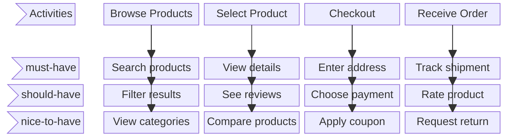
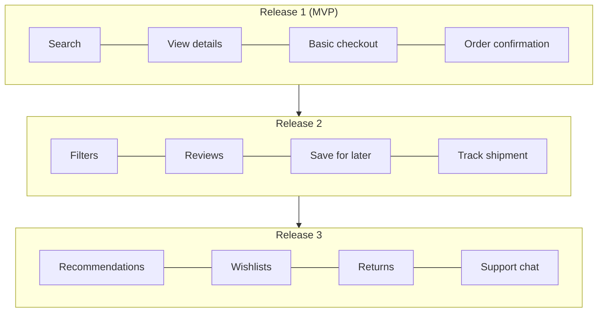
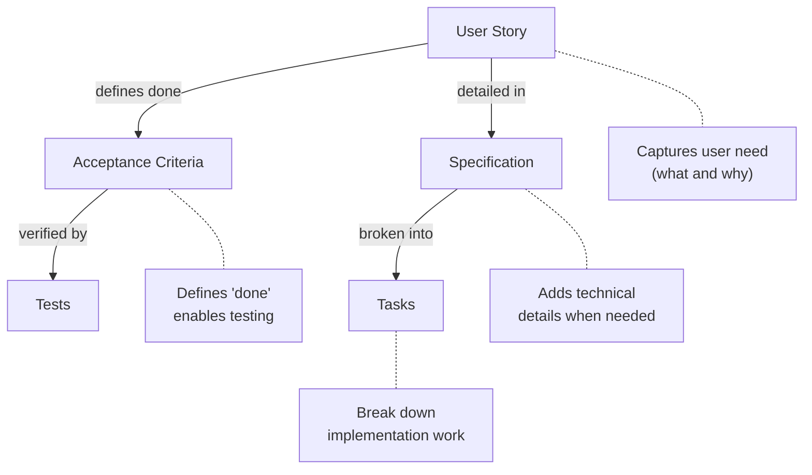

# User Stories

User stories capture requirements from the user's perspective. They describe what someone wants to accomplish and why, without specifying how to implement it.

---

## What Is a User Story

A user story is a short, informal description of a feature told from the perspective of someone who wants it. Stories focus on the value delivered to users, not technical implementation.

### The Standard Format

**IMPORTANT: Use code blocks**

```
As a [type of user]
I want [some goal]
So that [some reason/benefit]
```

**As a** — Identifies who wants this capability. Be specific about the role.

**I want** — Describes the goal or action. Focus on what, not how.

**So that** — Explains the benefit or value. This is often the most important part.

### Example Stories

```
As a registered customer
I want to save items to a wishlist
So that I can purchase them later without searching again

As a store manager
I want to see daily sales summaries
So that I can track performance without running manual reports

As a new visitor
I want to browse products without creating an account
So that I can evaluate the store before committing my information
```

### Why the Format Matters

The format enforces thinking about:

- **Who** benefits (not all users are the same)
- **What** they need (the actual capability)
- **Why** they need it (the underlying problem being solved)

**The "so that" clause often reveals the real requirement. If you cannot articulate why, you may not understand the need.**

---

## Writing Effective Stories

### The INVEST Criteria

Good user stories follow the INVEST principles:

**Independent** — Stories can be developed in any order. Minimize dependencies between stories.

```
Dependent (problematic):
  Story A: User can create account
  Story B: User can verify email (requires A)
  Story C: User can log in (requires A and B)

More independent:
  Story A: User can create account and log in with password
  Story B: User can add email verification to their account
  Story C: User can enable two-factor authentication

Each delivers value independently.
```

**Negotiable** — Stories are not contracts. Details are discussed and refined during development.

```
Too rigid:
  "Display exactly 10 products per page in a 2x5 grid with
   12px margins and blue borders"

Negotiable:
  "As a shopper, I want to browse products in pages
   so that I'm not overwhelmed by too many options"

  Implementation details are discussed when work begins.
```

**Valuable** — Each story delivers value to users or the business. No pure technical tasks.

```
Not valuable to users:
  "Refactor the database layer"
  "Update dependencies"

Valuable:
  "As a user, I want search results in under 2 seconds
   so that I don't lose patience while shopping"

  (May require database optimization, but frames it as user value)
```

**Estimable** — The team can roughly estimate the effort. If not, the story needs clarification or splitting.

```
Not estimable:
  "Improve the system performance"
  (Too vague to estimate)

Estimable:
  "As a user, I want the home page to load in under 3 seconds"
  (Clear scope, can estimate effort)
```

**Small** — Stories should be completable in a short time (typically within one iteration/sprint).

```
Too large:
  "As a user, I want to manage my entire profile"

Smaller:
  "As a user, I want to update my display name"
  "As a user, I want to change my profile picture"
  "As a user, I want to set my notification preferences"
```

**Testable** — Clear criteria exist to verify the story is complete.

```
Not testable:
  "As a user, I want the app to be intuitive"

Testable:
  "As a new user, I want to complete checkout without
   reading instructions so that I can buy quickly"

  Test: Can a new user complete a purchase unaided?
```

---

## Story Mapping

Story mapping is a technique for organizing user stories into a visual map that shows the big picture of a product or feature.

### The Map Structure



The backbone (top row) shows activities in the user journey from left to right. Stories hang below each activity, ordered by priority (must-have at top, nice-to-have at bottom).

### Building a Story Map

**Step 1: Identify the backbone**

List the major activities users perform, in sequence. These form the horizontal axis.

```
Example for e-commerce:
  Discover → Browse → Select → Purchase → Receive → Support
```

**Step 2: Add user tasks**

Under each activity, list the specific things users do. Order by priority (most important at top).

```
Under "Browse":
  - Search by keyword
  - Filter by category
  - Sort by price
  - View on sale items
```

**Step 3: Slice releases**

Draw horizontal lines to group stories into releases. Each slice should be a usable product.



### Benefits of Story Mapping

- **Sees the whole** — Individual stories in context of the full user journey
- **Identifies gaps** — Missing steps become visible
- **Enables prioritization** — Compare stories across the journey
- **Defines MVPs** — Draw a line for minimum viable slices
- **Communicates scope** — Stakeholders see what's included and what's not

---

## Splitting Large Stories

Large stories (epics) must be split into smaller, deliverable pieces. Split in ways that preserve user value.

### Splitting Strategies

**By workflow step**

Epic: "User can purchase a product"

Split into:

- User can add product to cart
- User can view and modify cart
- User can enter shipping address
- User can enter payment information
- User can confirm and place order

**By business rule variation**

Epic: "Calculate shipping cost"

Split into:

- Calculate flat-rate shipping
- Calculate shipping by weight
- Calculate expedited shipping options
- Apply free shipping for orders over $50

**By data type or variation**

Epic: "User can import contacts"

Split into:

- Import contacts from CSV file
- Import contacts from Google
- Import contacts from Outlook

**By user role**

Epic: "Manage inventory"

Split into:

- Warehouse staff can update stock counts
- Manager can set reorder thresholds
- Admin can configure warehouse locations

**By interface**

Epic: "User can access account on mobile"

Split into:

- View account summary on mobile web
- Optimized mobile checkout flow
- Mobile push notifications for order updates

**By operation (CRUD)**

Epic: "Manage saved addresses"

Split into:

- User can add new address
- User can view saved addresses
- User can edit existing address
- User can delete address
- User can set default address

### Splitting Anti-Patterns

Avoid splits that don't deliver value independently:

Bad splits (technical layers):

- Build database schema for orders
- Build API for orders
- Build UI for orders

None delivers value until all are complete.

Better splits (vertical slices):

- User can place simple order (one item, default options)
- User can order multiple items
- User can select shipping speed
- User can apply discount codes

Each delivers end-to-end value.

---

## Acceptance Criteria for Stories

Every user story needs acceptance criteria that define when it's complete.

### Writing Acceptance Criteria

Use concrete, testable conditions:

```
Story: As a customer, I want to search for products by name
       so that I can quickly find what I'm looking for

Acceptance criteria:
- Search box is visible on all pages
- Entering text and pressing Enter shows results
- Results display products with matching names
- Search is case-insensitive
- Results appear within 2 seconds
- "No results found" displays when nothing matches
- Partial matches are included (searching "shirt" finds "t-shirt")
```

### Given-When-Then Format

For behavior-focused criteria:

```
Story: As a shopper, I want to add items to my cart
       so that I can purchase multiple products at once

Acceptance criteria:

Given I am viewing a product page
When I click "Add to Cart"
Then the item appears in my cart
And the cart icon shows the updated count

Given I have an item in my cart
When I add the same item again
Then the quantity increases instead of duplicating

Given a product is out of stock
When I view its page
Then the "Add to Cart" button is disabled
And I see "Out of Stock" message
```

### Criteria Checklist

For each story, ensure criteria cover:

- [ ] Happy path (main success scenario)
- [ ] Empty/zero states
- [ ] Error handling
- [ ] Edge cases (limits, boundaries)
- [ ] Permissions (who can/cannot)
- [ ] Performance expectations (if relevant)

---

## Common User Story Mistakes

### Writing Technical Tasks as Stories

Wrong (this delivers no user value):

```
As a developer,
I want to refactor the auth module
so that the code is cleaner
```

Better:

```
As a user,
I want to stay logged in for 30 days
so that I don't have to log in every visit
```

Or don't make it a story. Technical work can be tasks attached to real user stories or handled separately.

### Skipping the "So That" Clause

```
Incomplete:
"As a user, I want to export my data"

Why? Compliance? Backup? Migration? Analysis?

Complete:
"As a user, I want to export my data as CSV
so that I can analyze my spending in a spreadsheet"

The reason shapes the implementation.
```

### Making Stories Too Large

Too large: "As a user, I want to manage my account"

This is an epic containing many stories.

Right-sized:

- "As a user, I want to change my password"
- "As a user, I want to update my email address"
- "As a user, I want to enable two-factor authentication"

### Writing Implementation Details

Too specific (this prescribes the solution):

```
"As a user, I want to click the blue button in the top-right
corner that opens a modal with a form containing..."
```

Appropriate (let design solve how):

```
"As a user, I want to quickly contact support
so that I can get help with my order"
```

### Forgetting Non-Happy Paths

Incomplete:

```
"As a user, I want to upload my resume"

What about invalid files? Too large? Wrong format? Network error?
```

Complete (with acceptance criteria):

```
"As a user, I want to upload my resume"

Criteria:

- Accepts PDF, DOC, DOCX formats
- Maximum file size: 5MB
- Shows progress during upload
- Shows error if format invalid
- Shows error if size exceeded
- Allows retry if upload fails
```

---

## User Stories in the Workflow

### Relationship to Other Requirements Artifacts



### When to Use User Stories

User stories work well for:

- Feature development
- User-facing functionality
- Iterative/agile development
- Requirements that benefit from discussion

User stories work less well for:

- Highly technical infrastructure work
- Compliance requirements with precise specifications
- Bug fixes (just describe the bug)
- Simple changes that need no discussion

---

## Story Writing Checklist

Before writing:

- [ ] Identified the specific user role
- [ ] Understood the underlying need (not just the request)
- [ ] Confirmed this delivers user or business value

The story:

- [ ] Follows "As a... I want... So that..." format
- [ ] Is independent (minimal dependencies)
- [ ] Is small enough to complete in one iteration
- [ ] Has clear acceptance criteria
- [ ] Covers error cases and edge cases

Story mapping:

- [ ] Stories organized by user journey
- [ ] Priorities clear (must-have vs. nice-to-have)
- [ ] MVP slice identified
- [ ] Gaps in journey identified
