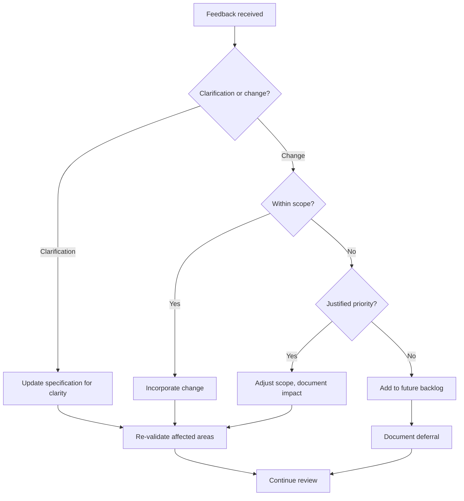

# Requirements Validation

Validation confirms that the specification is correct, complete, and ready for design. This is the final checkpoint before investing significant effort in implementation.

---

## Why Validation Matters

Errors caught during validation are far cheaper to fix than errors caught during implementation or after release.

- Requirements errors found during design: cost X to fix
- Requirements errors found during implementation: cost 5-10X to fix
- Requirements errors found after release: cost 50-100X to fix

Validation is not bureaucracy—it is risk reduction.

---

## Validation vs. Verification

**Validation** — Are we building the right thing? Does the specification solve the actual problem?

**Verification** — Are we building it right? Does the implementation match the specification?

This document covers validation. Verification happens during testing.

---

## Stakeholder Review

Specifications must be reviewed by stakeholders to confirm alignment with actual needs.

### Preparing for Stakeholder Review

Before presenting to stakeholders:

1. Ensure the specification is in reviewable form (not a rough draft)
2. Prepare a summary of key decisions and trade-offs
3. List any areas where you have concerns or low confidence
4. Identify questions that require stakeholder input

### Conducting the Review

During stakeholder review:

- Walk through requirements at appropriate detail level
- Confirm understanding, not just agreement
- Ask "Is this what you meant?" not "Is this okay?"
- Pay attention to hesitation or confusion
- Document all feedback, questions, and concerns

### Review Questions

Ask stakeholders:

- Does this solve your original problem?
- Is anything missing that you expected to see?
- Is anything included that should not be?
- Are the priorities correct?
- Are there any concerns about what is specified?
- Can you think of scenarios we have not covered?

### Handling Review Feedback

---

## Quality Criteria

A requirement passes quality review when it satisfies these criteria:

### Individual Requirement Quality

**Atomic** — Requirement describes one thing, not multiple bundled together.

- Poor: "Users can create, edit, and delete posts, and posts can have comments"
- Better: Separate requirements for post CRUD and comment functionality

**Essential** — Requirement is necessary; removing it would leave a gap.

**Consistent** — Requirement does not conflict with other requirements.

**Unambiguous** — Only one interpretation is possible.

**Testable** — Objective criteria exist to verify satisfaction.

**Traceable** — Requirement links back to a stated need.

### Specification Quality

**Complete** — All necessary requirements are present.

**Consistent** — No internal contradictions.

**Modifiable** — Changes can be made without extensive rewrites.

**Prioritized** — Relative importance is clear.

**Verifiable** — The specification as a whole can be validated.

---

## Validation Checklist

Use this checklist before signing off on requirements:

Completeness

- [ ] All features are specified
- [ ] All error cases are covered
- [ ] All edge cases are addressed
- [ ] NFRs are included
- [ ] Scope boundaries are clear
- [ ] No TBD items remain

Consistency

- [ ] No contradictions between requirements
- [ ] Terminology is uniform
- [ ] Priorities are coherent

Testability

- [ ] All requirements have acceptance criteria
- [ ] All criteria are objectively verifiable

Feasibility

- [ ] Technical approach is viable
- [ ] Constraints are respected
- [ ] Resources are available

Stakeholder Alignment

- [ ] Stakeholders have reviewed the specification
- [ ] Feedback has been incorporated
- [ ] Approval has been received

---

## When Validation Fails

If validation reveals problems:

### Missing Requirements

Return to gathering to collect missing information, then re-analyze and re-specify.

### Contradictions

Return to analysis to resolve conflicts, then update specification.

### Unclear Criteria

Rework the specific requirements in specification to add clarity.

### Stakeholder Disagreement

Return to gathering to understand the disagreement, re-analyze priorities, update specification.

### Feasibility Concerns

Adjust scope or constraints, return to analysis to reprioritize.

---

## Proceeding to Design

Once validation passes:

1. Archive the approved specification
2. Use it as the authoritative reference for design
3. Treat changes as scope changes requiring re-validation
4. Begin the design phase

The specification now serves as the contract for what will be built. Changes are possible but should go through change control to maintain integrity.
