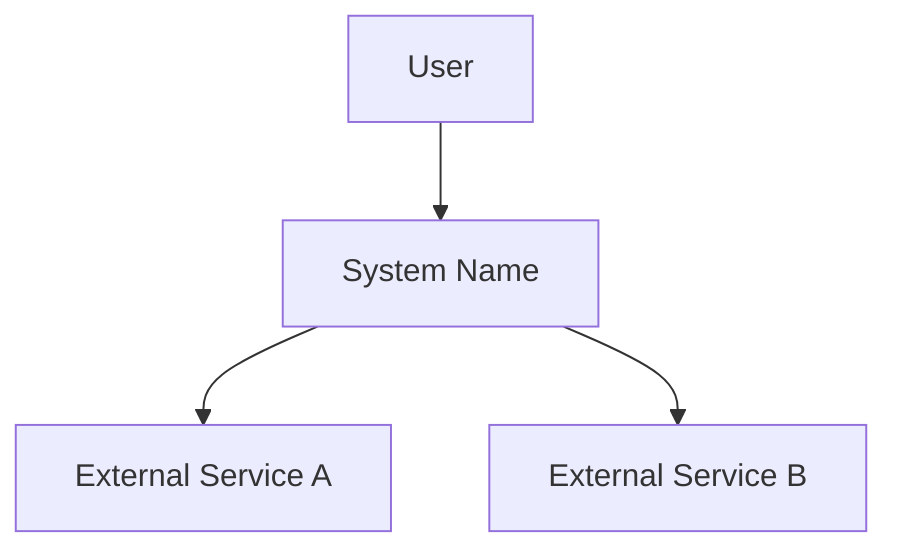
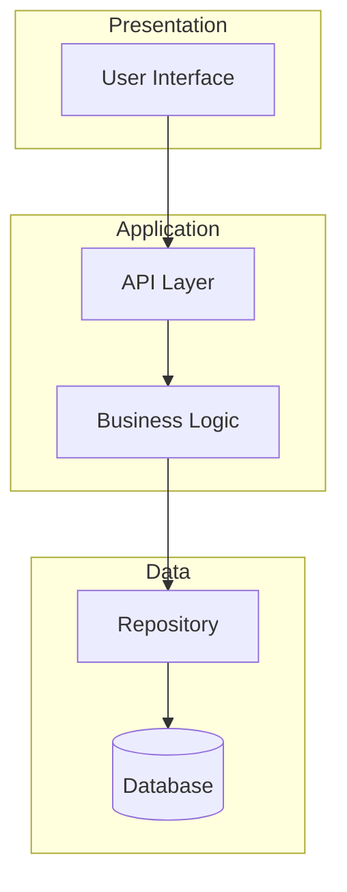
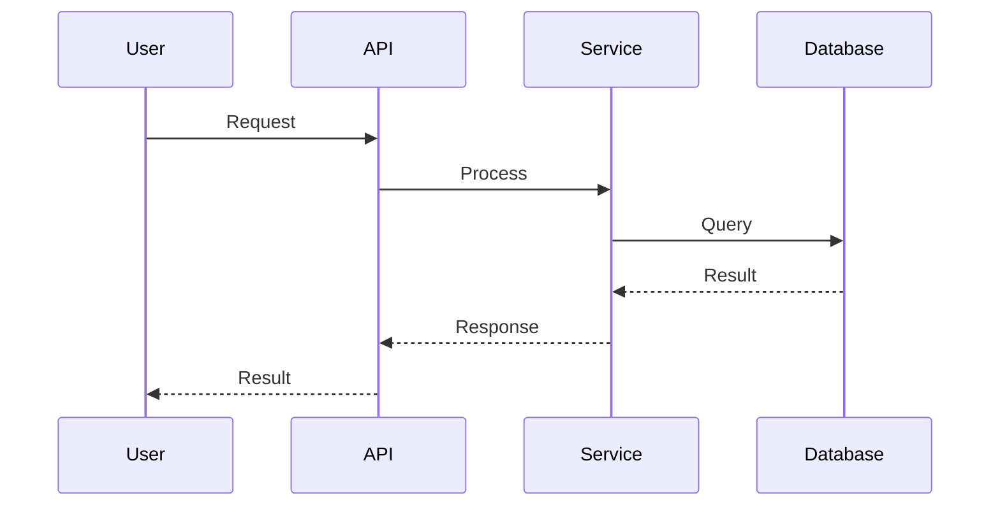

# [System/Feature Name] Architecture

## Overview

[Brief description of the system and its purpose]

---

## System Context

[Describe how the system interacts with external entities]

---

## Components

### [Component Name]

**Responsibility:** [What this component does, in 1-2 sentences]

**Interfaces:**

- Exposes: [What other components can call]
- Consumes: [What this component depends on]

**Key decisions:**

- [Important implementation choice and rationale]

---

### [Component Name]

**Responsibility:** [What this component does]

**Interfaces:**

- Exposes: [What other components can call]
- Consumes: [What this component depends on]

**Key decisions:**

- [Important implementation choice and rationale]

---

## Component Diagram

---

## Interactions

### [Flow Name]

---

## Cross-Cutting Concerns

### Security

- [Security approach: authentication, authorization, encryption]

### Error Handling

- [Error handling strategy across components]

### Observability

- [Logging, monitoring, tracing approach]
