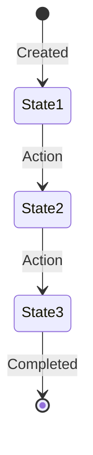
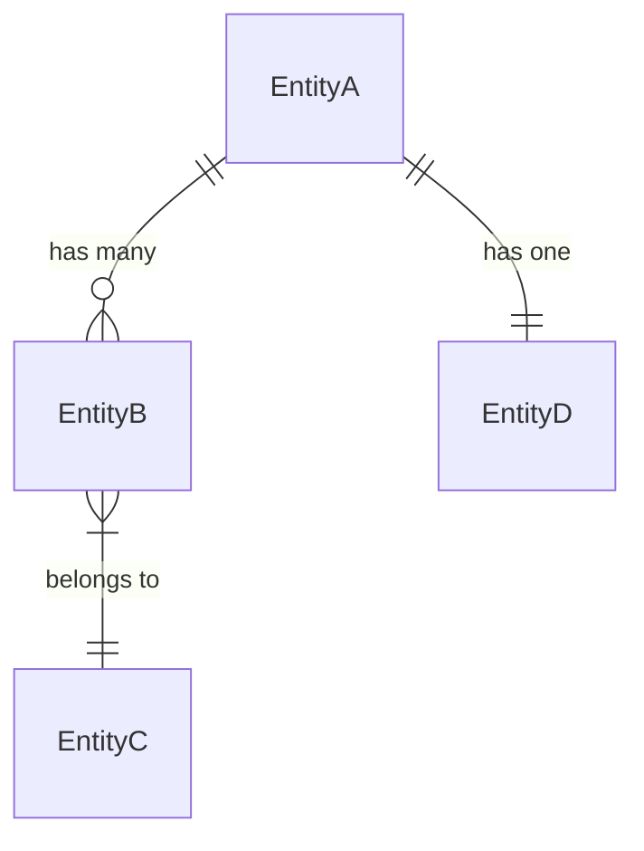

# [Domain/Feature] Data Model

## Overview

[Brief description of the domain and what data this model represents]

---

## Entities

### [Entity Name]

**Description:** [What this entity represents]

**Attributes:**

| Attribute   | Type      | Required | Description                       |
| ----------- | --------- | -------- | --------------------------------- |
| id          | UUID      | Yes      | Primary key (UUIDv7 recommended)  |
| [attribute] | [type]    | [Yes/No] | [Description]                     |
| [attribute] | [type]    | [Yes/No] | [Description]                     |
| created_at  | timestamp | Yes      | When the entity was created       |
| updated_at  | timestamp | Yes      | When the entity was last modified |

**Lifecycle:**

---

### [Entity Name]

**Description:** [What this entity represents]

**Attributes:**

| Attribute   | Type   | Required | Description   |
| ----------- | ------ | -------- | ------------- |
| id          | UUID   | Yes      | Primary key   |
| [attribute] | [type] | [Yes/No] | [Description] |

---

## Relationships

### [Relationship Name]

**Type:** [One-to-One | One-to-Many | Many-to-Many]

**Description:** [Explain the relationship and any constraints]

**Relationship Attributes:** (if applicable)

- [attribute]: [description]

---

## Constraints

### Business Rules

- [Entity] [constraint description]
- [Entity] [constraint description]

### Referential Integrity

- [Cascade/restrict behavior on delete/update]

### Temporal Constraints

- [Time-based rules, e.g., end_date > start_date]

---

## Indexes

| Entity   | Index        | Columns   | Purpose                 |
| -------- | ------------ | --------- | ----------------------- |
| [Entity] | [index_name] | [columns] | [Why this index exists] |
