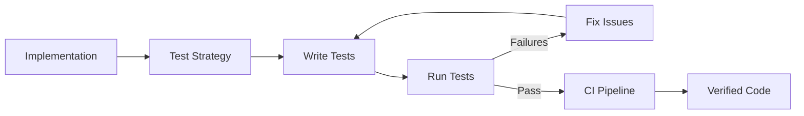

# Testing Phase

Verify that implementation meets requirements and design. Testing confirms that what was built works correctly and continues to work as the system evolves.

## Purpose

Testing answers the question: "Does the software do what it should?"

Without adequate testing:
- Bugs reach users
- Changes break existing functionality
- Confidence in the system erodes
- Development slows as fear of change grows

## Inputs and Outputs

**Inputs:**
- Implemented, reviewed code
- Requirements specification
- Interface contracts
- Design documentation

**Outputs:**
- Verified, tested code
- Test suite for ongoing verification
- Documented coverage and known limitations

## Contents

| Document                                         | Purpose                                    |
| ------------------------------------------------ | ------------------------------------------ |
| [test-strategy.md](test-strategy.md)             | Planning what to test and at what level    |
| [unit-testing.md](unit-testing.md)               | Testing individual components in isolation |
| [integration-testing.md](integration-testing.md) | Testing component interactions             |
| [test-design.md](test-design.md)                 | Writing effective, maintainable tests      |
| [test-automation.md](test-automation.md)         | CI integration and test infrastructure     |
| [test-maintenance.md](test-maintenance.md)       | Keeping tests healthy over time            |

## Reading Order

1. **test-strategy.md** — Understand what to test and why
2. **unit-testing.md** — Learn unit testing practices
3. **integration-testing.md** — Learn integration testing practices
4. **test-design.md** — Learn to write good tests
5. **test-automation.md** — Automate tests in CI/CD
6. **test-maintenance.md** — Learn to maintain tests

## Workflow

Testing is ongoing—it starts during development and continues throughout the system's life.

## Key Principles

- **Test behavior, not implementation** — Tests verify what code does, not how it does it
- **Fast feedback** — Tests should run quickly to encourage frequent execution
- **Isolation** — Tests should not affect each other; failure in one does not cascade
- **Determinism** — Tests produce the same results every time
- **Clarity** — Test failures should clearly indicate what is wrong

## Testing Levels

Different tests serve different purposes:

**Unit tests** — Verify individual components in isolation.
- Fast, focused, many of them
- Catch bugs in component logic
- Run on every change

**Integration tests** — Verify components working together.
- Slower, broader scope
- Catch issues at boundaries
- Run regularly

**End-to-end tests** — Verify complete workflows.
- Slowest, full system scope
- Catch integration issues
- Run before releases

## Test Coverage

Coverage indicates what code is exercised by tests, not test quality.

**High coverage with poor tests** — Code runs but assertions are weak.

**Low coverage with good tests** — Critical paths tested well; others ignored.

Target meaningful coverage:
- Critical paths: high coverage
- Edge cases: tested explicitly
- Error handling: verified
- Trivial code: may not need tests

## When Testing is Complete

Testing is adequate when:

- All requirements have corresponding tests
- Critical paths are thoroughly covered
- Edge cases and error conditions are tested
- Tests pass consistently
- Confidence exists that changes will not silently break functionality

Testing is never truly complete—it evolves with the system.
