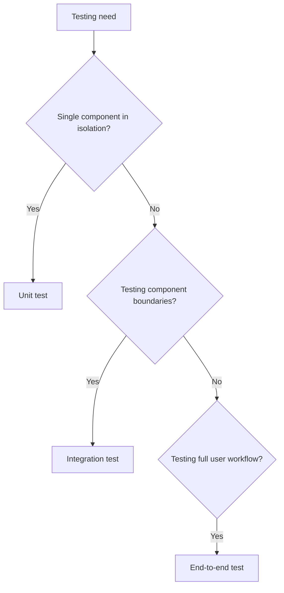

# Integration Testing

Integration tests verify that components work together correctly. They catch issues that unit tests miss—problems at the boundaries between components.

---

## What Integration Tests Verify

Integration tests check:

- **Component interaction** — Components communicate correctly
- **Data flow** — Data passes correctly between components
- **Contract compliance** — Components honor their interfaces
- **Configuration** — Components are wired together correctly
- **Infrastructure integration** — Code works with real databases, APIs, etc.

---

## When Unit Tests Are Not Enough



Integration tests are needed when:

- Testing how components connect
- Verifying database queries work correctly
- Testing API request/response handling
- Verifying message queue producers and consumers
- Testing that configuration correctly assembles components

---

## Integration vs. Unit Tests

| Aspect          | Unit Tests       | Integration Tests   |
| --------------- | ---------------- | ------------------- |
| Scope           | Single component | Multiple components |
| Speed           | Milliseconds     | Seconds             |
| Dependencies    | Mocked/stubbed   | Real or realistic   |
| Isolation       | Complete         | Partial             |
| What they catch | Logic errors     | Integration errors  |
| Quantity        | Many             | Fewer               |

---

## Real Dependencies vs. Test Doubles

For types of test doubles (stubs, mocks, fakes), see [unit-testing.md](unit-testing.md).

**Use real dependencies when:**

- Testing the integration itself (that is the point)
- Testing database queries (need real database behavior)
- Test doubles would be complex to maintain

**Use test doubles when:**

- External service is unreliable, slow, or has side effects
- Setting up real service is impractical
- Need to test error scenarios hard to produce with real service

---

## Database Integration

Testing with databases is common. Approaches:

### In-Memory Database

Use an in-memory database that matches production behavior.

```
Advantages:
  - Fast
  - No cleanup needed
  - Easy to reset state

Disadvantages:
  - May differ from production database
  - Some features may not be supported
```

### Test Database Instance

Use a real database instance dedicated to testing.

```
Advantages:
  - Same behavior as production
  - All features available

Disadvantages:
  - Slower
  - Requires setup and cleanup
  - May need isolation between test runs
```

### Database Testing Guidelines

```
Setup:
  - Create fresh schema for each test run (or transaction rollback)
  - Insert only data needed for the test

Isolation:
  - Tests should not depend on order
  - Clean up after tests (or use transactions)

Speed:
  - Minimize database operations
  - Use transactions to rollback instead of delete
  - Consider parallel test execution with isolated databases
```

---

## API Integration

Testing API interactions:

### Testing Your APIs

When testing APIs you provide:

```
Test:
  - Correct responses for valid requests
  - Error responses for invalid requests
  - Authentication and authorization
  - Content types and headers
  - Status codes

Approach:
  - Use test client that makes real HTTP requests
  - Test through the HTTP layer, not by calling handlers directly
```

### Testing External APIs

When testing against external APIs:

```
Options:
  1. Mock the API client
     - Fast, controlled
     - May miss API changes

  2. Use sandbox/test environment
     - Real API behavior
     - May be slow or rate-limited

  3. Record/replay (contract testing)
     - Record real responses, replay in tests
     - Balance of real behavior and speed

Recommendation:
  - Unit test with mocks for logic
  - Integration test with sandbox/recorded responses
  - Occasional verification against real API
```

---

## Boundary Testing

Focus integration tests on component boundaries.

### What to Test at Boundaries

```
Between components:
  - Data format and transformation
  - Error propagation
  - Contract compliance

Between system and external world:
  - Input validation
  - Output formatting
  - Error handling
```

### Boundary Test Example

```
Testing boundary between OrderService and PaymentGateway:

test "order service handles payment timeout":
  // Arrange
  payment_gateway = create_slow_payment_gateway(timeout_after=30s)
  order_service = OrderService(payment_gateway)
  order = create_test_order()

  // Act
  result = order_service.process_payment(order)

  // Assert
  assert result.status == "payment_failed"
  assert result.error.type == "timeout"
  assert order.status == "pending"  // Not changed to paid
```

---

## Test Environment Management

Integration tests need more environment setup than unit tests.

### Environment Setup

```
Before tests:
  - Start required services (database, message queue)
  - Create schemas/tables
  - Configure connections
  - Seed reference data

After tests:
  - Clean up test data
  - Release connections
  - Stop services (if started for tests)
```

### Test Data Management

```
Principles:
  - Each test creates what it needs
  - Tests do not share mutable data
  - Tests clean up after themselves

Strategies:
  - Transaction rollback (fast, automatic cleanup)
  - Truncate tables between tests
  - Unique identifiers per test run
  - Isolated database per test (slowest but safest)
```

### Configuration

```
Test configuration should:
  - Point to test resources, not production
  - Use shorter timeouts for faster feedback
  - Enable additional logging for debugging
  - Disable side effects (email sending, external calls)
```

---

## Integration Test Structure

### Test Organization

Group integration tests by:
- Component pairs being tested
- Feature areas
- Infrastructure type

### Test Example Structure

```
test "user registration stores user and sends welcome email":
  // Arrange
  email_service = FakeEmailService()
  user_repo = RealUserRepository(test_database)
  registration_service = RegistrationService(user_repo, email_service)

  // Act
  user = registration_service.register(
    email="test@example.com",
    name="Test User"
  )

  // Assert
  assert user.id is not null
  assert user_repo.find_by_email("test@example.com") is not null
  assert email_service.sent_emails contains email to "test@example.com"
```

---

## Integration Test Checklist

```
Setup:
[ ] Test environment is configured
[ ] Dependencies are available (database, services)
[ ] Test data strategy is defined
[ ] Isolation mechanism is in place

Test quality:
[ ] Tests focus on integration, not unit logic
[ ] Tests verify component interactions
[ ] Tests handle error scenarios
[ ] Tests clean up after themselves

Maintenance:
[ ] Tests are reliable (no flakiness)
[ ] Tests run in reasonable time
[ ] Test data is manageable
[ ] Configuration is separate from production
```

---

## Common Integration Testing Mistakes

### Testing Too Much

```
Problem:
  Integration tests that test component logic (should be unit tests)

Fix:
  Test logic in unit tests
  Test integration in integration tests
  Each test level has its purpose
```

### Not Testing Enough

```
Problem:
  Only unit tests exist; integration is never tested

Fix:
  Add integration tests for component boundaries
  Test database queries
  Test API interactions
```

### Flaky Tests

Tests that sometimes pass, sometimes fail. Common in integration tests due to timing, shared state, and network issues. See [test-maintenance.md](test-maintenance.md) for comprehensive diagnosis and fixes.

### Slow Tests

```
Problem:
  Integration tests take too long

Causes:
  - Too much setup/teardown
  - Real services that are slow
  - Too many integration tests

Fix:
  - Optimize setup (reuse where safe)
  - Use faster test doubles
  - Push logic testing to unit tests
  - Run integration tests in parallel
```
