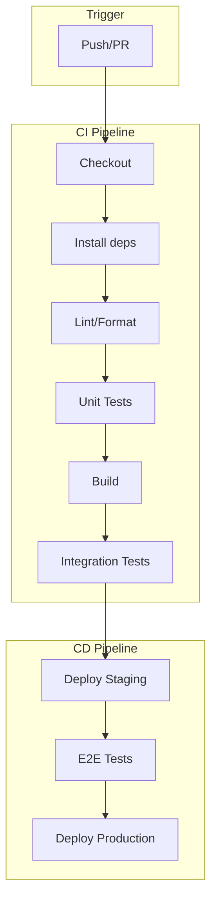
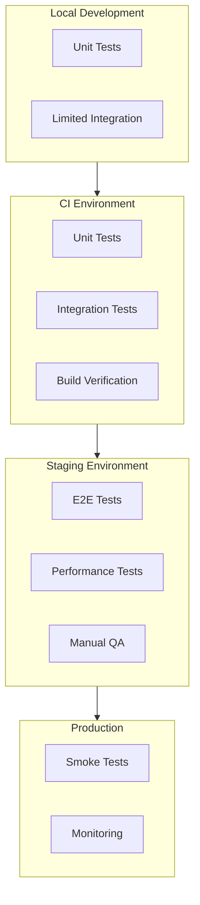
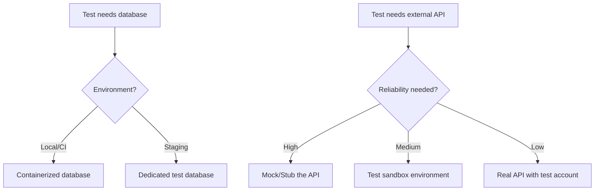
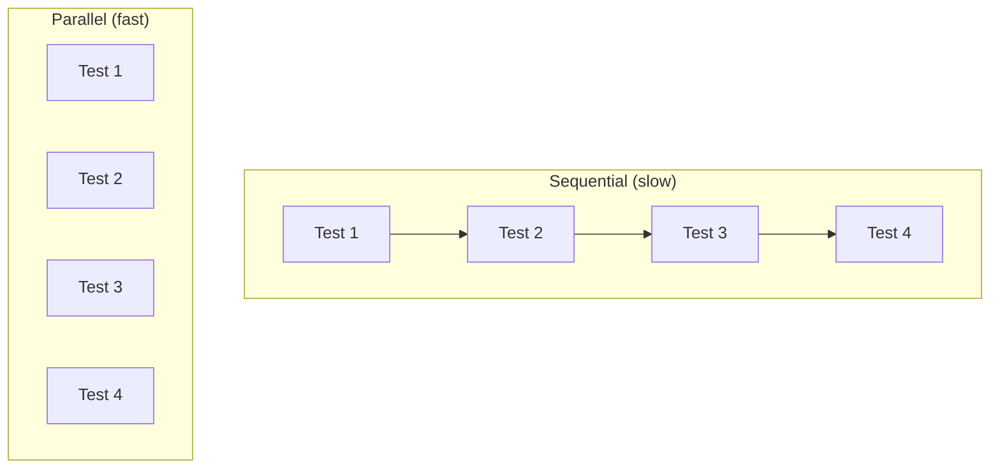
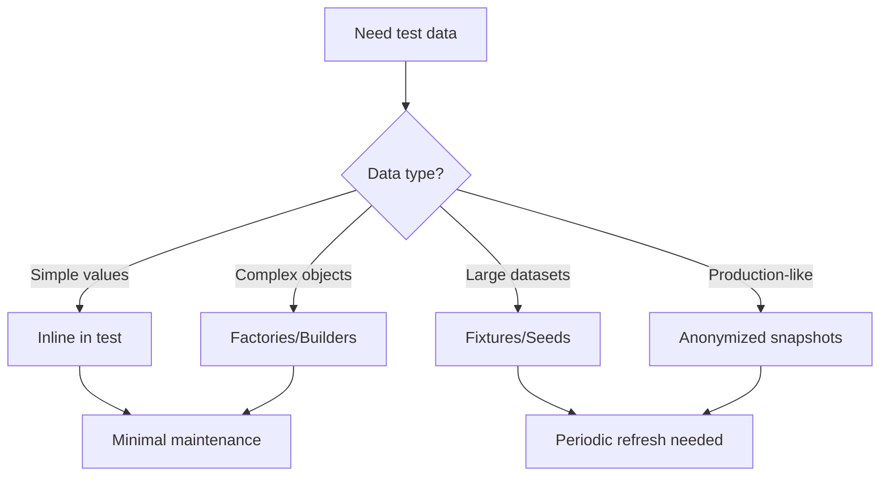
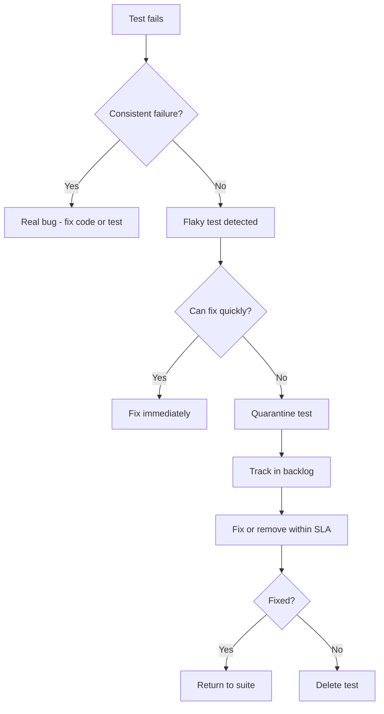
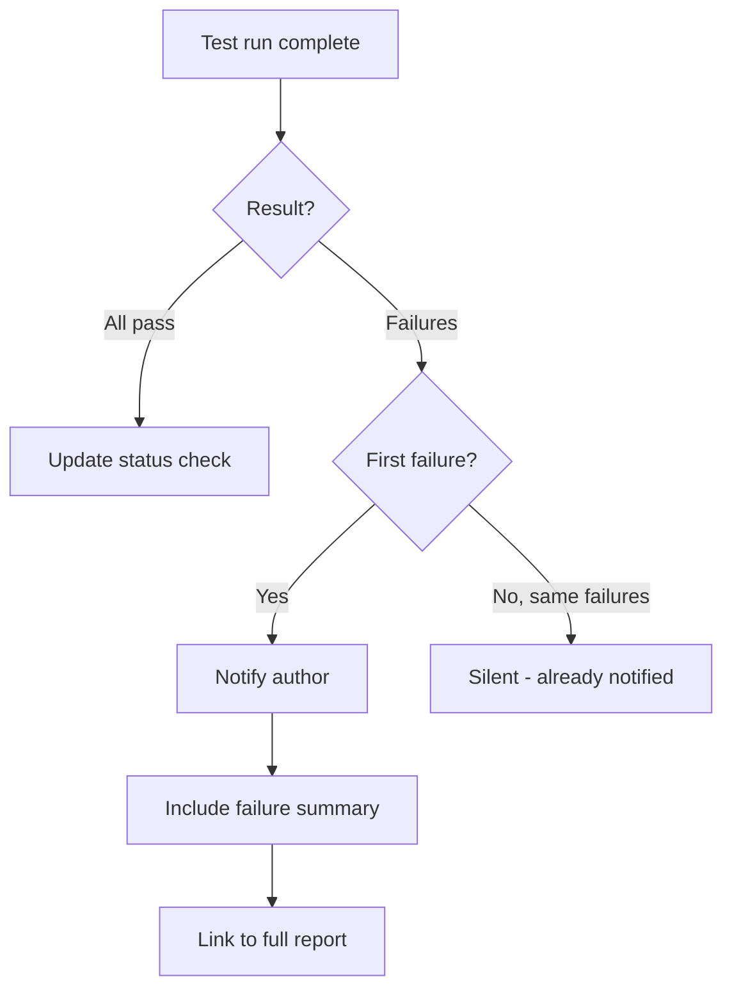
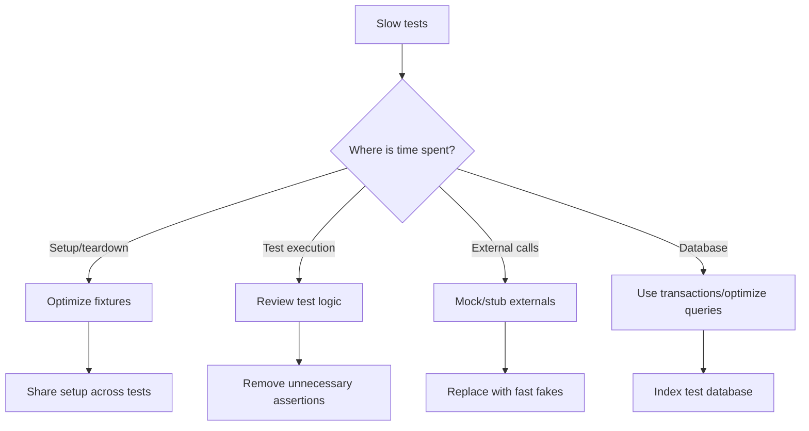

# Test Automation

Test automation runs tests automatically, consistently, and frequently. This document covers integrating tests into CI/CD pipelines and building reliable test infrastructure.

---

## Test Automation Mindset

### Why Automate Tests

Manual testing does not scale:

- Humans are inconsistent
- Manual testing is slow
- Repetitive testing is error-prone
- Testing gets skipped under pressure

Automated tests provide:

- Consistent execution every time
- Fast feedback on changes
- Confidence to refactor
- Documentation of expected behavior

### Automation Goals

Primary goals:

- ✓ Fast feedback — Know quickly if changes break things
- ✓ Consistent results — Same tests, same conditions, same results
- ✓ Low maintenance — Tests run reliably without babysitting
- ✓ Clear signals — Pass/fail is unambiguous and actionable

Anti-goals:

- ✗ 100% automation — Some tests are better manual
- ✗ Automation for its own sake — Automate what provides value
- ✗ Complex infrastructure — Simpler is more reliable

---

## CI/CD Pipeline Integration

Continuous Integration (CI) runs tests automatically when code changes. Continuous Deployment (CD) extends this to automatically deploy verified code.

### Pipeline Structure



### Pipeline Stages

**Stage 1: Fast Checks (seconds)**

- Purpose: Catch obvious issues immediately
- Run: On every push and PR

Steps:

- Checkout code
- Install dependencies (cached)
- Lint and format checks
- Type checking (if applicable)
- Security scanning (dependencies)

Fail fast: Stop pipeline on first failure

**Stage 2: Unit Tests (minutes)**

- Purpose: Verify component logic
- Run: On every push and PR

Steps:

- Run unit test suite
- Generate coverage report
- Check coverage thresholds

Parallelization: Split across multiple runners

**Stage 3: Build (minutes)**

- Purpose: Verify code compiles/bundles
- Run: On every push and PR

Steps:

- Build application
- Build artifacts for deployment
- Store artifacts for later stages

Caching: Cache build outputs when possible

**Stage 4: Integration Tests (minutes to hours)**

- Purpose: Verify component interactions
- Run: On PR merge, pre-deployment

Steps:

- Start test dependencies (databases, services)
- Run integration test suite
- Clean up test resources

Isolation: Each run gets fresh environment

**Stage 5: End-to-End Tests (minutes to hours)**

- Purpose: Verify complete workflows
- Run: Pre-deployment, scheduled

Steps:

- Deploy to staging environment
- Run E2E test suite
- Capture screenshots/videos on failure

Stability: Retry flaky tests (with limits)

---

## Test Infrastructure

### Test Environment Architecture



### Environment Parity

Test environments should match production as closely as practical:

Critical parity:

- ✓ Same OS/runtime versions
- ✓ Same database type and version
- ✓ Same service configurations
- ✓ Same network topology (where relevant)

Acceptable differences:

- ~ Smaller scale (fewer instances)
- ~ Synthetic data (not production data)
- ~ Simplified external services (mocks/stubs)
- ~ Reduced resources (memory, storage)

Dangerous differences:

- ✗ Different database type
- ✗ Missing services
- ✗ Disabled security features
- ✗ Hardcoded configurations

### Test Dependencies

Managing external dependencies in tests:



**Containerized dependencies:**

Benefits:

- Consistent across environments
- Fast startup (pre-built images)
- Isolated per test run
- Easy cleanup

Common services:

- PostgreSQL, MySQL (databases)
- Redis, Memcached (caches)
- RabbitMQ, Kafka (message queues)
- Elasticsearch (search)
- LocalStack (AWS services)

**External service handling:**

Options (from most to least isolated):

1. Mocks (in-memory fakes)
   - Fastest, most reliable
   - May not catch integration issues

2. Stubs (lightweight fake servers)
   - Simulates API behavior
   - Good for contract testing

3. Sandbox environments
   - Real service, test mode
   - Provider must support this

4. Real services
   - Most realistic
   - Slowest, least reliable
   - Risk of side effects

---

## Test Parallelization

Running tests in parallel reduces feedback time.

### Parallelization Strategies



**File-level parallelization:**

Each test file runs in parallel

- Simple to implement
- Good isolation
- May have uneven distribution

Example (4 runners, 12 test files):

- Runner 1: files 1, 5, 9
- Runner 2: files 2, 6, 10
- Runner 3: files 3, 7, 11
- Runner 4: files 4, 8, 12

**Test-level parallelization:**

Individual tests run in parallel

- Maximum parallelism
- Requires careful isolation
- Complex resource management

Requirements:

- Tests must not share state
- Database isolation per test
- No hardcoded ports/resources

**Sharding:**

Split test suite across multiple machines

- Scales horizontally
- Reduces total time
- Requires test distribution logic

Example:

- Machine 1: tests A-M
- Machine 2: tests N-Z

Smart sharding:

- Split by historical duration
- Balance load across shards
- Rebalance periodically

### Parallelization Requirements

Tests must be:

- Independent — No test depends on another
- Isolated — No shared mutable state
- Idempotent — Can run multiple times
- Deterministic — Same result every time

Avoid:

- Shared database records
- Hardcoded resource identifiers
- Global state modification
- Order-dependent tests

---

## Test Data Management

### Test Data Strategies



**Inline test data:**

Best for: Simple, test-specific data

Example:

```
test "validates email format":
  valid_email = "user@example.com"
  invalid_email = "not-an-email"

  assert is_valid_email(valid_email)
  assert not is_valid_email(invalid_email)
```

**Factories/Builders:**

Best for: Complex objects with defaults

Example:

```
UserFactory:
  default:
    name: "Test User"
    email: generated unique email
    role: "member"

  admin:
    extends default
    role: "admin"

test "admins can delete users":
  admin = UserFactory.create(admin)
  user = UserFactory.create()

  delete_user(admin, user)
  assert user_deleted(user)
```

**Fixtures/Seeds:**

Best for: Shared reference data, large datasets

Structure:

```
fixtures/
  users.json
  products.json
  categories.json
```

Loading:

```
before_all:
  load_fixtures(["users", "products", "categories"])
```

Caution:

- Keep fixtures minimal
- Document fixture contents
- Version control fixtures
- Refresh periodically

**Database isolation patterns:**

Transaction rollback:

```
before_each: begin_transaction()
after_each: rollback_transaction()
```

Fast, but some features may not work in transactions

Database cleaning:

```
after_each: truncate_all_tables()
```

Slower, but more realistic

Database per test:

```
before_each: create_database()
after_each: drop_database()
```

Slowest, best isolation

---

## Flaky Test Management

Flaky tests pass or fail inconsistently. They erode trust in the test suite.

### Identifying Flaky Tests

Signs of flakiness:

- Test passes locally, fails in CI
- Test fails intermittently
- Test fails only when run with other tests
- Test fails under load
- Test fails near midnight/time boundaries

Common causes:

- Race conditions
- Time-dependent logic
- External service dependencies
- Shared state between tests
- Resource exhaustion
- Non-deterministic ordering

### Flaky Test Response



### Quarantine Strategy

Quarantine process:

1. Mark test as quarantined
2. Remove from blocking pipeline
3. Run separately for monitoring
4. Set SLA for resolution (e.g., 2 weeks)
5. Fix or delete before SLA expires

Quarantine limits:

- Maximum 5% of tests quarantined
- Maximum 2 weeks in quarantine
- Require approval for quarantine

---

## Reporting and Notifications

### Test Reports

Essential report information:

- Total tests run
- Pass/fail/skip counts
- Duration (total and per test)
- Failure details with stack traces
- Flaky test indicators
- Coverage metrics

Report formats:

- JUnit XML (CI integration)
- HTML (human readable)
- JSON (programmatic access)

### Notification Strategy



**Notification principles:**

Do:

- ✓ Notify on first failure
- ✓ Include actionable information
- ✓ Link to logs and artifacts
- ✓ Notify relevant people only

Don't:

- ✗ Spam on every run
- ✗ Notify on expected failures
- ✗ Send walls of text
- ✗ Notify entire team for one person's PR

---

## CI Platform Patterns

### CI Best Practices

**Caching:**

Cache aggressively:

- Dependencies (node_modules, venv)
- Build outputs
- Docker layers
- Test fixtures

Cache keys:

- Include lockfile hash
- Include relevant config files
- Version cache format

Example key: `deps-{{ checksum "package-lock.json" }}`

**Artifacts:**

Save useful artifacts:

- Build outputs
- Test reports
- Coverage reports
- Screenshots/videos (E2E)
- Logs on failure

Retention:

- Short for PR builds (7 days)
- Longer for release builds (90 days)
- Permanent for production artifacts

**Secrets management:**

Do:

- ✓ Use CI platform's secret storage
- ✓ Limit secret access by branch/environment
- ✓ Rotate secrets regularly
- ✓ Audit secret access

Don't:

- ✗ Commit secrets to repository
- ✗ Print secrets in logs
- ✗ Share secrets across environments
- ✗ Use production secrets in CI

---

## Test Performance Optimization

### Identifying Slow Tests

Measure:

- Total pipeline duration
- Duration by stage
- Duration by test file
- Slowest individual tests

Tools:

- CI platform analytics
- Test framework timing reports
- Custom timing instrumentation

### Optimization Techniques



**Common optimizations:**

Quick wins:

- Parallelize test execution
- Cache dependencies
- Use RAM disk for database
- Share expensive setup

Medium effort:

- Profile and optimize slow tests
- Replace slow mocks with faster ones
- Reduce test data volume
- Split large test files

Larger effort:

- Implement test sharding
- Upgrade CI infrastructure
- Rewrite slow test patterns
- Archive rarely-needed tests

---

## Test Automation Checklist

### Pipeline Setup

- [ ] Tests run on every push/PR
- [ ] Fast checks run first
- [ ] Pipeline fails fast on errors
- [ ] Caching configured for dependencies
- [ ] Artifacts stored appropriately
- [ ] Secrets managed securely

### Test Infrastructure

- [ ] Test environments documented
- [ ] Dependencies containerized or mocked
- [ ] Database isolation configured
- [ ] Test data strategy defined
- [ ] Environment parity verified

### Reliability

- [ ] Tests are deterministic
- [ ] Tests can run in parallel
- [ ] Flaky test process defined
- [ ] Quarantine policy in place
- [ ] SLA for flaky test resolution

### Monitoring

- [ ] Test reports generated
- [ ] Coverage tracked over time
- [ ] Notification strategy defined
- [ ] Pipeline duration monitored
- [ ] Flaky test rate tracked

### Maintenance

- [ ] Regular pipeline review scheduled
- [ ] Slow test optimization planned
- [ ] Dependency updates automated
- [ ] Documentation kept current
- [ ] Team trained on CI/CD practices
