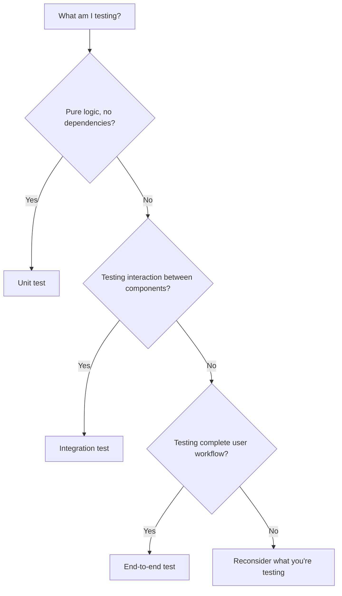

# Test Strategy

Determines what to test, at what level, and to what extent. Maximize confidence, minimize effort.

---

## Strategy Principles

### Risk-Based Testing

Focus testing effort where risk is highest.

**High risk:**

- Core business logic
- Security-sensitive code
- Financial calculations
- Data integrity operations
- Complex algorithms

**Lower risk:**

- Simple getters/setters
- Pass-through code
- UI cosmetics
- Configuration

Allocate testing effort proportional to risk.

### Test Pyramid

The test pyramid guides the distribution of test types:

```
        /\
       /  \        Few end-to-end tests (slow, broad)
      /----\
     /      \      Some integration tests (moderate)
    /--------\
   /          \    Many unit tests (fast, focused)
  --------------
```

**Unit tests** — Foundation. Fast, isolated, numerous.
**Integration tests** — Verify boundaries. Slower, fewer.
**End-to-end tests** — Verify full flows. Slowest, fewest.

---

## Determining Test Levels



### When to Unit Test

Unit test when:

- Testing a single function or class
- Testing pure logic with deterministic output
- Testing edge cases and error handling
- Fast feedback is critical

Unit tests should:

- Run in milliseconds
- Have no external dependencies
- Be completely deterministic
- Test one thing per test

### When to Integration Test

Integration test when:

- Testing interaction between components
- Testing data flow across boundaries
- Testing behavior with real dependencies (database, APIs)
- Unit tests would require excessive mocking

Integration tests should:

- Focus on the interaction, not component internals
- Use real dependencies or realistic fakes
- Verify contracts between components

### When to End-to-End Test

End-to-end test when:

- Testing complete user workflows
- Testing system behavior as users experience it
- Verifying configuration and deployment work together

End-to-end tests should:

- Cover critical user journeys
- Be kept to a minimum (they are slow and brittle)
- Verify what other tests cannot

---

## Coverage Planning

### What to Cover

**Must cover:**

- All acceptance criteria from requirements
- All specified error conditions
- Security-sensitive operations
- Data integrity operations

**Should cover:**

- Common paths through the code
- Edge cases
- Error handling paths
- Integration points

**May not cover:**

- Trivial code (simple getters, configuration)
- External library code (unless wrapping it)
- Temporary debugging code

### Coverage Goals

Set appropriate goals:

```
Critical paths: 90%+ coverage
Core business logic: 80%+ coverage
Infrastructure/glue code: 50-70% coverage
Overall: 70-80% coverage is typically adequate

Coverage numbers are guidelines. Meaningful tests matter more than percentages.
```

### Coverage Gaps

Accept some gaps:

- Code that is genuinely hard to test may not be worth the effort
- Some code changes so rarely it may not need tests
- Some code is better verified through other means (code review, static analysis)

Document intentional coverage gaps and their rationale.

---

## Test Planning

### Planning by Feature

For each feature or requirement:

```
Feature: User Registration

Test coverage plan:
  Unit tests:
    - Email validation logic
    - Password strength validation
    - Username uniqueness check

  Integration tests:
    - Registration flow with database
    - Duplicate email handling
    - Email verification process

  End-to-end tests:
    - Complete registration journey
```

### Planning by Component

For each component:

```
Component: PaymentService

Test coverage plan:
  Unit tests:
    - Amount calculation
    - Input validation
    - Error mapping

  Integration tests:
    - Payment gateway interaction
    - Transaction recording
    - Failure handling

  Dependencies:
    - Mock payment gateway for unit tests
    - Test payment gateway for integration tests
```

---

## Test Environment

### Environment Requirements

Different test levels need different environments:

**Unit tests:**

- No external services
- No database
- No network calls
- Fast startup

**Integration tests:**

- Test database (local or containerized)
- Mock or test versions of external services
- Controlled environment

**End-to-end tests:**

- Complete system deployed
- Test data setup
- Isolation from production

### Data Management

Test data needs:

- **Setup** — Create necessary data before tests
- **Isolation** — Tests do not affect each other's data
- **Cleanup** — Remove test data after tests
- **Determinism** — Same data produces same results

---

## Strategy Checklist

```
Planning:
- [ ] Risk areas identified
- [ ] Test levels determined for each area
- [ ] Coverage goals set
- [ ] Critical paths identified
- [ ] Edge cases listed

Resources:
- [ ] Test environment available
- [ ] Test data strategy defined
- [ ] Dependencies mockable or testable

Documentation:
- [ ] Test plan documented
- [ ] Coverage expectations clear
- [ ] Intentional gaps documented
```

---

## Strategy Anti-Patterns

### Ice Cream Cone

Inverted pyramid: many end-to-end tests, few unit tests.

```
Problems:
  - Tests are slow
  - Failures are hard to diagnose
  - Tests are brittle
  - Feedback loop is slow

Fix: Invert the pyramid. Push testing down to unit level.
```

### Testing Everything

Trying to achieve 100% coverage everywhere.

```
Problems:
  - Diminishing returns
  - Wasted effort on trivial code
  - Tests become maintenance burden
  - Coverage theater (high numbers, weak tests)

Fix: Focus on risk and value. Accept strategic gaps.
```

### Testing Nothing

No automated tests; relying on manual testing.

```
Problems:
  - Regression risk
  - Slow, expensive verification
  - Fear of change
  - Quality degrades over time

Fix: Start with high-risk areas. Build testing habits incrementally.
```

### Testing Implementation

Tests that verify how code works internally, not what it does.

```
Problems:
  - Tests break when implementation changes
  - Tests provide false confidence
  - Refactoring becomes painful

Fix: Test behavior and contracts, not internal structure.
```

---

## After Strategy

Once strategy is defined:

1. Document the test plan
2. Set up test environments
3. Begin implementing tests following the strategy
4. Track coverage against goals
5. Adjust strategy as you learn

Strategy evolves—revisit it when requirements change or gaps appear.
